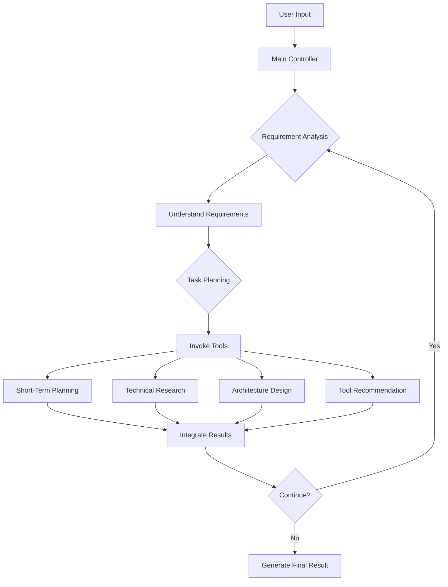

# GTPlanner: Intelligent Task Planning System

<p align="center">
  
</p>

<p align="center">
  <strong>GTPlanner (Graph Task Planner) is an intelligent task planning system designed for modern AI-assisted development that automatically generates structured task flowcharts and related documentation based on user requirements.</strong>
</p>

<p align="center">
  <a href="#-overview">Overview</a> •
  <a href="#-web-ui-recommended">Web UI</a> •
  <a href="#mcp-integration">MCP Integration</a> •
  <a href="#-features">Features</a> •
  <a href="#-environment-requirements-backend-and-cli">Environment Requirements</a> •
  <a href="#-installation-backend-and-cli">Installation</a> •
  <a href="#️-usage">Usage</a> •
  <a href="#️-system-architecture">System Architecture</a> •
  <a href="#-project-structure">Project Structure</a> •
  <a href="#-dependencies">Dependencies</a> •
  <a href="#-multilingual-support">Multilingual Support</a> •
  <a href="#-contributing">Contributing</a> •
  <a href="#-license">License</a> •
  <a href="#-acknowledgements">Acknowledgements</a>
</p>

<p align="center">
  <strong>Languages:</strong>
  <a href="README.md">🇺🇸 English</a> •
  <a href="README_zh-CN.md">🇨🇳 简体中文</a> •
  <a href="README_ja.md">🇯🇵 日本語</a>
</p>

---

## 🎯 Overview

GTPlanner is an intelligent task planning system designed for modern AI-assisted development. The system uses an advanced Agent architecture to intelligently analyze user requirements, conduct technical research, generate architectural designs, and output structured technical documentation.

### 🚀 Core Features

- **🧠 Intelligent Reasoning**: Provides intelligent task analysis and planning capabilities.
- **🔄 Streaming Response Experience**: Natively supports Server-Sent Events (SSE) for a real-time user interaction experience.
- **⚡ Stateless Architecture**: Supports high concurrency and horizontal scaling with a stateless design, suitable for production environments.
- **🛠️ Function Calling**: Integrates with OpenAI Function Calling for intelligent tool invocation and task execution.
- **🌐 Multi-Interface Support**: Offers multiple integration methods, including CLI, FastAPI REST API, and MCP services.

This project consists of two core parts:
- **💻 GTPlanner-frontend (Web UI)**: Provides a feature-rich and interactive online planning experience. (Recommended) [🚀 Try the Live Demo!](https://the-agent-builder.com/)
- **⚙️ GTPlanner (Backend)**: A powerful backend engine based on an Agent architecture, offering various integration methods like CLI and API.

## 💻 Web UI (Recommended)

For the best and most convenient experience, we highly recommend using our Web UI. It provides a seamless AI planning workflow tailored for modern developers.


**Core Advantages:**
- **Intelligent Planning Assistant**: Quickly generate complex system architectures and project plans with AI assistance.
- **Instant Document Generation**: Automatically create comprehensive technical documentation from your planning sessions.
- **Born for Vibe Coding**: Optimized output that perfectly adapts to modern AI development tools like Cursor, Windsurf, and GitHub Copilot.
- **Team Collaboration**: Supports exporting in multiple formats for easy sharing and collaboration with your team.

## MCP Integration
Plans generated by GTPlanner can be used directly in your favorite AI programming tools, seamlessly integrating into your development workflow:

- In Cherry Studio:
  - 
- In Cursor:
  - 


---

## ✨ Features

### 🧠 Intelligent Agent Capabilities
- **🤖 Intelligent Reasoning**: Intelligently analyzes user requirements to provide professional planning suggestions.
- **🔧 Function Calling**: Integrates with OpenAI Function Calling to support intelligent tool invocation.
- **📊 Intelligent Planning**: Specialized planning capabilities for short-term plans, long-term designs, and architectural designs.
- **🔍 Technical Research**: Intelligent technical research and information gathering based on Jina Search.
- **🛠️ Tool Recommendation**: A vectorized tool recommendation system that intelligently matches the most suitable development tools.

### 🚀 Modern Architecture
- **⚡ Stateless Design**: A stateless architecture that supports high concurrency and horizontal scaling.
- **🔄 Streaming Response**: Native support for Server-Sent Events (SSE) to provide a real-time user experience.
- **💾 Smart Storage**: Session management based on SQLite, supporting smart compression and data persistence.
- **📈 Execution Tracing**: Integrated with pocketflow-tracing and Langfuse for detailed execution tracing.

### 🌐 Multi-Interface Support
- **🖥️ Modern CLI**: A command-line tool that supports session management, streaming display, and a multilingual interface.
- **🌐 REST API**: A high-performance REST API service based on FastAPI.
- **🔌 MCP Integration**: Supports the Model Context Protocol for seamless integration with AI assistants.
- **🖼️ Web UI**: Provides a complete web user interface when combined with the frontend.

### 🌍 Globalization Support
- **🌐 Multilingual Support**: Full support for Chinese, English, Japanese, Spanish, and French, with automatic language detection.
- **🎯 Smart Language Detection**: Automatically identifies the user's language and provides corresponding localized responses.
- **🔧 LLM Compatibility**: Supports various large language models (OpenAI, Anthropic, etc.).

---

## 📋 Environment Requirements (Backend and CLI)

- **Python**: 3.10 or higher
- **Package Manager**: [uv](https://github.com/astral-sh/uv) (recommended) or pip
- **LLM API Access**: Any OpenAI-compatible API endpoint (e.g., OpenAI, Anthropic, or a local model)

## 🚀 Installation (Backend and CLI)

1. Clone this repository

```bash
git clone https://github.com/OpenSQZ/GTPlanner.git
cd GTPlanner
```

2. Install dependencies

Using uv (recommended):
```bash
uv sync
```

Using pip:
```bash
pip install -r requirements.txt
```

3. Configuration

GTPlanner supports any OpenAI-compatible API. You can configure your LLM, API key, environment variables, and language in the `settings.toml` file. The default language is English.

```bash
export LLM_API_KEY="your-api-key-here"
```

## 🛠️ Usage

### 🖥️ CLI Mode

GTPlanner offers a modern CLI based on a new streaming response architecture, supporting real-time streaming display, session management, and a multilingual interface.


#### Interactive Mode

Start the interactive CLI for a conversational experience:
```bash
python gtplanner.py
# or
python agent/cli/gtplanner_cli.py
```

**Core Features:**
- 🔄 **Real-time Streaming Response**: See the AI's thought process and tool execution in real-time.
- 💾 **Session Management**: Automatic persistence of conversation history, with support for loading and switching sessions.
- 🤖 **Function Calling**: Native support for OpenAI Function Calling.
- 📊 **Multiple Tools**: Professional tools for requirements analysis, technical research, architectural design, and more.
- 🌍 **Multilingual Interface**: Supports interfaces in Chinese, English, Japanese, Spanish, and French.

#### Direct Execution Mode

Process requirements directly without entering interactive mode:
```bash
python gtplanner.py "Design a user management system"
python agent/cli/gtplanner_cli.py "Analyze the requirements for an e-commerce platform"
```

#### Session Management

**Load an existing session:**
```bash
python gtplanner.py --load <session_id>
```

**Available commands in interactive mode:**
- `/help` - Show available commands
- `/new` - Create a new session
- `/sessions` - List all sessions
- `/load <id>` - Load a specific session
- `/delete <id>` - Delete a specific session
- `/stats` - Show performance statistics
- `/verbose` - Toggle verbose mode
- `/quit` - Exit the CLI

**Common Parameters:**
- `--verbose, -v`: Display detailed processing information.
- `--load <session_id>`: Load a specific conversation session.
- `--language <zh|en|ja|es|fr>`: Set the interface language.

### 🌐 FastAPI Backend

Start the REST API service:

```bash
uv run fastapi_main.py
```

The service runs by default at `http://0.0.0.0:11211`. Access `http://0.0.0.0:11211/docs` to view the interactive API documentation.

**Core Features:**
- **🔄 SSE Streaming Response**: Real-time data transmission based on Server-Sent Events.
- **🤖 Agent API**: Uses `StatelessGTPlanner` to provide stateless, high-concurrency processing.
- **📊 Real-time Tool Invocation**: Real-time display of tool execution status and progress.
- **🌍 Multilingual Support**: The API natively supports multilingual processing and responses.

**Main Endpoints:**

*   **Agent Streaming Chat Endpoint (Recommended)**
    *   `POST /api/chat/agent`: A streaming Agent chat endpoint based on SSE that integrates intelligent reasoning, tool invocation, and real-time responses. This is the preferred interface for building interactive applications.

*   **Health Check Endpoints**
    *   `GET /health`: An enhanced health check endpoint that includes API status information.
    *   `GET /api/status`: Get detailed API status information.


### 🔌 MCP Service (Recommended for AI Integration)

The MCP service can be seamlessly integrated with AI assistants and supports direct function calls.

1. Start the MCP service.

```bash
cd mcp
uv sync
uv run python mcp_service.py
```

2. Configure your MCP client.

```json
{
  "mcpServers": {
    "GT-planner": {
      "url": "http://127.0.0.1:8001/mcp"
    }
  }
}
```

**Available MCP Tools:**
- `generate_flow`: Generate a planning flow from requirements.
- `generate_design_doc`: Create a detailed PRD.

---

## 🏗️ System Architecture

GTPlanner adopts a modern Agent architecture built using the PocketFlow asynchronous workflow engine:

### 🧠 Core Agent Architecture

1.  **Main Controller Flow** (`agent/flows/react_orchestrator_refactored/`)
    -   Intelligent task orchestration and flow control.
    -   Supports execution tracing with `pocketflow_tracing`.
    -   Coordinates node execution and context passing.

2.  **StatelessGTPlanner** (`agent/stateless_planner.py`)
    -   A completely stateless implementation of GTPlanner that supports high concurrency.
    -   Native support for streaming responses.
    -   Purely functional design, where each call is completely independent.

3.  **Function Calling System** (`agent/function_calling/`)
    -   Intelligent tool invocation integrated with OpenAI Function Calling.
    -   Professional tools for short-term planning, technical research, architectural design, tool recommendation, and more.
    -   Supports asynchronous tool execution and result handling.

4.  **Streaming System** (`agent/streaming/`)
    -   A streaming response system based on Server-Sent Events.
    -   Supports real-time message transmission and tool invocation status updates.
    -   Type-safe stream event handling.

### 🔄 Intelligent Workflow



### 🛠️ Specialized Subflows

- **Short-Term Planning** (`agent/subflows/short_planning/`): Generates high-level project plans and task breakdowns.
- **Technical Research** (`agent/subflows/research/`): Intelligent technical research based on Jina Search.
- **Architecture Design** (`agent/subflows/architecture/`): In-depth architecture design and technology selection.
- **Tool Recommendation** (`tools/`): A vectorized tool recommendation system that supports API and Python package recommendations.

---

## 📦 Project Structure

```
GTPlanner/
├── gtplanner.py               # Main CLI startup script
├── fastapi_main.py           # FastAPI backend service
├── settings.toml             # Configuration file
├── pyproject.toml            # Project metadata and dependencies
├── agent/                     # Core Agent system
│   ├── __init__.py           # Agent module entry point
│   ├── gtplanner.py          # Stateful GTPlanner main controller
│   ├── stateless_planner.py  # Stateless GTPlanner implementation
│   ├── context_types.py      # Stateless data type definitions
│   ├── pocketflow_factory.py # PocketFlow data conversion factory
│   ├── flows/                # Main control flows
│   │   └── react_orchestrator_refactored/ # Main controller flow
│   ├── subflows/             # Specialized Agent subflows
│   │   ├── short_planning/   # Short-term planning subflow
│   │   ├── research/         # Technical research subflow
│   │   └── architecture/     # Architecture design subflow
│   ├── nodes/                # Atomic capability nodes
│   │   ├── node_search.py    # Search engine node
│   │   ├── node_url.py       # URL parsing node
│   │   ├── node_compress.py  # Context compression node
│   │   └── node_output.py    # Output document node
│   ├── function_calling/     # Function Calling tools
│   │   └── agent_tools.py    # Agent tool definitions
│   ├── streaming/            # Streaming response system
│   │   ├── stream_types.py   # Stream event type definitions
│   │   ├── stream_interface.py # Streaming session interface
│   │   └── sse_handler.py    # SSE handler
│   ├── api/                  # Agent API implementation
│   │   └── agent_api.py      # SSE GTPlanner API
│   ├── cli/                  # Modern CLI implementation
│   │   ├── gtplanner_cli.py  # Main CLI implementation
│   │   └── cli_text_manager.py # CLI multilingual text manager
│   └── persistence/          # Data persistence
│       ├── sqlite_session_manager.py # SQLite session manager
│       └── smart_compressor.py # Smart compressor
├── mcp/                      # MCP service
│   ├── mcp_service.py       # MCP server implementation
│   └── pyproject.toml       # MCP-specific dependencies
├── tools/                    # Tool recommendation system
│   ├── apis/                # API-type tool definitions
│   └── python_packages/     # Python package-type tool definitions
├── utils/                    # Utility functions
│   └── config_manager.py    # Configuration manager
├── docs/                     # Design documents
└── assets/                   # Project assets
```

---

## 📚 Dependencies

### Core Dependencies
- **Python** >= 3.11 - Runtime environment
- **openai** >= 1.0.0 - LLM API communication
- **pocketflow** == 0.0.3 - Asynchronous workflow engine
- **pocketflow-tracing** >= 0.1.4 - Execution tracing system
- **dynaconf** >= 3.1.12 - Configuration management
- **aiohttp** >= 3.8.0 - Asynchronous HTTP client
- **json-repair** >= 0.45.0 - JSON response repair
- **python-dotenv** >= 1.0.0 - Environment variable loading

### API Dependencies
- **fastapi** == 0.115.9 - REST API framework
- **uvicorn** == 0.23.1 - ASGI server
- **pydantic** >= 2.5.0 - Data validation

### CLI Dependencies
- **rich** >= 13.0.0 - Terminal beautification and interaction

### MCP Dependencies
- **fastmcp** - Model Context Protocol (MCP) implementation

### Development Dependencies
- **pytest** >= 8.4.1 - Testing framework
- **pytest-asyncio** >= 1.1.0 - Asynchronous test support

---

## 🌍 Multilingual Support

GTPlanner offers comprehensive multilingual support, allowing developers worldwide to use their native language for project planning.

### Supported Languages

| Language | Code | Native Name |
|----------|------|-------------|
| English  | `en` | English     |
| Chinese  | `zh` | 中文        |
| Spanish  | `es` | Español     |
| French   | `fr` | Français    |
| Japanese | `ja` | 日本語      |

### Core Features

- **🔍 Automatic Language Detection**: Intelligently identifies the language of the user's input.
- **🎯 Language Priority System**: Automatically selects the most appropriate language based on user preference and the request.
- **📝 Localized Prompt Templates**: Provides culturally adapted prompt templates for each language.
- **🔄 Smart Fallback Mechanism**: Automatically falls back to the default language when the requested language is unavailable.

### Usage

#### CLI Mode
```bash
# Specify the language
python gtplanner.py --language zh "设计一个用户管理系统"

# Automatic detection (inputting Chinese will be automatically recognized)
python gtplanner.py "设计一个用户管理系统"
```

#### API Mode
```python
# Explicitly specify the language
response = requests.post("/api/chat/agent", json={
    "session_id": "test-session",
    "dialogue_history": [{"role": "user", "content": "设计一个用户管理系统"}],
    "language": "zh"
})

# Automatic detection
response = requests.post("/api/chat/agent", json={
    "session_id": "test-session",
    "dialogue_history": [{"role": "user", "content": "设计一个用户管理系统"}]
})
```

### Configuration

Configure multilingual settings in `settings.toml`:

```toml
[default.multilingual]
default_language = "en"
auto_detect = true
fallback_enabled = true
supported_languages = ["en", "zh", "es", "fr", "ja"]
```

For detailed multilingual feature descriptions and configuration guides, please refer to the [Multilingual Guide](docs/multilingual-guide.md).

---

## 🤝 Contributing

We believe that an excellent tool is built on the wisdom and collaboration of the community. GTPlanner welcomes your participation to jointly shape a more powerful planning ecosystem:

### 🔧 Contribute Tools - Expand the Planner's Knowledge Base
Help GTPlanner learn about more available solutions so it can make accurate recommendations during planning:
- **🌐 API Tools** - Web APIs, REST services, platform integrations
- **📦 Python Packages** - PyPI libraries, data analysis packages, utility tools
- **🔌 MCP Services** - Private services that follow the MCP specification

### 💻 Contribute Core Code - Prove Optimizations with Data
Improve planning quality and system performance through evaluation-driven development.

### 📚 Share Case Studies - Inspire the Community
Share your use cases, tutorials, and best practices to help the community unlock the full potential of GTPlanner.

### 📖 Detailed Guide
For complete contribution methods, technical specifications, and submission processes, please see:
**[Contribution Guide](CONTRIBUTING.md)** - Includes detailed contribution flows, templates, and examples.

## 📄 License

This project is licensed under the MIT License. See the [LICENSE](LICENSE.md) file for details.

## 🙏 Acknowledgements

- Built on the [PocketFlow](https://github.com/The-Pocket/PocketFlow) asynchronous workflow engine.
- Configuration management is powered by [Dynaconf](https://www.dynaconf.com/).
- Designed to seamlessly integrate with AI assistants via the MCP protocol.

---

**GTPlanner** - The intelligent task planning system that transforms your ideas into structured technical documents and executable project plans with the power of AI.