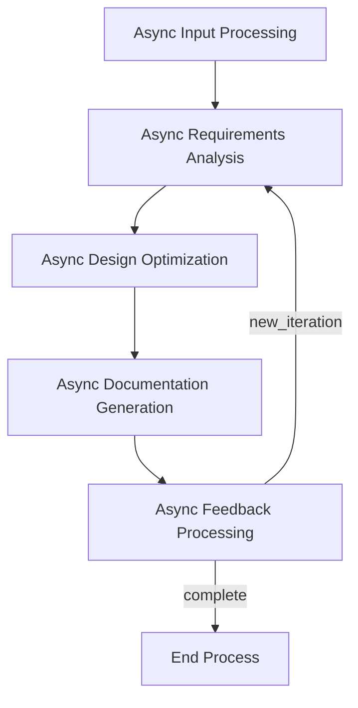

# GTPlanner: AI-Powered PRD Generation Tool

<p align="center">
  
</p>

<p align="center">
  <strong>An intelligent Product Requirement Document (PRD) generation tool that transforms natural language descriptions into structured technical documents suitable for Vibe coding.</strong>
</p>

<p align="center">
  <a href="#-overview">Overview</a> •
  <a href="#-web-ui-recommended">Web UI (Recommended)</a> •
  <a href="#mcp-integration">MCP Integration</a> •
  <a href="#-features">Features</a> •
  <a href="#-requirements-backend-and-cli">Requirements</a> •
  <a href="#-installation-backend-and-cli">Installation</a> •
  <a href="#️-usage">Usage</a> •
  <a href="#️-architecture">Architecture</a> •
  <a href="#-project-structure">Project Structure</a> •
  <a href="#-dependencies">Dependencies</a> •
  <a href="#-multilingual-support">Multilingual Support</a> •
  <a href="#-contributing">Contributing</a> •
  <a href="#-license">License</a> •
  <a href="#-acknowledgments">Acknowledgments</a>
</p>

<p align="center">
  <strong>Languages:</strong>
  <a href="README.md">🇺🇸 English</a> •
  <a href="README_zh-CN.md">🇨🇳 简体中文</a> •
  <a href="README_ja.md">🇯🇵 日本語</a>
</p>
---

## 🎯 Overview

GTPlanner is an advanced AI tool designed for "vibe coding," aimed at efficiently transforming high-level ideas and requirements into clearly structured and detailed technical documents. We recommend experiencing the full capabilities of GTPlanner through our modern **Web Interface**.

For developers looking for deep integration and custom development, we also provide a powerful backend engine. It features an asynchronous, node-based architecture and supports various usage methods, including an interactive CLI, REST API, and MCP service.

This project consists of two core parts:
- **💻 GTPlanner-frontend (Web UI)**: Provides a feature-rich and user-friendly online planning experience. (Recommended) [🚀 Try the Live Demo Now!](https://the-agent-builder.com/)
- **⚙️ GTPlanner (Backend)**: A powerful backend engine offering multiple integration methods like CLI, API, etc.

## 💻 Web UI (Recommended)

For the best and most convenient experience, we highly recommend using our Web UI. It offers a streamlined AI planning workflow tailored for modern developers.


**Core Advantages:**
- **Intelligent Planning Assistant**: Quickly generate complex system architectures and project plans with AI assistance.
- **Instant Document Generation**: Automatically create comprehensive technical documents from your planning sessions.
- **Built for Vibe Coding**: Optimized output that perfectly integrates with modern AI development tools like Cursor, Windsurf, and GitHub Copilot.
- **Team Collaboration**: Supports exporting in multiple formats for easy sharing and collaboration with your team.

## MCP Integration
Plans generated by GTPlanner can be used directly in your favorite AI programming tools, seamlessly integrating into your development workflow:

- In Cherry Studio:
  - 
- In Cursor:
  - 

---

## ✨ Features

- **🗣️ Natural Language Processing**: Converts your requirement descriptions into structured PRDs.
- **🌍 Multilingual Support**: Full support for English, Chinese, Spanish, French, and Japanese, with automatic language detection. See the [Multilingual Guide](docs/multilingual-guide.md) for details.
- **📝 Markdown Support**: Processes and integrates existing Markdown documents.
- **⚡ Asynchronous Processing**: A fully asynchronous pipeline ensures responsive performance.
- **🔄 Multi-turn Optimization**: Iteratively refines documents through an interactive feedback loop.
- **📊 Structured Output**: Generates standardized and customizable technical documents.
- **🧩 Extensible Architecture**: Modular node design allows for easy customization and extension.
- **🌐 Multiple Interfaces**: Comprehensive support for CLI, FastAPI, and MCP protocols.
- **🔧 LLM Agnostic**: Compatible with various Large Language Models (LLMs) through configurable endpoints.
- **📁 Automatic File Management**: Automatically generates filenames and output directories.
- **🎯 Smart Language Detection**: Automatically detects user language and provides corresponding responses.

---

## 📋 Requirements (Backend and CLI)

- **Python**: 3.10 or higher
- **Package Manager**: [uv](https://github.com/astral-sh/uv) (recommended) or pip
- **LLM API Access**: Any OpenAI-compatible API endpoint (e.g., OpenAI, Anthropic, or local models)

## 🚀 Installation (Backend and CLI)

1. Clone this repository

```bash
git clone https://github.com/OpenSQZ/GTPlanner.git
cd GTPlanner
```

2. Install dependencies

Using uv (recommended):
```bash
uv sync
```

Using pip:
```bash
pip install -r requirements.txt
```

3. Configuration

GTPlanner supports any OpenAI-compatible API. You can configure your LLM, API key, environment variables, and language in the `settings.toml` file. The default language is English.

```bash
export LLM_API_KEY="your-api-key-here"
```

## 🛠️ Usage

### 🖥️ CLI Mode

GTPlanner provides a modern, Function Calling-based CLI with real-time streaming output and comprehensive session management.


#### Quick Start

**Simple launcher:**
```bash
python gtplanner.py
```

**Direct CLI access:**
```bash
python cli/gtplanner_cli.py
```

#### Interactive Mode

Start the interactive CLI for a conversational experience:
```bash
python gtplanner.py
# or
python cli/gtplanner_cli.py
```

**Features:**
- 🔄 **Real-time streaming**: See AI thinking and tool execution in real-time
- 💾 **Session management**: Automatic conversation history persistence
- 🤖 **Function Calling**: Native OpenAI Function Calling support
- 📊 **Multiple tools**: Requirements analysis, research, architecture design

#### Direct Execution Mode

Process requirements directly without entering interactive mode:
```bash
python gtplanner.py "Design a user management system"
python cli/gtplanner_cli.py "Analyze e-commerce platform requirements"
```

#### Session Management

**Load existing session:**
```bash
python gtplanner.py --load <session_id>
```

**Available commands in interactive mode:**
- `/help` - Show available commands
- `/new` - Create new session
- `/sessions` - List all sessions
- `/load <id>` - Load specific session
- `/delete <id>` - Delete specific session
- `/stats` - Show performance statistics
- `/verbose` - Toggle detailed mode
- `/quit` - Exit CLI

**Common Parameters:**
- `--verbose, -v`: Show detailed processing information
- `--load <session_id>`: Load specific conversation session

### 🌐 FastAPI Backend

Start the REST API service:

```bash
uv run fastapi_main.py
```

The service runs on `http://0.0.0.0:11211` by default. Access `http://0.0.0.0:11211/docs` to view the interactive API documentation.

**Available Endpoints:**

Our API provides standard, streaming, and unified chat endpoints for maximum flexibility.

*   **Unified Chat Endpoint (Recommended)**
    *   `POST /chat/unified`: A powerful, streaming-first endpoint. It integrates intent recognition, contextual conversation, plan generation, and document creation. This is the preferred interface for building interactive applications like the GTPlanner Web UI.

*   **Streaming Planning Endpoints**
    *   `POST /planning/short/stream`: Generates a high-level plan step-by-step via a streaming response.
    *   `POST /planning/long/stream`: Generates a detailed design document via a streaming response, ideal for showing real-time progress on long tasks.

*   **Standard Planning Endpoints**
    *   `POST /planning/short`: Generates a complete high-level plan in a single response.
    *   `POST /planning/long`: Generates a complete detailed design document in a single response.


### 🔌 MCP Service (Recommended for AI Integration)

The MCP service integrates seamlessly with AI assistants and supports direct function calls.

1. Start the MCP service.

```bash
cd mcp
uv sync
uv run python mcp_service.py
```

2. Configure your MCP client.

```json
{
  "mcpServers": {
    "GT-planner": {
      "url": "http://127.0.0.1:8001/mcp"
    }
  }
}
```

**Available MCP Tools:**
- `generate_flow`: Generates a planning flow from requirements.
- `generate_design_doc`: Creates a detailed PRD.

---

## 🏗️ Architecture

GTPlanner uses an asynchronous node-based architecture built on PocketFlow:

### Core Components

1.  **Short Planner Flow** (`short_planner_flow.py`)
    -   Generates high-level planning steps
    -   Supports iterative refinement
    -   Includes review and finalization nodes

2.  **Main Requirement Engine** (`cli_flow.py`)
    -   A complete document generation pipeline
    -   Features multi-stage processing and feedback loops

3.  **Node Implementations** (`nodes.py`)
    -   `AsyncInputProcessingNode`: Handles user input
    -   `AsyncRequirementsAnalysisNode`: Extracts and classifies requirements
    -   `AsyncDesignOptimizationNode`: Suggests improvements and optimizations
    -   `AsyncDocumentationGenerationNode`: Creates structured documents
    -   `AsyncFeedbackProcessingNode`: Manages the iterative refinement process

### Flowchart



### Utility Functions (`utils/`)

- **`call_llm.py`**: Asynchronous/synchronous LLM communication with JSON repair capabilities
- **`parse_markdown.py`**: Processes Markdown documents and extracts their structure
- **`format_documentation.py`**: Standardized document formatting
- **`store_conversation.py`**: Manages conversation history

---

## 📦 Project Structure

```
GTPlanner/
├── gtplanner.py               # Main CLI launcher script
├── short_planner_flow.py      # Short planner flow implementation
├── nodes.py                   # Core asynchronous node implementations
├── fastapi_main.py            # FastAPI backend service
├── settings.toml              # Configuration file
├── pyproject.toml             # Project metadata and dependencies
├── cli/                       # Modern CLI implementation
│   ├── gtplanner_cli.py      # Function Calling-based CLI
│   └── session_manager.py    # Session management
├── agent/                     # Core agent system
│   ├── flows/                # Main orchestration flows
│   ├── subflows/             # Specialized agent subflows
│   ├── nodes/                # Atomic capability nodes
│   ├── function_calling/     # Function calling tools
│   └── shared.py             # Shared state management
├── api/                       # API implementation
│   └── v1/
│       └── planning.py       # Planning endpoints
├── mcp/                      # MCP service
│   ├── mcp_service.py       # MCP server implementation
│   └── pyproject.toml       # MCP-specific dependencies
├── tools/                    # Tool recommendation system
│   ├── apis/                # API type tool definitions
│   │   ├── example_openweather.yml
│   │   └── ...
│   └── python_packages/     # Python package type tool definitions
│       ├── example_yt_dlp.yml
│       └── ...
├── utils/                    # Utility functions
│   ├── call_llm.py          # LLM communication
│   ├── parse_markdown.py    # Markdown processing
│   ├── format_documentation.py # Documentation formatting
│   └── store_conversation.py   # Conversation management
├── docs/                     # Design documentation
│   ├── design.md            # Main architecture design
│   └── design-longplan.md   # Long planning API design
├── output/                   # Generated documentation output
└── assets/                   # Project assets
    └── banner.png           # Project banner
```

---

## 📚 Dependencies

### Core Dependencies
- **Python** >= 3.10
- **openai** >= 1.0.0 - LLM API communication
- **pocketflow** == 0.0.1 - Asynchronous workflow engine
- **dynaconf** >= 3.1.12 - Configuration management
- **aiohttp** >= 3.8.0 - Asynchronous HTTP client
- **json-repair** >= 0.45.0 - JSON response repair
- **python-dotenv** >= 1.0.0 - Environment variable loading

### API Dependencies
- **fastapi** == 0.115.9 - REST API framework
- **uvicorn** == 0.23.1 - ASGI server
- **pydantic** - Data validation

### MCP Dependencies
- **fastmcp** - Model Context Protocol (MCP) implementation

---

## 🌍 Multilingual Support

GTPlanner provides comprehensive multilingual support, enabling developers worldwide to use their native language for project planning.

### Supported Languages

| Language | Code | Native Name |
|----------|------|-------------|
| English  | `en` | English     |
| Chinese  | `zh` | 中文        |
| Spanish  | `es` | Español     |
| French   | `fr` | Français    |
| Japanese | `ja` | 日本語      |

### Core Features

- **🔍 Automatic Language Detection**: Intelligently identifies the language of user input
- **🎯 Language Priority System**: Automatically selects the most appropriate language based on user preferences and requests
- **📝 Localized Prompt Templates**: Provides culturally adapted prompt templates for each language
- **🔄 Smart Fallback Mechanism**: Automatically falls back to default language when requested language is unavailable

### Usage

#### CLI Mode
```bash
# Specify language explicitly
uv run python main.py --lang en --input "Summarize the WeChat group chat and create user profiles for members"

# Auto-detection (language will be automatically detected)
uv run python main.py --input "Summarize the WeChat group chat and create user profiles for members"
```

#### API Mode
```python
# Explicit language specification
response = requests.post("/planning/short", json={
    "requirement": "Summarize the WeChat group chat and create user profiles for members",
    "language": "en"
})

# Auto-detection (language will be automatically detected)
response = requests.post("/planning/short", json={
    "requirement": "Summarize the WeChat group chat and create user profiles for members"
})
```

### Configuration

Configure multilingual settings in `settings.toml`:

```toml
[default.multilingual]
default_language = "en"
auto_detect = true
fallback_enabled = true
supported_languages = ["en", "zh", "es", "fr", "ja"]
```

For detailed multilingual functionality and configuration guide, please refer to the [Multilingual Guide](docs/multilingual-guide.md).

---

## 🤝 Contributing

We warmly welcome all forms of contributions and collaborations. Please check out our [Contributing Guide](CONTRIBUTING.md) and get involved.

### 🔧 Contributing Tools

GTPlanner includes an intelligent tool recommendation system that supports community-contributed tools. We welcome contributions of high-quality tools in two categories:

#### Supported Tool Types

**🌐 API Tools (APIS)**
- Web APIs and REST services
- Cloud-based processing tools
- External service integrations
- Real-time data processing APIs

**📦 Python Package Tools (PYTHON_PACKAGE)**
- PyPI packages and libraries
- Local processing tools
- Data analysis packages
- Utility libraries

#### How to Contribute Tools

1. **Choose the Right Template**: Use our specialized PR templates for better organization:
   - [API Tool Template](.github/PULL_REQUEST_TEMPLATE/api_tool.md) - For web APIs and services
   - [Python Package Template](.github/PULL_REQUEST_TEMPLATE/python_package_tool.md) - For PyPI packages

2. **Quality Standards**: All contributed tools must meet our quality criteria:
   - ✅ Publicly accessible and well-documented
   - ✅ Stable and actively maintained
   - ✅ Clear usage examples and integration guides
   - ✅ Proper error handling and security practices
   - ✅ No duplicate functionality with existing tools

3. **Tool Information Format**: Each tool requires:
   - Unique identifier (e.g., `org.tool-name`)
   - Comprehensive description and use cases
   - Complete API specification or package details
   - Working examples and integration code
   - Testing and validation results

4. **Review Process**: All tool contributions go through:
   - Technical accuracy review
   - Quality and security assessment
   - Documentation completeness check
   - Community feedback integration

#### 🛠️ Tool Definition Format

All tools are defined using YAML format with the following core fields:

**Common Fields:**
- **id**: Unique tool identifier
- **type**: Tool type ("APIS" or "PYTHON_PACKAGE")
- **summary**: One-line functionality overview
- **description**: Detailed functionality description
- **examples**: Usage examples

**APIS Type Additional Fields:**
- **base_url**: Base URL address of the API
- **endpoints**: Array of API endpoint definitions
  - **summary**: Endpoint functionality description
  - **method**: HTTP method (GET, POST, PUT, DELETE, etc.)
  - **path**: Endpoint path
  - **inputs**: Input parameter definitions (JSON Schema format)
  - **outputs**: Output result definitions (JSON Schema format)

**PYTHON_PACKAGE Type Additional Fields:**
- **requirement**: PyPI package installation requirement (e.g., "package-name==1.0.0")

#### Example Tools

**API Tool Example**
See `tools/apis/example_openweather.yml` for how to define an API tool.

**Python Package Example**
See `tools/python_packages/example_yt_dlp.yml` for how to define a Python package tool.

#### Example Tool Formats

**API Tool Example:**
```yaml
id: "public.weather-api"
type: "APIS"
summary: "Get real-time weather information for global cities."
description: |
  Query current weather, temperature, humidity, wind speed and other detailed
  meteorological data through public weather API. Completely free to use,
  no registration or API key required.
base_url: "https://api.open-meteo.com/v1"
endpoints:
  - method: "GET"
    path: "/forecast"
    summary: "Get current weather data by coordinates"
```

**Python Package Example:**
```yaml
id: "pypi.yt-dlp"
type: "PYTHON_PACKAGE"
summary: "Powerful video downloader supporting thousands of video sites."
description: |
  yt-dlp is a feature-rich fork of youtube-dl that supports downloading videos and audio
  from YouTube, Bilibili, TikTok and thousands of other video sites.
requirement: "yt-dlp"
```

For detailed contribution guidelines, see our [tool contribution templates](.github/PULL_REQUEST_TEMPLATE/).

## 📄 License

This project is licensed under the MIT License. See the [LICENSE](LICENSE.md) file for details.

## 🙏 Acknowledgments

- Built on the [PocketFlow](https://github.com/The-Pocket/PocketFlow) asynchronous workflow engine
- Configuration management powered by [Dynaconf](https://www.dynaconf.com/)
- Designed for seamless integration with AI assistants via the MCP protocol


---

**GTPlanner** - Use the power of AI to transform your ideas into structured technical documents.