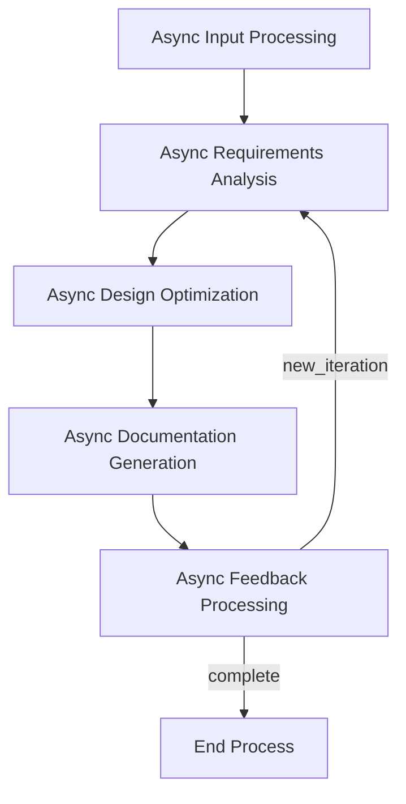

# GTPlanner: AI-Powered PRD Generation Tool

<p align="center">
  
</p>

<p align="center">
  <strong>An intelligent Product Requirement Document (PRD) generation tool that transforms natural language description into structured PRD for Vibe coding</strong>
</p>

<p align="center">
  <a href="#-overview">Overview</a> •
  <a href="#-features">Features</a> •
  <a href="#-installation">Installation</a> •
  <a href="#️-usage">Usage</a> •
  <a href="#️-architecture">Architecture</a> •
  <a href="#-contributing">Contributing</a>
</p>

<p align="center">
  <strong>Languages:</strong>
  <a href="README.md">🇺🇸 English</a> •
  <a href="README_zh-CN.md">🇨🇳 简体中文</a> •
  <a href="README_ja.md">🇯🇵 日本語</a>
</p>

---

## 🎯 Overview

GTPlanner is an advanced AI-powered tool designed for "vibe coding" - transforming high-level ideas and requirements into detailed, structured technical documentation. Built on an asynchronous node-based architecture using [PocketFlow](https://github.com/The-Pocket/PocketFlow), it supports both interactive CLI usage and programmatic API access.

The project consists of three main components:
- **CLI Interface**: Interactive command-line tool for requirement processing
- **FastAPI Backend**: REST API service for programmatic access
- **MCP Service**: Model Context Protocol integration for seamless AI assistant integration

The following examples show the implmentation process in Cherry Studio and Cursor.

- In Cherry Studio:
  - 
- In Cursor:
  - 

## ✨ Features

- **🗣️ Natural Language Processing**: Convert your requirements into structured PRDs
- **🌍 Multilingual Support**: Full support for English, Chinese, Spanish, French, and Japanese with automatic language detection. For details, see the [Multilingual Guide](docs/multilingual-guide.md).
- **📝 Markdown Support**: Process and integrate the existing Markdown documents
- **⚡ Asynchronous Processing**: Full async pipeline for responsive performance
- **🔄 Multi-turn Optimization**: Interactive feedback loop for iterative document refinement
- **📊 Structured Output**: Generate standardized, customizable technical documentation
- **🧩 Extensible Architecture**: Modular node-based design for easy customization
- **🌐 Multiple Interfaces**: CLI, FastAPI, and MCP protocol support
- **🔧 LLM Agnostic**: Compatible with various language models via configurable endpoints
- **📁 Auto File Management**: Generate filename and output directory automatically
- **🎯 Smart Language Detection**: Detect user language automatically and provide appropriate responses 

---

## 📋 Prerequisites

- **Python**: 3.10 or higher
- **Package Manager**: [uv](https://github.com/astral-sh/uv) (recommended) or pip
- **LLM API Access**: OpenAI-compatible API endpoint (OpenAI, Anthropic, local models, etc.)

## 🚀 Installation

1. Clone the repository

```bash
git clone https://github.com/OpenSQZ/GTPlanner.git
cd GTPlanner
```

2. Install dependencies

Using uv (recommended):
```bash
uv sync
```

Using pip:
```bash
pip install -r requirements.txt
```

3. Configure

GTPlanner supports any OpenAI-compatible API. You can figure your LLM, API key, enviornment variables, and language in the `settings.toml` file. The default lanugage is English.

```bash
export LLM_API_KEY="your-api-key-here"
```

## 🛠️ Usage

### 🖥️ CLI Mode (Interactive)

Start the interactive CLI:

```bash
uv run python main.py
# or use the batch script on Windows
start_cli.bat
```

**Features:**
- Interactive requirement input
- Optional Markdown file integration
- Multi-turn feedback and optimization
- Automatic file saving to `output/` directory

**Example workflow:**
1. Enter your project requirements in natural language
2. Optionally provide the existing Markdown document
3. Review the generated document
4. Provide feedback for iterative refinement
5. Type 'q' to save and exit

### 🌐 FastAPI Backend

Start the REST API service:

```bash
uv run fastapi_main.py
```

The service runs on `http://0.0.0.0:11211` by default. Visit `http://0.0.0.0:11211/docs` for interactive API documentation.

**Available endpoints:**
- `POST /planning/short` - Generate short planning flows
- `POST /planning/long` - Generate detailed design documents

### 🔌 MCP Service (Recommended for AI Integration)

The MCP service provides seamless integration with AI assistants and supports direct function calls.

1. Start the MCP service.

```bash
cd mcp
uv sync
uv run python mcp_service.py
```

2. Configure your MCP client.

```json
{
  "mcpServers": {
    "GT-planner": {
      "url": "http://127.0.0.1:8001/mcp"
    }
  }
}
```

The following MCP tools are available:  
- `generate_flow`: Generate planning flows from requirements
- `generate_design_doc`: Create detailed PRDs

---

## 🏗️ Architecture

GTPlanner uses an asynchronous node-based architecture built on PocketFlow:

### Core Components

1. **Short Planner Flow** (`short_planner_flow.py`)
   - Generates high-level planning steps
   - Supports iterative optimization
   - Includes review and finalization nodes

2. **Main Requirement Engine** (`cli_flow.py`)
   - Full document generation pipeline
   - Multi-stage processing with feedback loops

3. **Node Implementations** (`nodes.py`)
   - `AsyncInputProcessingNode`: Handles user input processing
   - `AsyncRequirementsAnalysisNode`: Extracts and categorizes requirements
   - `AsyncDesignOptimizationNode`: Suggests improvements and optimizations
   - `AsyncDocumentationGenerationNode`: Creates structured documentation
   - `AsyncFeedbackProcessingNode`: Manages iterative refinement

### Flow Diagram



### Utility Functions (`utils/`)

- **`call_llm.py`**: Async/sync LLM communication with JSON repair
- **`parse_markdown.py`**: Processes Markdown document and extracts structure
- **`format_documentation.py`**: Standardized documentation formatting
- **`store_conversation.py`**: Manages the conversation history

---

## 📦 Project Structure

```
GTPlanner/
├── main.py                    # Main CLI entry point with full features
├── cli.py                     # Simplified CLI entry point
├── cli_flow.py               # Main requirement engine flow definition
├── short_planner_flow.py     # Short planning flow implementation
├── filename_flow.py          # Automatic filename generation
├── nodes.py                  # Core async node implementations
├── fastapi_main.py           # FastAPI backend service
├── settings.toml             # Configuration file
├── pyproject.toml            # Project metadata and dependencies
├── requirements.txt          # Python dependencies
├── start_cli.bat            # Windows batch script for CLI
├── api/                      # API implementation
│   └── v1/
│       └── planning.py       # Planning endpoints
├── mcp/                      # MCP service
│   ├── mcp_service.py       # MCP server implementation
│   └── pyproject.toml       # MCP-specific dependencies
├── utils/                    # Utility functions
│   ├── call_llm.py          # LLM communication
│   ├── parse_markdown.py    # Markdown processing
│   ├── format_documentation.py # Documentation formatting
│   └── store_conversation.py   # Conversation management
├── docs/                     # Design documentation
│   ├── design.md            # Main architecture design
│   └── design-longplan.md   # Long planning API design
├── output/                   # Generated documentation output
└── assets/                   # Project assets
    └── banner.png           # Project banner
```

---

## 📚 Dependencies

### Core Dependencies
- **Python** >= 3.10
- **openai** >= 1.0.0 - LLM API communication
- **pocketflow** == 0.0.1 - Async workflow engine
- **dynaconf** >= 3.1.12 - Configuration management
- **aiohttp** >= 3.8.0 - Async HTTP client
- **json-repair** >= 0.45.0 - JSON response repair
- **python-dotenv** >= 1.0.0 - Environment variable loading

### API Dependencies
- **fastapi** == 0.115.9 - REST API framework
- **uvicorn** == 0.23.1 - ASGI server
- **pydantic** - Data validation

### MCP Dependencies
- **fastmcp** - Model Context Protocol implementation

---

## 🤝 Contributing

Contributions and collaborations are welcome and highly appreciated. Check out the [contributing guide](CONTRIBUTING.md) and get involved.

## 📄 License

This project is licensed under the MIT License. For details, see the [LICENSE](LICENSE.md) file.

## 🙏 Acknowledgments

- Built on [PocketFlow](https://github.com/The-Pocket/PocketFlow) async workflow engine
- Configuration powered by [Dynaconf](https://www.dynaconf.com/)
- Designed for seamless integration with AI assistants via MCP protocol
