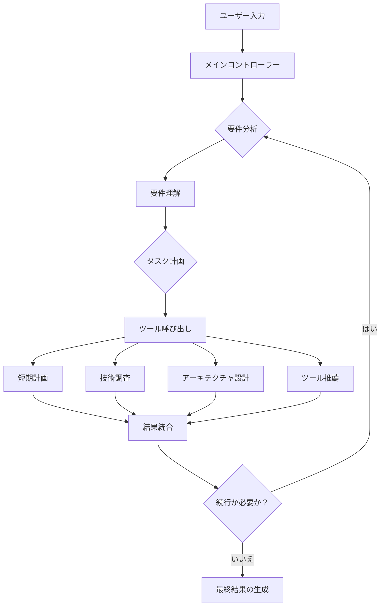

# GTPlanner: インテリジェントタスク計画システム

<p align="center">
  
</p>

<p align="center">
  <strong>GTPlanner (Graph Task Planner) は、ユーザーの要求に応じて構造化されたタスクフローチャートと関連ドキュメントを自動生成できるインテリジェントなタスク計画システムであり、現代のAI支援開発のために特別に設計されています。</strong>
</p>

<p align="center">
  <a href="#-概要">概要</a> •
  <a href="#-web-ui-推奨">Web UI</a> •
  <a href="#mcp統合">MCP統合</a> •
  <a href="#-機能">機能</a> •
  <a href="#-環境要件-バックエンドとcli">環境要件</a> •
  <a href="#-インストール-バックエンドとcli">インストール</a> •
  <a href="#️-使用方法">使用方法</a> •
  <a href="#️-システムアーキテクチャ">システムアーキテクチャ</a> •
  <a href="#-プロジェクト構造">プロジェクト構造</a> •
  <a href="#-依存関係">依存関係</a> •
  <a href="#-多言語サポート">多言語サポート</a> •
  <a href="#-貢献">貢献</a> •
  <a href="#-ライセンス">ライセンス</a> •
  <a href="#-謝辞">謝辞</a>
</p>

<p align="center">
  <strong>言語:</strong>
  <a href="README.md">🇺🇸 English</a> •
  <a href="README_zh-CN.md">🇨🇳 简体中文</a> •
  <a href="README_ja.md">🇯🇵 日本語</a>
</p>

---

## 🎯 概要

GTPlannerは、現代のAI支援開発のために設計されたインテリジェントなタスク計画システムです。このシステムは先進的なエージェントアーキテクチャを採用しており、ユーザーの要求をインテリジェントに分析し、技術調査を実行し、アーキテクチャ設計を生成し、構造化された技術ドキュメントを出力することができます。

### 🚀 主な機能

- **🧠 インテリジェントな推論**：インテリジェントなタスク分析と計画能力を提供
- **🔄 ストリーミング応答体験**：Server-Sent Events (SSE)をネイティブにサポートし、リアルタイムのユーザーインタラクション体験を提供
- **⚡ ステートレスアーキテクチャ**：高並行性と水平スケーリングをサポートするステートレス設計で、本番環境へのデプロイに適しています
- **🛠️ Function Calling**：OpenAI Function Callingを統合し、インテリジェントなツール呼び出しとタスク実行をサポート
- **🌐 マルチインターフェースサポート**：CLI、FastAPI REST API、MCPサービスなど、複数の統合方法を提供

このプロジェクトには、2つのコア部分が含まれています：
- **💻 GTPlanner-frontend (Web UI)**：機能豊富でインタラクティブなオンライン計画体験を提供します。（推奨）[🚀 ライブデモを体験！](https://the-agent-builder.com/)
- **⚙️ GTPlanner (Backend)**：エージェントアーキテクチャに基づく強力なバックエンドエンジンで、CLI、APIなど複数の統合方法を提供します。

## 💻 Web UI (推奨)

最高かつ最も便利な体験を得るために、Web UIの使用を強くお勧めします。現代の開発者向けにカスタマイズされた、スムーズなAI計画ワークフローを提供します。


**主な利点:**
- **インテリジェント計画アシスタント**: AIの支援により、複雑なシステムアーキテクチャとプロジェクト計画を迅速に生成します。
- **即時ドキュメント生成**: 計画セッションから包括的な技術ドキュメントを自動的に作成します。
- **Vibe Codingのために設計**: Cursor、Windsurf、GitHub Copilotなどの現代的なAI開発ツールに最適な出力を最適化します。
- **チームコラボレーション**: 複数の形式でのエクスポートをサポートし、チームとの共有とコラボレーションを容易にします。

## MCP統合
GTPlannerが生成した計画は、お気に入りのAIプログラミングツールで直接使用でき、開発フローにシームレスに接続します。

- Cherry Studioでの使用:
  - 
- Cursorでの使用:
  - 


---

## ✨ 機能

### 🧠 インテリジェントエージェント能力
- **🤖 インテリジェントな推論**: ユーザーの要求をインテリジェントに分析し、専門的な計画提案を提供
- **🔧 Function Calling**: OpenAI Function Callingを統合し、インテリジェントなツール呼び出しをサポート
- **📊 インテリジェント計画**: 短期計画、長期設計、アーキテクチャ設計などの専門的な計画能力
- **🔍 技術調査**: Jina検索に基づくインテリジェントな技術調査と情報収集
- **🛠️ ツール推薦**: ベクトル化されたツール推薦システムで、最適な開発ツールをインテリジェントにマッチング

### 🚀 モダンアーキテクチャ
- **⚡ ステートレス設計**: 高並行性と水平スケーリングをサポートするステートレスアーキテクチャ
- **🔄 ストリーミング応答**: Server-Sent Events (SSE)をネイティブにサポートし、リアルタイムのユーザー体験を提供
- **💾 インテリジェントストレージ**: SQLiteに基づくセッション管理、インテリジェントな圧縮とデータ永続化をサポート
- **📈 実行追跡**: pocketflow-tracingとLangfuseを統合し、詳細な実行追跡を実現

### 🌐 マルチインターフェースサポート
- **🖥️ モダンCLI**: セッション管理、ストリーミング表示、多言語インターフェースをサポートするコマンドラインツール
- **🌐 REST API**: FastAPIに基づく高性能なREST APIサービス
- **🔌 MCP統合**: Model Context Protocolをサポートし、AIアシスタントとシームレスに統合
- **🌐 Web UI**: フロントエンドと連携し、完全なWebユーザーインターフェースを提供

### 🌍 グローバリゼーションサポート
- **🌐 多言語サポート**: 中国語、英語、日本語、スペイン語、フランス語を完全にサポートし、自動言語検出機能を備える
- **🎯 インテリジェント言語検出**: ユーザーの言語を自動的に認識し、対応するローカライズされた応答を提供
- **🔧 LLM互換性**: 各種大規模言語モデル（OpenAI、Anthropicなど）をサポート

---

## 📋 環境要件 (バックエンドとCLI)

- **Python**: 3.10 以降
- **パッケージマネージャー**: [uv](https://github.com/astral-sh/uv) (推奨) または pip
- **LLM APIアクセス**: OpenAI互換のAPIエンドポイント (例: OpenAI, Anthropic, またはローカルモデル)

## 🚀 インストール (バックエンドとCLI)

1. リポジトリをクローンする

```bash
git clone https://github.com/OpenSQZ/GTPlanner.git
cd GTPlanner
```

2. 依存関係をインストールする

uvを使用 (推奨):
```bash
uv sync
```

pipを使用:
```bash
pip install -r requirements.txt
```

3. 設定

GTPlannerは、OpenAI互換のAPIをサポートしています。`settings.toml` ファイルでLLM、APIキー、環境変数、言語を設定できます。デフォルト言語は英語です。

```bash
export LLM_API_KEY="your-api-key-here"
```

## 🛠️ 使用方法

### 🖥️ CLIモード

GTPlannerは、新しいストリーミング応答アーキテクチャに基づいたモダンなCLIを提供し、リアルタイムのストリーミング表示、セッション管理、多言語インターフェースをサポートします。


#### 対話モード

対話型CLIを起動して、対話形式の体験を始めます:
```bash
python gtplanner.py
# または
python agent/cli/gtplanner_cli.py
```

**主な機能:**
- 🔄 **リアルタイムストリーミング応答**: AIの思考プロセスとツール実行をリアルタイムで表示
- 💾 **セッション管理**: 対話履歴の自動永続化、セッションの読み込みと切り替えをサポート
- 🤖 **Function Calling**: ネイティブなOpenAI Function Callingをサポート
- 📊 **多様なツール**: 要件分析、技術調査、アーキテクチャ設計などの専門ツール
- 🌍 **多言語インターフェース**: 中国語、英語、日本語、スペイン語、フランス語のインターフェースをサポート

#### 直接実行モード

対話モードに入らずに、直接要求を処理します:
```bash
python gtplanner.py "ユーザー管理システムを設計する"
python agent/cli/gtplanner_cli.py "ECプラットフォームの要件を分析する"
```

#### セッション管理

**既存のセッションを読み込む:**
```bash
python gtplanner.py --load <session_id>
```

**対話モードで利用可能なコマンド:**
- `/help` - 利用可能なコマンドを表示
- `/new` - 新しいセッションを作成
- `/sessions` - すべてのセッションをリスト表示
- `/load <id>` - 指定したセッションを読み込む
- `/delete <id>` - 指定したセッションを削除
- `/stats` - パフォーマンス統計を表示
- `/verbose` - 詳細モードの切り替え
- `/quit` - CLIを終了

**よく使われるパラメータ:**
- `--verbose, -v`: 詳細な処理情報を表示
- `--load <session_id>`: 指定した対話セッションを読み込む
- `--language <zh|en|ja|es|fr>`: インターフェース言語を設定

### 🌐 FastAPI バックエンド

REST APIサービスを起動します:

```bash
uv run fastapi_main.py
```

サービスはデフォルトで `http://0.0.0.0:11211` で実行されます。`http://0.0.0.0:11211/docs` にアクセスすると、インタラクティブなAPIドキュメントを閲覧できます。

**主な機能:**
- **🔄 SSEストリーミング応答**: Server-Sent Eventsに基づくリアルタイムのデータ転送
- **🤖 エージェントAPI**: StatelessGTPlannerを使用し、ステートレスで高並行性な処理能力を提供
- **📊 リアルタイムツール呼び出し**: ツールの実行状態と進捗をリアルタイムで表示
- **🌍 多言語サポート**: APIは多言語処理と応答をネイティブにサポート

**主なエンドポイント:**

*   **エージェントストリーミングチャットエンドポイント (推奨)**
    *   `POST /api/chat/agent`: SSEに基づくストリーミングエージェントチャットエンドポイント。インテリジェントな推論、ツール呼び出し、リアルタイム応答機能を統合しています。これは、インタラクティブなアプリケーションを構築するための推奨インターフェースです。

*   **ヘルスチェックエンドポイント**
    *   `GET /health`: APIステータス情報を含む強化されたヘルスチェックエンドポイント
    *   `GET /api/status`: 詳細なAPIステータス情報を取得

### 🔌 MCPサービス (AI統合に推奨)

MCPサービスはAIアシスタントとシームレスに統合でき、直接の関数呼び出しをサポートします。

1. MCPサービスを起動します。

```bash
cd mcp
uv sync
uv run python mcp_service.py
```

2. MCPクライアントを設定します。

```json
{
  "mcpServers": {
    "GT-planner": {
      "url": "http://127.0.0.1:8001/mcp"
    }
  }
}
```

**利用可能なMCPツール:**
- `generate_flow`: 要求から計画フローを生成します。
- `generate_design_doc`: 詳細なPRDを作成します。

---

## 🏗️ システムアーキテクチャ

GTPlannerは、モダンなエージェントアーキテクチャを採用し、PocketFlow非同期ワークフローエンジンを使用して構築されています：

### 🧠 コアエージェントアーキテクチャ

1.  **メインコントローラーフロー** (`agent/flows/react_orchestrator_refactored/`)
    -   インテリジェントなタスクオーケストレーションとフロー制御
    -   pocketflow_tracingによる実行追跡をサポート
    -   各ノードの実行とコンテキストの受け渡しを調整

2.  **StatelessGTPlanner** (`agent/stateless_planner.py`)
    -   完全にステートレスなGTPlanner実装で、高並行性をサポート
    -   ネイティブなストリーミング応答をサポート
    -   純粋関数型設計で、各呼び出しは完全に独立

3.  **Function Calling System** (`agent/function_calling/`)
    -   OpenAI Function Callingを統合したインテリジェントなツール呼び出し
    -   短期計画、技術調査、アーキテクチャ設計、ツール推薦などの専門ツール
    -   非同期ツール実行と結果処理をサポート

4.  **Streaming System** (`agent/streaming/`)
    -   Server-Sent Eventsに基づくストリーミング応答システム
    -   リアルタイムのメッセージ転送とツール呼び出し状態の更新をサポート
    -   型安全なストリーミングイベント処理

### 🔄 インテリジェントワークフロー



### 🛠️ 特化サブフロー

- **短期計画** (`agent/subflows/short_planning/`): 高レベルのプロジェクト計画とタスク分解を生成
- **技術調査** (`agent/subflows/research/`): Jina検索に基づくインテリジェントな技術調査
- **アーキテクチャ設計** (`agent/subflows/architecture/`): 詳細なアーキテクチャ設計と技術選定
- **ツール推薦** (`tools/`): APIとPythonパッケージの推薦をサポートするベクトル化されたツール推薦システム

---

## 📦 プロジェクト構造

```
GTPlanner/
├── gtplanner.py               # メインCLI起動スクリプト
├── fastapi_main.py           # FastAPIバックエンドサービス
├── settings.toml             # 設定ファイル
├── pyproject.toml            # プロジェクトメタデータと依存関係
├── agent/                     # コアエージェントシステム
│   ├── __init__.py           # エージェントモジュールエントリ
│   ├── gtplanner.py          # ステートフルGTPlannerメインコントローラー
│   ├── stateless_planner.py  # ステートレスGTPlanner実装
│   ├── context_types.py      # ステートレスデータ型定義
│   ├── pocketflow_factory.py # PocketFlowデータ変換ファクトリ
│   ├── flows/                # メイン制御フロー
│   │   └── react_orchestrator_refactored/ # メインコントローラーフロー
│   ├── subflows/             # 専門エージェントサブフロー
│   │   ├── short_planning/   # 短期計画サブフロー
│   │   ├── research/         # 技術調査サブフロー
│   │   └── architecture/     # アーキテクチャ設計サブフロー
│   ├── nodes/                # アトミック能力ノード
│   │   ├── node_search.py    # 検索エンジンノード
│   │   ├── node_url.py       # URL解析ノード
│   │   ├── node_compress.py  # コンテキスト圧縮ノード
│   │   └── node_output.py    # 出力ドキュメントノード
│   ├── function_calling/     # Function Callingツール
│   │   └── agent_tools.py    # エージェントツール定義
│   ├── streaming/            # ストリーミング応答システム
│   │   ├── stream_types.py   # ストリーミングイベント型定義
│   │   ├── stream_interface.py # ストリーミングセッションインターフェース
│   │   └── sse_handler.py    # SSEハンドラ
│   ├── api/                  # エージェントAPI実装
│   │   └── agent_api.py      # SSE GTPlanner API
│   ├── cli/                  # モダンCLI実装
│   │   ├── gtplanner_cli.py  # メインCLI実装
│   │   └── cli_text_manager.py # CLI多言語テキスト管理
│   └── persistence/          # データ永続化
│       ├── sqlite_session_manager.py # SQLiteセッション管理
│       └── smart_compressor.py # インテリジェントコンプレッサー
├── mcp/                      # MCPサービス
│   ├── mcp_service.py       # MCPサーバー実装
│   └── pyproject.toml       # MCP固有の依存関係
├── tools/                    # ツール推薦システム
│   ├── apis/                # API型ツール定義
│   └── python_packages/     # Pythonパッケージ型ツール定義
├── utils/                    # ユーティリティ関数
│   └── config_manager.py    # 設定管理
├── docs/                     # 設計ドキュメント
└── assets/                   # プロジェクトリソース
```

---

## 📚 依存関係

### コア依存関係
- **Python** >= 3.11 - 実行環境
- **openai** >= 1.0.0 - LLM API通信
- **pocketflow** == 0.0.3 - 非同期ワークフローエンジン
- **pocketflow-tracing** >= 0.1.4 - 実行追跡システム
- **dynaconf** >= 3.1.12 - 設定管理
- **aiohttp** >= 3.8.0 - 非同期HTTPクライアント
- **json-repair** >= 0.45.0 - JSON応答修復
- **python-dotenv** >= 1.0.0 - 環境変数読み込み

### API依存関係
- **fastapi** == 0.115.9 - REST APIフレームワーク
- **uvicorn** == 0.23.1 - ASGIサーバー
- **pydantic** >= 2.5.0 - データ検証

### CLI依存関係
- **rich** >= 13.0.0 - ターミナルの美化と対話

### MCP依存関係
- **fastmcp** - Model Context Protocol (MCP) 実装

### 開発依存関係
- **pytest** >= 8.4.1 - テストフレームワーク
- **pytest-asyncio** >= 1.1.0 - 非同期テストサポート

---

## 🌍 多言語サポート

GTPlannerは包括的な多言語サポートを提供し、世界中の開発者が母国語でプロジェクト計画を行えるようにします。

### サポート言語

| 言語 | コード | ローカル名 |
|------|------|----------|
| 英語 | `en` | English |
| 中国語 | `zh` | 中文 |
| スペイン語 | `es` | Español |
| フランス語 | `fr` | Français |
| 日本語 | `ja` | 日本語 |

### 主な機能

- **🔍 自動言語検出**: ユーザーが入力した言語をインテリジェントに認識
- **🎯 言語優先度システム**: ユーザーの好みとリクエストに応じて最適な言語を自動的に選択
- **📝 ローカライズされたプロンプトテンプレート**: 各言語に文化的に適応したプロンプトテンプレートを提供
- **🔄 インテリジェントフォールバックメカニズム**: 要求された言語が利用できない場合に自動的にデフォルト言語にフォールバック

### 使用方法

#### CLI モード
```bash
# 言語を指定
python gtplanner.py --language ja "ユーザー管理システムを設計する"

# 自動検出（日本語で入力すると自動的に認識されます）
python gtplanner.py "ユーザー管理システムを設計する"
```

#### API モード
```python
# 明示的に言語を指定
response = requests.post("/api/chat/agent", json={
    "session_id": "test-session",
    "dialogue_history": [{"role": "user", "content": "ユーザー管理システムを設計する"}],
    "language": "ja"
})

# 自動検出
response = requests.post("/api/chat/agent", json={
    "session_id": "test-session",
    "dialogue_history": [{"role": "user", "content": "ユーザー管理システムを設計する"}]
})
```

### 設定

`settings.toml`で多言語設定を構成します：

```toml
[default.multilingual]
default_language = "en"
auto_detect = true
fallback_enabled = true
supported_languages = ["en", "zh", "es", "fr", "ja"]
```

詳細な多言語機能の説明と設定ガイドについては、[多言語ガイド](docs/multilingual-guide.md)を参照してください。

---

## 🤝 貢献

優れたツールは、コミュニティの知恵と共同構築によって生まれると私たちは信じています。GTPlannerは、より強力な計画エコシステムを共に築くためのあなたの参加を歓迎します：

### 🔧 ツールの貢献 - プランナーの知識ベースを拡張
GTPlannerがより多くの利用可能なソリューションを理解し、計画中に正確な推薦を行えるように支援してください：
- **🌐 APIツール** - Web API、RESTサービス、プラットフォーム統合
- **📦 Pythonパッケージ** - PyPIライブラリ、データ分析パッケージ、ユーティリティツール
- **🔌 MCPサービス** - MCP仕様に準拠したプライベートサービス

### 💻 コアコードの貢献 - データで最適化を証明
評価主導の開発アプローチを通じて、計画の品質とシステムのパフォーマンスを向上させます。

### 📚 実践事例の共有 - コミュニティの経験を啓発
あなたの使用事例、チュートリアル、ベストプラクティスを共有し、コミュニティがGTPlannerの全ての可能性を発見するのを助けてください。

### 📖 詳細ガイド
貢献方法、技術仕様、提出プロセスの詳細については、以下をご覧ください：
**[貢献ガイド](contribute_ja.md)** - 詳細な貢献プロセス、テンプレート、例が含まれています

## 📄 ライセンス

このプロジェクトはMITライセンスに基づいています。詳細は[LICENSE](LICENSE.md)ファイルをご覧ください。

## 🙏 謝辞

- [PocketFlow](https://github.com/The-Pocket/PocketFlow)非同期ワークフローエンジンを基に構築
- 設定管理は[Dynaconf](https://www.dynaconf.com/)によってサポート
- MCPプロトコルを介してAIアシスタントとシームレスに統合することを目指しています

---

**GTPlanner** - AIの力であなたのアイデアを構造化された技術ドキュメントと実行可能なプロジェクト計画に変換する、インテリジェントタスク計画システム。