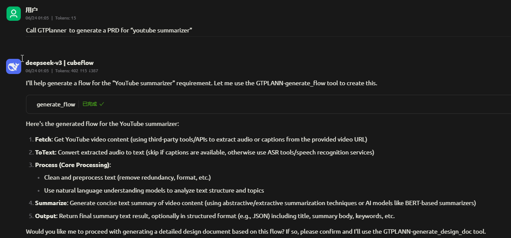
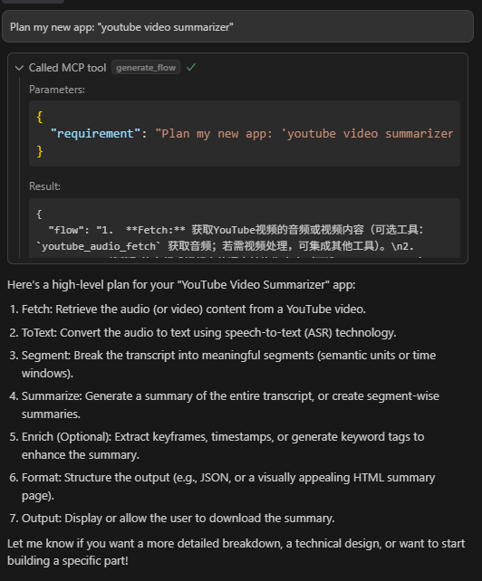
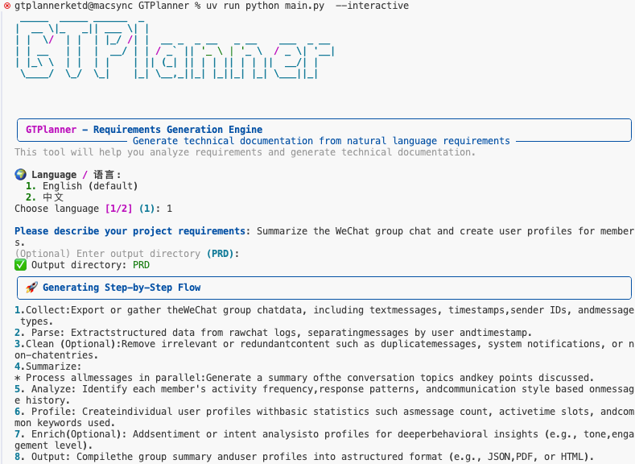
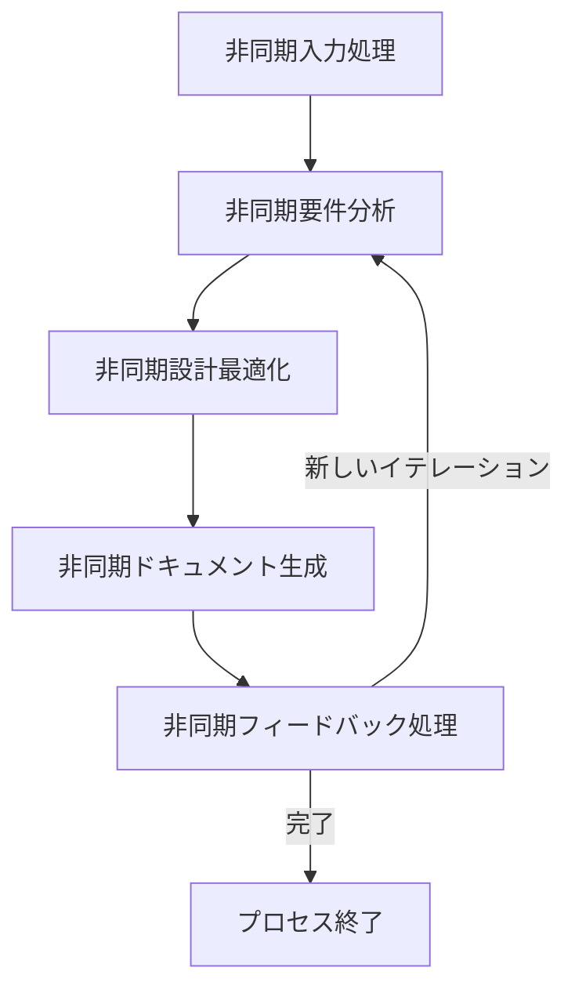

# GTPlanner: AI搭載のPRD生成ツール

<p align="center">
  
</p>

<p align="center">
  <strong>自然言語の記述を、Vibeコーディングに適した構造化された技術文書に変換する、インテリジェントな製品要求仕様書（PRD）生成ツールです。</strong>
</p>

<p align="center">
  <a href="#-概要">概要</a> •
  <a href="#-web-ui-推奨">Web UI </a> •
  <a href="#mcp統合">MCP統合</a> •
  <a href="#-機能">機能</a> •
  <a href="#-環境要件-バックエンドとcli">環境要件</a> •
  <a href="#-インストール-バックエンドとcli">インストール</a> •
  <a href="#️-使用方法">使用方法</a> •
  <a href="#️-アーキテクチャ">アーキテクチャ</a> •
  <a href="#-プロジェクト構造">プロジェクト構造</a> •
  <a href="#-依存関係">依存関係</a> •
  <a href="#-多言語サポート">多言語サポート</a> •
  <a href="#-貢献">貢献</a> •
  <a href="#-ライセンス">ライセンス</a> •
  <a href="#-謝辞">謝辞</a>
</p>

<p align="center">
  <strong>言語版:</strong>
  <a href="README.md">🇺🇸 English</a> •
  <a href="README_zh-CN.md">🇨🇳 简体中文</a> •
  <a href="README_ja.md">🇯🇵 日本語</a>
</p>

---

## 🎯 概要

GTPlannerは、「vibeコーディング」のために設計された先進的なAIツールで、高レベルのアイデアや要件を、構造が明確で内容が詳細な技術文書に効率的に変換することを目的としています。最新の**Webインターフェース**を通じて、GTPlannerの全機能を体験することをお勧めします。

深い統合やカスタム開発を希望する開発者向けに、強力なバックエンドエンジンも提供しています。これは非同期・ノードベースのアーキテクチャを採用し、インタラクティブなCLI、REST API、MCPサービスなど、複数の利用方法をサポートしています。

このプロジェクトは、2つの主要な部分から構成されています：
- **💻 GTPlanner-frontend (Web UI)**：機能豊富でインタラクティブなオンラインプランニング体験を提供します。（推奨）[🚀 ライブデモを今すぐ体験！](https://the-agent-builder.com/)
- **⚙️ GTPlanner (Backend)**：CLIやAPIなど、多様な統合方法を提供する強力なバックエンドエンジン。

## 💻 Web UI (推奨)

最高かつ最も便利な体験を得るために、当社のWeb UIの使用を強くお勧めします。現代の開発者向けにカスタマイズされた、スムーズなAIプランニングワークフローを提供します。


**主な利点:**
- **インテリジェントプランニングアシスタント**: AIの支援により、複雑なシステムアーキテクチャやプロジェクト計画を迅速に生成します。
- **即時ドキュメント生成**: プランニングセッションから包括的な技術文書を自動的に作成します。
- **Vibeコーディングのための設計**: Cursor、Windsurf、GitHub Copilotなどの最新のAI開発ツールに完璧に適合するよう出力を最適化します。
- **チームコラボレーション**: 複数のフォーマットでのエクスポートをサポートし、チームとの共有や協力を容易にします。

## MCP統合
GTPlannerが生成した計画は、お気に入りのAIプログラミングツールで直接使用でき、開発フローにシームレスに連携します：

- Cherry Studioでの使用:
  - 
- Cursorでの使用:
  - 


---

## ✨ 機能

- **🗣️ 自然言語処理**: あなたの要件記述を構造化されたPRDに変換します。
- **🌍 多言語サポート**: 英語、中国語、スペイン語、フランス語、日本語を完全にサポートし、自動言語検出機能を備えています。詳細は[多言語ガイド](docs/multilingual-guide.md)をご覧ください。
- **📝 Markdownサポート**: 既存のMarkdownドキュメントを処理し、統合します。
- **⚡ 非同期処理**: 完全非同期のパイプラインにより、迅速な応答性能を保証します。
- **🔄 反復的な最適化**: インタラクティブなフィードバックループを通じて、ドキュメントを反復的に最適化します。
- **📊 構造化された出力**: 標準化され、カスタマイズ可能な技術文書を生成します。
- **🧩 拡張可能なアーキテクチャ**: モジュール化されたノード設計により、カスタマイズと拡張が容易です。
- **🌐 多様なインターフェース**: CLI、FastAPI、MCPプロトコルを完全にサポートします。
- **🔧 LLM非依存**: 設定可能なエンドポイントにより、さまざまな大規模言語モデル（LLM）と互換性があります。
- **📁 自動ファイル管理**: ファイル名と出力ディレクトリを自動的に生成します。
- **🎯 スマート言語検出**: ユーザーの言語を自動検出し、適切な応答を提供します。

---

## 📋 環境要件 (バックエンドとCLI)

- **Python**: 3.10以降
- **パッケージマネージャー**: [uv](https://github.com/astral-sh/uv) (推奨) または pip
- **LLM APIアクセス**: OpenAI互換のAPIエンドポイント (例：OpenAI, Anthropic, またはローカルモデル)

## 🚀 インストール (バックエンドとCLI)

1. このリポジトリをクローンします

```bash
git clone https://github.com/OpenSQZ/GTPlanner.git
cd GTPlanner
```

2. 依存関係をインストールします

uvを使用 (推奨):
```bash
uv sync
```

pipを使用:
```bash
pip install -r requirements.txt
```

3. 設定

GTPlannerは、OpenAI互換のAPIをサポートしています。`settings.toml`ファイルでLLM、APIキー、環境変数、言語を設定できます。デフォルト言語は英語です。

```bash
export LLM_API_KEY="your-api-key-here"
```

## 🛠️ 使用方法

### 🖥️ CLIモード

コマンドラインを好む開発者向けに、GTPlannerは**インタラクティブモード**と**直接実行モード**をサポートする強力なコマンドラインインターフェースを提供します。



#### インタラクティブモード

CLIを初めて使用するユーザーに推奨される方法で、プロセス全体をガイドします。

インタラクティブCLIを起動:
```bash
uv run python main.py --interactive
```
または、Windowsではバッチスクリプト`start_cli.bat`を使用します。

**ワークフロー例:**
1.  起動後、言語を選択します。
2.  自然言語でプロジェクトの要件を入力します。
3.  (オプション) 出力ディレクトリを指定します。
4.  ツールがステップバイステップのプロセスを生成し、反復的な最適化のためにあなたのフィードバックを待ちます。
5.  'q'を入力して保存し、終了します。

#### 直接実行モード (非インタラクティブモード)

自動化スクリプトや迅速な生成タスクのために、コマンドライン引数で直接入力を提供し、ワンステップで完了できます。

**使用例:**
```bash
uv run python main.py --input "WeChatグループチャットを要約し、メンバーのユーザープロファイルを作成する" --output-dir "wechat_analyzer" --lang "ja"
```

**主なパラメータ:**
-   `--interactive`: インタラクティブモードを起動します。
-   `--input "..."`: 要件文字列を直接入力します。
-   `--output-dir "..."`: ドキュメントを保存するディレクトリを指定します（デフォルトは`PRD`）。
-   `--output "..."`: 具体的な出力ファイル名を指定します（`--output-dir`の設定を上書きします）。
-   `--lang <en|ja>`: 言語を設定します（デフォルトは`en`）。

### 🌐 FastAPIバックエンド

REST APIサービスを起動します:

```bash
uv run fastapi_main.py
```

サービスはデフォルトで`http://0.0.0.0:11211`で実行されます。`http://0.0.0.0:11211/docs`にアクセスして、インタラクティブなAPIドキュメントを表示できます。

**利用可能なエンドポイント:**

当社のAPIは、最大限の柔軟性を実現するために、標準、ストリーミング、統合対話など、複数のエンドポイントを提供します。

*   **統合対話エンドポイント (推奨)**
    *   `POST /chat/unified`: 強力なストリーミングファーストのエンドポイントです。意図認識、コンテキスト対話、計画生成、ドキュメント生成機能を統合しています。GTPlanner Web UIのようなインタラクティブなアプリケーションを構築するための推奨インターフェースです。

*   **ストリーミング計画エンドポイント**
    *   `POST /planning/short/stream`: ストリーミング応答を通じて、高レベルの計画を段階的に生成します。
    *   `POST /planning/long/stream`: ストリーミング応答を通じて、詳細な設計書を生成します。長時間のタスクでリアルタイムに進捗を表示するのに最適です。

*   **標準計画エンドポイント**
    *   `POST /planning/short`: 単一の応答で、完全な高レベルの計画を生成します。
    *   `POST /planning/long`: 単一の応答で、完全な詳細設計書を生成します。

### 🔌 MCPサービス (AI統合に推奨)

MCPサービスはAIアシスタントとシームレスに統合し、直接関数呼び出しをサポートします。

1. MCPサービスを起動します。

```bash
cd mcp
uv sync
uv run python mcp_service.py
```

2. MCPクライアントを設定します。

```json
{
  "mcpServers": {
    "GT-planner": {
      "url": "http://127.0.0.1:8001/mcp"
    }
  }
}
```

**利用可能なMCPツール:**
- `generate_flow`: 要件から計画フローを生成します。
- `generate_design_doc`: 詳細なPRDを作成します。

---

## 🏗️ アーキテクチャ

GTPlannerは、PocketFlow上に構築された非同期ノードベースのアーキテクチャを使用しています：

### 主要コンポーネント

1.  **Short Planner Flow** (`short_planner_flow.py`)
    -   高レベルの計画ステップを生成
    -   反復的な最適化をサポート
    -   レビューおよび最終化ノードを含む

2.  **Function Calling System** (`agent/function_calling/`)
    -   OpenAI Function Callingベースのインテリジェントツール呼び出し
    -   要件分析、研究、アーキテクチャ設計などの専門ツール

3.  **Agent System** (`agent/`)
    -   専門化されたAgentサブフロー
    -   原子能力ノード
    -   統一された状態管理

### フローチャート



### ユーティリティ関数 (`utils/`)

- **`call_llm.py`**: JSON修復機能を備えた非同期/同期のLLM通信
- **`parse_markdown.py`**: Markdownドキュメントを処理し、その構造を抽出
- **`format_documentation.py`**: 標準化されたドキュメントフォーマット
- **`store_conversation.py`**: 対話履歴を管理

---

## 📦 プロジェクト構造

```
GTPlanner/
├── gtplanner.py               # メインCLI起動スクリプト
├── short_planner_flow.py      # 短期計画フローの実装
├── nodes.py                   # 主要な非同期ノードの実装
├── fastapi_main.py            # FastAPIバックエンドサービス
├── settings.toml              # 設定ファイル
├── pyproject.toml             # プロジェクトメタデータと依存関係
├── cli/                       # モダンCLI実装
│   ├── gtplanner_cli.py      # Function CallingベースのCLI
│   └── session_manager.py    # セッション管理
├── agent/                     # コアAgentシステム
│   ├── flows/                # メイン編成フロー
│   ├── subflows/             # 専門化されたAgentサブフロー
│   ├── nodes/                # 原子能力ノード
│   ├── function_calling/     # Function Callingツール
│   └── shared.py             # 共有状態管理
├── api/                       # API実装
│   └── v1/
│       └── planning.py       # 計画エンドポイント
├── mcp/                      # MCPサービス
│   ├── mcp_service.py       # MCPサーバー実装
│   └── pyproject.toml       # MCP固有の依存関係
├── tools/                    # ツール推奨システム
│   ├── apis/                # APIタイプツール定義
│   │   ├── example_openweather.yml
│   │   └── ...
│   └── python_packages/     # Pythonパッケージタイプツール定義
│       ├── example_yt_dlp.yml
│       └── ...
├── utils/                    # ユーティリティ関数
│   ├── call_llm.py          # LLM通信
│   ├── parse_markdown.py    # Markdown処理
│   ├── format_documentation.py # 文書フォーマット
│   └── store_conversation.py   # 会話管理
├── docs/                     # 設計文書
│   ├── design.md            # メインアーキテクチャ設計
│   └── design-longplan.md   # 長期計画API設計
├── output/                   # 生成された文書出力
└── assets/                   # プロジェクトアセット
    └── banner.png           # プロジェクトバナー
```

---

## 📚 依存関係

### 主要な依存関係
- **Python** >= 3.10
- **openai** >= 1.0.0 - LLM API通信
- **pocketflow** == 0.0.1 - 非同期ワークフローエンジン
- **dynaconf** >= 3.1.12 - 設定管理
- **aiohttp** >= 3.8.0 - 非同期HTTPクライアント
- **json-repair** >= 0.45.0 - JSONレスポンスの修復
- **python-dotenv** >= 1.0.0 - 環境変数の読み込み

### APIの依存関係
- **fastapi** == 0.115.9 - REST APIフレームワーク
- **uvicorn** == 0.23.1 - ASGIサーバー
- **pydantic** - データ検証

### MCPの依存関係
- **fastmcp** - モデルコンテキストプロトコル（MCP）の実装

---

## 🌍 多言語サポート

GTPlanner は包括的な多言語サポートを提供し、世界中の開発者が母国語でプロジェクト計画を立てることができます。

### サポートされている言語

| 言語 | コード | 現地名 |
|------|--------|--------|
| 英語 | `en` | English |
| 中国語 | `zh` | 中文 |
| スペイン語 | `es` | Español |
| フランス語 | `fr` | Français |
| 日本語 | `ja` | 日本語 |

### 主要機能

- **🔍 自動言語検出**: ユーザー入力の言語を自動的に識別
- **🎯 言語優先システム**: ユーザーの設定とリクエストに基づいて最適な言語を自動選択
- **📝 ローカライズされたプロンプトテンプレート**: 各言語に文化的に適応したプロンプトテンプレートを提供
- **🔄 スマートフォールバック機能**: 要求された言語が利用できない場合、自動的にデフォルト言語にフォールバック

### 使用方法

#### CLIモード
```bash
# 言語を指定
uv run python main.py --lang ja --input "WeChatグループチャットを要約し、メンバーのユーザープロファイルを作成する"

# 自動検出（日本語入力は自動的に認識されます）
uv run python main.py --input "WeChatグループチャットを要約し、メンバーのユーザープロファイルを作成する"
```

#### APIモード
```python
# 明示的な言語指定
response = requests.post("/planning/short", json={
    "requirement": "WeChatグループチャットを要約し、メンバーのユーザープロファイルを作成する",
    "language": "ja"
})

# 自動検出
response = requests.post("/planning/short", json={
    "requirement": "WeChatグループチャットを要約し、メンバーのユーザープロファイルを作成する"
})
```

### 設定

`settings.toml` で多言語設定を構成：

```toml
[default.multilingual]
default_language = "en"
auto_detect = true
fallback_enabled = true
supported_languages = ["en", "zh", "es", "fr", "ja"]
```

詳細な多言語機能と設定ガイドについては、[多言語ガイド](docs/multilingual-guide.md)をご参照ください。

---

## 🤝 貢献

貢献とコラボレーションを歓迎し、高く評価しています。[貢献ガイド](CONTRIBUTING.md)をチェックして参加してください。

### 🔧 ツールの貢献

GTPlannerには、コミュニティが貢献したツールをサポートするインテリジェントツール推奨システムが含まれています。2つのカテゴリで高品質なツールの貢献を歓迎します：

#### サポートされているツールタイプ

**🌐 APIツール (APIS)**
- Web APIとRESTサービス
- クラウドベースの処理ツール
- 外部サービス統合
- リアルタイムデータ処理API

**📦 Pythonパッケージツール (PYTHON_PACKAGE)**
- PyPIパッケージとライブラリ
- ローカル処理ツール
- データ分析パッケージ
- ユーティリティライブラリ

#### ツールの貢献方法

1. **適切なテンプレートを選択**：より良い組織化のために専用PRテンプレートを使用：
   - [APIツールテンプレート](.github/PULL_REQUEST_TEMPLATE/api_tool.md) - Web APIとサービス用
   - [Pythonパッケージテンプレート](.github/PULL_REQUEST_TEMPLATE/python_package_tool.md) - PyPIパッケージ用

2. **品質基準**：貢献されるすべてのツールは品質基準を満たす必要があります：
   - ✅ 公開アクセス可能で十分に文書化されている
   - ✅ 安定しており積極的にメンテナンスされている
   - ✅ 明確な使用例と統合ガイド
   - ✅ 適切なエラーハンドリングとセキュリティ実践
   - ✅ 既存ツールとの機能重複なし

3. **ツール情報形式**：各ツールには以下が必要：
   - 一意の識別子（例：`org.tool-name`）
   - 包括的な説明とユースケース
   - 完全なAPI仕様またはパッケージ詳細
   - 動作する例と統合コード
   - テストと検証結果

4. **レビュープロセス**：すべてのツール貢献は以下を経ます：
   - 技術的正確性レビュー
   - 品質とセキュリティ評価
   - ドキュメント完全性チェック
   - コミュニティフィードバック統合

#### 🛠️ ツール定義形式

すべてのツールは以下のコアフィールドを含むYAML形式で定義されます：

**共通フィールド：**
- **id**: ツールの一意識別子
- **type**: ツールタイプ（"APIS" または "PYTHON_PACKAGE"）
- **summary**: 一行での機能概要
- **description**: 詳細な機能説明
- **examples**: 使用例

**APISタイプ追加フィールド：**
- **base_url**: APIのベースURL
- **endpoints**: APIエンドポイント定義の配列
  - **summary**: エンドポイント機能の説明
  - **method**: HTTPメソッド（GET、POST、PUT、DELETE等）
  - **path**: エンドポイントパス
  - **inputs**: 入力パラメータ定義（JSON Schema形式）
  - **outputs**: 出力結果定義（JSON Schema形式）

**PYTHON_PACKAGEタイプ追加フィールド：**
- **requirement**: PyPIパッケージインストール要件（例："package-name==1.0.0"）

#### サンプルツール

**APIツールの例**
APIツールの定義方法については `tools/apis/example_openweather.yml` を参照してください。

**Pythonパッケージの例**
Pythonパッケージツールの定義方法については `tools/python_packages/example_yt_dlp.yml` を参照してください。

#### ツール形式の例

**APIツールの例：**
```yaml
id: "public.weather-api"
type: "APIS"
summary: "世界の都市のリアルタイム天気情報を取得。"
description: |
  公開天気APIを通じて、指定された都市の現在の天気、温度、湿度、
  風速などの詳細な気象データを照会できます。完全無料で使用でき、登録やAPIキーは不要です。
base_url: "https://api.open-meteo.com/v1"
endpoints:
  - method: "GET"
    path: "/forecast"
    summary: "経緯度座標による現在の天気データを取得"
```

**Pythonパッケージの例：**
```yaml
id: "pypi.yt-dlp"
type: "PYTHON_PACKAGE"
summary: "数千の動画サイトをサポートする強力な動画ダウンローダー。"
description: |
  yt-dlpはyoutube-dlの機能強化版で、YouTube、Bilibili、TikTokなど
  数千の動画サイトから動画と音声をダウンロードできます。
requirement: "yt-dlp"
```

詳細な貢献ガイドラインについては、[ツール貢献テンプレート](.github/PULL_REQUEST_TEMPLATE/)を参照してください。

### 一般的な貢献フロー

1. リポジトリをフォーク
2. 機能ブランチを作成（`git checkout -b feature/amazing-feature`）
3. 変更をコミット（`git commit -m 'Add amazing feature'`）
4. ブランチにプッシュ（`git push origin feature/amazing-feature`）
5. プルリクエストを開く


## 📄 ライセンス

このプロジェクトはMITライセンスに基づいています。詳細は[LICENSE](LICENSE.md)ファイルをご覧ください。

## 🙏 謝辞

- [PocketFlow](https://github.com/The-Pocket/PocketFlow)非同期ワークフローエンジンをベースに構築
- 設定管理は[Dynaconf](https://www.dynaconf.com/)によって提供
- MCPプロトコルを介してAIアシスタントとシームレスに統合することを目指して設計

---

**GTPlanner** - AIの力で、あなたのアイデアを構造化された技術文書に変換します。
