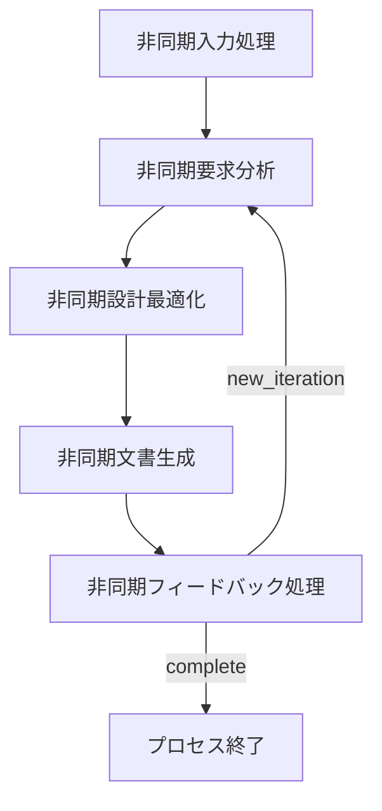

# GTPlanner: AI駆動のPRD生成ツール

<p align="center">
  
</p>

<p align="center">
  <strong>自然言語の説明を包括的な技術文書に変換するインテリジェントな製品要求仕様書（PRD）生成ツール</strong>
</p>

<p align="center">
  <a href="#-概要">概要</a> •
  <a href="#-機能">機能</a> •
  <a href="#-インストール">インストール</a> •
  <a href="#️-使用方法">使用方法</a> •
  <a href="#️-アーキテクチャ">アーキテクチャ</a> •
  <a href="#-多言語サポート">多言語サポート</a> •
  <a href="#-設定">設定</a> •
  <a href="#-貢献">貢献</a>
</p>

<p align="center">
  <strong>言語版:</strong>
  <a href="README.md">🇺🇸 English</a> •
  <a href="README_zh-CN.md">🇨🇳 简体中文</a> •
  <a href="README_ja.md">🇯🇵 日本語</a>
</p>

---

## 🎯 概要

GTPlannerは「バイブコーディング」のために設計された高度なAI駆動ツールです。高レベルなアイデアや要求を詳細で構造化された技術文書に変換します。[PocketFlow](https://github.com/The-Pocket/PocketFlow)を使用した非同期ノードベースアーキテクチャで構築され、インタラクティブなCLI使用とプログラマティックなAPIアクセスの両方をサポートします。

このプロジェクトは3つの主要コンポーネントで構成されています：
- **CLIインターフェース**：要求処理のためのインタラクティブなコマンドラインツール
- **FastAPIバックエンド**：プログラマティックアクセス用のREST APIサービス
- **MCPサービス**：AIアシスタントとのシームレスな統合のためのModel Context Protocol統合

## ✨ 機能

- **🗣️ 自然言語処理**：自然言語の要求を構造化されたPRDに変換
- **🌍 多言語サポート**：英語、中国語、スペイン語、フランス語、日本語の完全サポートと自動言語検出
- **📝 Markdownサポート**：既存のMarkdown文書の処理と統合
- **⚡ 非同期処理**：レスポンシブなパフォーマンスのための完全非同期パイプライン
- **🔄 マルチターン最適化**：反復的な文書改良のためのインタラクティブフィードバックループ
- **📊 構造化出力**：標準化されたカスタマイズ可能な技術文書の生成
- **🧩 拡張可能なアーキテクチャ**：簡単なカスタマイズのためのモジュラーノードベース設計
- **🌐 複数のインターフェース**：CLI、FastAPI、MCPプロトコルサポート
- **🔧 LLM非依存**：設定可能なエンドポイントを介して様々な言語モデルと互換
- **📁 自動ファイル管理**：自動ファイル名生成と出力整理

## スクリーンショット

- Cherry Studioでの使用：
  - 
- Cursorでの使用：
  - 
---

## 📋 前提条件

- **Python**：3.10以上
- **パッケージマネージャー**：[uv](https://github.com/astral-sh/uv)（推奨）またはpip
- **LLM APIアクセス**：OpenAI互換のAPIエンドポイント（OpenAI、Anthropic、ローカルモデルなど）

## 🚀 インストール

### 1. リポジトリのクローン

```bash
git clone https://github.com/your-org/GTPlanner.git
cd GTPlanner
```

### 2. 依存関係のインストール

uvを使用（推奨）：
```bash
uv sync
```

pipを使用：
```bash
pip install -r requirements.txt
```

### 3. 設定

GTPlannerは設定管理に[Dynaconf](https://www.dynaconf.com/)を使用します。`settings.toml`を編集してLLMサービスを設定してください：

```toml
[default.llm]
base_url = "https://api.openai.com/v1"  # あなたのLLM APIエンドポイント
api_key = "your-api-key-here"           # あなたのAPIキー
model = "gpt-4"                         # モデル名
```

#### 環境変数（代替方法）

環境変数を使用することもできます：

```bash
export LLM_API_KEY="your-api-key-here"
export LLM_BASE_URL="https://api.openai.com/v1"
export LLM_MODEL="gpt-4"
```

---

## 🛠️ 使用方法

### 🖥️ CLIモード（インタラクティブ）

インタラクティブCLIを開始：

```bash
uv run python main.py
# またはWindowsでバッチスクリプトを使用
start_cli.bat
```

**機能：**
- インタラクティブな要求入力
- オプションのMarkdownファイル統合
- マルチターンフィードバックと最適化
- `output/`ディレクトリへの自動ファイル保存

**ワークフローの例：**
1. プロジェクト要求を自然言語で入力
2. オプションで既存のMarkdown文書を提供
3. 生成された文書をレビュー
4. 反復的な改良のためのフィードバックを提供
5. 'q'を入力して保存・終了

### 🌐 FastAPIバックエンド

REST APIサービスを開始：

```bash
uv run fastapi_main.py
```

サービスはデフォルトで`http://0.0.0.0:11211`で実行されます。インタラクティブなAPI文書は`http://0.0.0.0:11211/docs`で確認できます。

**利用可能なエンドポイント：**
- `POST /planning/short` - 短い計画フローの生成
- `POST /planning/long` - 詳細な設計文書の生成

### 🔌 MCPサービス（AI統合に推奨）

MCPサービスはAIアシスタントとのシームレスな統合を提供し、直接関数呼び出しをサポートします。

1. MCPサービスを開始：

```bash
cd mcp
uv sync
uv run python mcp_service.py
```

2. MCPクライアントを設定：

```json
{
  "mcpServers": {
    "GT-planner": {
      "url": "http://127.0.0.1:8001/mcp"
    }
  }
}
```

**利用可能なMCPツール：**
- `generate_flow` - 要求から計画フローを生成
- `generate_design_doc` - 詳細な設計文書を作成

---

## 🏗️ アーキテクチャ

GTPlannerはPocketFlowで構築された非同期ノードベースアーキテクチャを使用します：

### コアコンポーネント

1. **短期計画フロー**（`short_planner_flow.py`）
   - 高レベルな計画ステップの生成
   - 反復的最適化のサポート
   - レビューと最終化ノードを含む

2. **メイン要求エンジン**（`cli_flow.py`）
   - 完全な文書生成パイプライン
   - フィードバックループを持つマルチステージ処理

3. **ノード実装**（`nodes.py`）
   - `AsyncInputProcessingNode`：ユーザー入力処理を担当
   - `AsyncRequirementsAnalysisNode`：要求の抽出と分類
   - `AsyncDesignOptimizationNode`：改善と最適化の提案
   - `AsyncDocumentationGenerationNode`：構造化文書の作成
   - `AsyncFeedbackProcessingNode`：反復的改良の管理

### フロー図



### ユーティリティ関数（`utils/`）

- **`call_llm.py`**：JSON修復機能付きの非同期/同期LLM通信
- **`parse_markdown.py`**：Markdown文書処理と構造抽出
- **`format_documentation.py`**：標準化された文書フォーマット
- **`store_conversation.py`**：永続化機能付きの会話履歴管理

---

## 📦 プロジェクト構造

```
GTPlanner/
├── main.py                    # メインCLIエントリーポイント
├── cli.py                     # 簡略化CLIエントリーポイント
├── cli_flow.py               # メイン要求エンジンフロー定義
├── short_planner_flow.py     # 短期計画フロー実装
├── filename_flow.py          # 自動ファイル名生成
├── nodes.py                  # コア非同期ノード実装
├── fastapi_main.py           # FastAPIバックエンドサービス
├── settings.toml             # 設定ファイル
├── pyproject.toml            # プロジェクトメタデータと依存関係
├── requirements.txt          # Python依存関係
├── start_cli.bat            # Windowsバッチスクリプト
├── api/                      # API実装
│   └── v1/
│       └── planning.py       # 計画エンドポイント
├── mcp/                      # MCPサービス
│   ├── mcp_service.py       # MCPサーバー実装
│   └── pyproject.toml       # MCP固有の依存関係
├── tools/                    # ツール推奨システム
│   ├── apis/                # APIタイプツール定義
│   │   ├── example_openweather.yml
│   │   └── ...
│   └── python_packages/     # Pythonパッケージタイプツール定義
│       ├── example_yt_dlp.yml
│       └── ...
├── utils/                    # ユーティリティ関数
│   ├── call_llm.py          # LLM通信
│   ├── parse_markdown.py    # Markdown処理
│   ├── format_documentation.py # 文書フォーマット
│   └── store_conversation.py   # 会話管理
├── docs/                     # 設計文書
│   ├── design.md            # メインアーキテクチャ設計
│   └── design-longplan.md   # 長期計画API設計
├── output/                   # 生成された文書出力
└── assets/                   # プロジェクトアセット
    └── banner.png           # プロジェクトバナー
```

---

## 🌍 多言語サポート

GTPlannerは自動言語検出と文化的に適応した応答を備えた包括的な多言語機能を提供します。

### サポートされている言語

| 言語 | コード | ネイティブ名 | ステータス |
|------|--------|-------------|-----------|
| 英語 | `en` | English | ✅ 完全サポート |
| 中国語 | `zh` | 中文 | ✅ 完全サポート |
| スペイン語 | `es` | Español | ✅ 完全サポート |
| フランス語 | `fr` | Français | ✅ 完全サポート |
| 日本語 | `ja` | 日本語 | ✅ 完全サポート |

### 主な機能

- **🔍 自動言語検出**：入力テキストからユーザーの言語を検出
- **🎯 スマートフォールバック**：必要に応じてデフォルト言語にフォールバック
- **🌐 文化的適応**：各言語の文化的背景に適応したプロンプト
- **⚙️ 設定可能**：デフォルト言語と設定の簡単な設定

### クイック使用法

```python
# 明示的な言語でのAPI
response = requests.post("/planning/short", json={
    "requirement": "ウェブアプリケーションを作成する",
    "language": "ja"
})

# 自動検出（日本語の例）
response = requests.post("/planning/short", json={
    "requirement": "ウェブアプリケーションを作成する"
})
```

詳細な多言語設定と使用方法については、[多言語ガイド](docs/multilingual-guide.md)を参照してください。

---

## 🔧 設定

### LLM設定

GTPlannerは任意のOpenAI互換APIをサポートします。`settings.toml`で設定：

```toml
[default]
debug = false

[default.llm]
base_url = "https://api.openai.com/v1"
api_key = "@format {env[LLM_API_KEY]}"
model = "gpt-4"
```

### 環境変数

```bash
# 必須
LLM_API_KEY=your-api-key-here

# オプション（デフォルトはOpenAI）
LLM_BASE_URL=https://api.openai.com/v1
LLM_MODEL=gpt-4
```

### 多言語設定

```toml
[default.multilingual]
default_language = "ja"
auto_detect = true
supported_languages = ["en", "zh", "es", "fr", "ja"]
```

```bash
# 環境変数
GTPLANNER_DEFAULT_LANGUAGE=ja
GTPLANNER_AUTO_DETECT=true
```

---

## 📚 依存関係

### コア依存関係
- **Python** >= 3.10
- **openai** >= 1.0.0 - LLM API通信
- **pocketflow** == 0.0.1 - 非同期ワークフローエンジン
- **dynaconf** >= 3.1.12 - 設定管理
- **aiohttp** >= 3.8.0 - 非同期HTTPクライアント
- **json-repair** >= 0.45.0 - JSONレスポンス修復
- **python-dotenv** >= 1.0.0 - 環境変数読み込み

### API依存関係
- **fastapi** == 0.115.9 - REST APIフレームワーク
- **uvicorn** == 0.23.1 - ASGIサーバー
- **pydantic** - データ検証

### MCP依存関係
- **fastmcp** - Model Context Protocol実装

---

## 🤝 貢献

貢献とコラボレーションを歓迎し、高く評価しています。[貢献ガイド](CONTRIBUTING.md)をチェックして参加してください。

### 🔧 ツールの貢献

GTPlannerには、コミュニティが貢献したツールをサポートするインテリジェントツール推奨システムが含まれています。2つのカテゴリで高品質なツールの貢献を歓迎します：

#### サポートされているツールタイプ

**🌐 APIツール (APIS)**
- Web APIとRESTサービス
- クラウドベースの処理ツール
- 外部サービス統合
- リアルタイムデータ処理API

**📦 Pythonパッケージツール (PYTHON_PACKAGE)**
- PyPIパッケージとライブラリ
- ローカル処理ツール
- データ分析パッケージ
- ユーティリティライブラリ

#### ツールの貢献方法

1. **適切なテンプレートを選択**：より良い組織化のために専用PRテンプレートを使用：
   - [APIツールテンプレート](.github/PULL_REQUEST_TEMPLATE/api_tool.md) - Web APIとサービス用
   - [Pythonパッケージテンプレート](.github/PULL_REQUEST_TEMPLATE/python_package_tool.md) - PyPIパッケージ用

2. **品質基準**：貢献されるすべてのツールは品質基準を満たす必要があります：
   - ✅ 公開アクセス可能で十分に文書化されている
   - ✅ 安定しており積極的にメンテナンスされている
   - ✅ 明確な使用例と統合ガイド
   - ✅ 適切なエラーハンドリングとセキュリティ実践
   - ✅ 既存ツールとの機能重複なし

3. **ツール情報形式**：各ツールには以下が必要：
   - 一意の識別子（例：`org.tool-name`）
   - 包括的な説明とユースケース
   - 完全なAPI仕様またはパッケージ詳細
   - 動作する例と統合コード
   - テストと検証結果

4. **レビュープロセス**：すべてのツール貢献は以下を経ます：
   - 技術的正確性レビュー
   - 品質とセキュリティ評価
   - ドキュメント完全性チェック
   - コミュニティフィードバック統合

#### 🛠️ ツール定義形式

すべてのツールは以下のコアフィールドを含むYAML形式で定義されます：

**共通フィールド：**
- **id**: ツールの一意識別子
- **type**: ツールタイプ（"APIS" または "PYTHON_PACKAGE"）
- **summary**: 一行での機能概要
- **description**: 詳細な機能説明
- **examples**: 使用例

**APISタイプ追加フィールド：**
- **base_url**: APIのベースURL
- **endpoints**: APIエンドポイント定義の配列
  - **summary**: エンドポイント機能の説明
  - **method**: HTTPメソッド（GET、POST、PUT、DELETE等）
  - **path**: エンドポイントパス
  - **inputs**: 入力パラメータ定義（JSON Schema形式）
  - **outputs**: 出力結果定義（JSON Schema形式）

**PYTHON_PACKAGEタイプ追加フィールド：**
- **requirement**: PyPIパッケージインストール要件（例："package-name==1.0.0"）

#### サンプルツール

**APIツールの例**
APIツールの定義方法については `tools/apis/example_openweather.yml` を参照してください。

**Pythonパッケージの例**
Pythonパッケージツールの定義方法については `tools/python_packages/example_yt_dlp.yml` を参照してください。

#### ツール形式の例

**APIツールの例：**
```yaml
id: "public.weather-api"
type: "APIS"
summary: "世界の都市のリアルタイム天気情報を取得。"
description: |
  公開天気APIを通じて、指定された都市の現在の天気、温度、湿度、
  風速などの詳細な気象データを照会できます。完全無料で使用でき、登録やAPIキーは不要です。
base_url: "https://api.open-meteo.com/v1"
endpoints:
  - method: "GET"
    path: "/forecast"
    summary: "経緯度座標による現在の天気データを取得"
```

**Pythonパッケージの例：**
```yaml
id: "pypi.yt-dlp"
type: "PYTHON_PACKAGE"
summary: "数千の動画サイトをサポートする強力な動画ダウンローダー。"
description: |
  yt-dlpはyoutube-dlの機能強化版で、YouTube、Bilibili、TikTokなど
  数千の動画サイトから動画と音声をダウンロードできます。
requirement: "yt-dlp"
```

詳細な貢献ガイドラインについては、[ツール貢献テンプレート](.github/PULL_REQUEST_TEMPLATE/)を参照してください。

### 一般的な貢献フロー

1. リポジトリをフォーク
2. 機能ブランチを作成（`git checkout -b feature/amazing-feature`）
3. 変更をコミット（`git commit -m 'Add amazing feature'`）
4. ブランチにプッシュ（`git push origin feature/amazing-feature`）
5. プルリクエストを開く

## 📄 ライセンス

このプロジェクトはMITライセンスの下でライセンスされています - 詳細は[LICENSE](LICENSE)ファイルを参照してください。

## 🙏 謝辞

- [PocketFlow](https://github.com/The-Pocket/PocketFlow)非同期ワークフローエンジンで構築
- [Dynaconf](https://www.dynaconf.com/)による設定管理
- MCPプロトコルを介したAIアシスタントとのシームレスな統合のために設計

---

**GTPlanner** - AIの力であなたのアイデアを構造化された技術文書に変換します。
