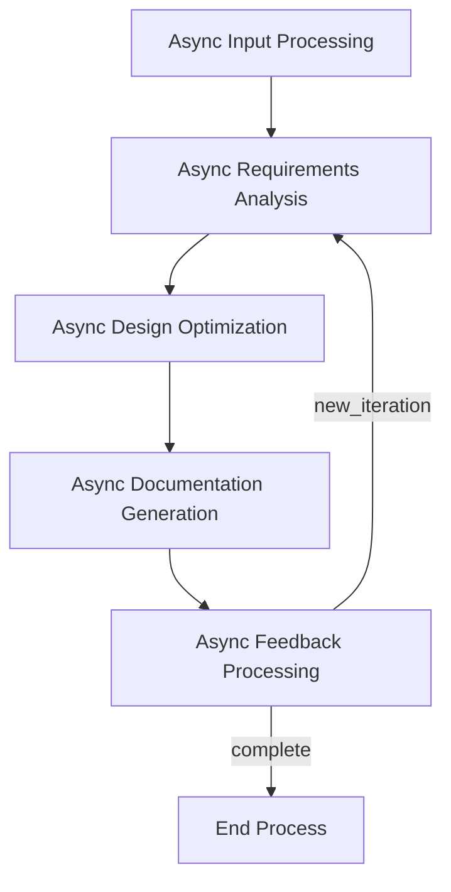

# GTPlanner: AI驱动的PRD生成工具

<p align="center">
  
</p>

<p align="center">
  <strong>一款智能产品需求文档（PRD）生成工具，能将自然语言描述转化为结构化的、适用于 Vibe coding 的技术文档。</strong>
</p>

<p align="center">
  <a href="#-概览">概览</a> •
  <a href="#-web-ui-推荐">Web UI</a> •
  <a href="#mcp集成">MCP集成</a> •
  <a href="#-功能特性">功能特性</a> •
  <a href="#-环境要求-后端和cli">环境要求</a> •
  <a href="#-安装-后端和cli">安装</a> •
  <a href="#️-使用方法">使用方法</a> •
  <a href="#️-系统架构">系统架构</a> •
  <a href="#-项目结构">项目结构</a> •
  <a href="#-依赖">依赖</a> •
  <a href="#-多语言支持">多语言支持</a> •
  <a href="#-参与贡献">参与贡献</a> •
  <a href="#-许可证">许可证</a> •
  <a href="#-致谢">致谢</a>
</p>

<p align="center">
  <strong>语言版本:</strong>
  <a href="README.md">🇺🇸 English</a> •
  <a href="README_zh-CN.md">🇨🇳 简体中文</a> •
  <a href="README_ja.md">🇯🇵 日本語</a>
</p>

---

## 🎯 概览

GTPlanner 是一款专为 "vibe coding" 设计的先进 AI 工具，旨在将高层次的想法和需求，高效转化为结构清晰、内容详尽的技术文档。我们推荐通过我们现代化的 **Web 界面**来体验 GTPlanner 的全部功能。

对于希望进行深度集成和定制开发的开发者，我们同样提供了强大的后端引擎，采用异步、基于节点的架构，并支持交互式 CLI、REST API 以及 MCP 服务等多种使用方式。

该项目包含两个核心部分：
- **💻 GTPlanner-frontend (Web UI)**：提供功能丰富、交互友好的在线规划体验。（推荐）[🚀 立刻体验 Live Demo!](https://the-agent-builder.com/)
- **⚙️ GTPlanner (Backend)**：强大的后端引擎，提供 CLI、API 等多种集成方式。

## 💻 Web UI (推荐)

为了获得最佳且最便捷的体验，我们强烈建议您使用我们的 Web UI。它提供了一个为现代开发者量身打造的、流畅的 AI 规划工作流。


**核心优势:**
- **智能规划助手**: 通过 AI 辅助，快速生成复杂的系统架构和项目计划。
- **即时文档生成**: 从您的规划会话中自动创建全面的技术文档。
- **为 Vibe Coding 而生**: 优化输出，完美适配 Cursor、Windsurf、GitHub Copilot 等现代 AI 开发工具。
- **团队协作**: 支持多种格式导出，方便与团队共享和协作。

## mcp集成
GTPlanner 生成的计划可以直接在您最喜欢的 AI 编程工具中使用，无缝衔接您的开发流程：

- 在 Cherry Studio 中:
  - 
- 在 Cursor 中:
  - 


---

## ✨ 功能特性

- **🗣️ 自然语言处理**: 将您的需求描述转化为结构化的 PRD。
- **🌍 多语言支持**: 全面支持英语、中文、西班牙语、法语和日语，并具备自动语言检测功能。详情请参阅 [多语言指南](docs/multilingual-guide.md)。
- **📝 Markdown 支持**: 处理并集成已有的 Markdown 文档。
- **⚡ 异步处理**: 完全异步的流水线，确保了响应迅速的性能。
- **🔄 多轮优化**: 通过交互式反馈循环，迭代优化文档。
- **📊 结构化输出**: 生成标准化、可定制的技术文档。
- **🧩 可扩展架构**: 模块化的节点设计，便于定制和扩展。
- **🌐 多种接口**: 全面支持 CLI、FastAPI 和 MCP 协议。
- **🔧 LLM 无关性**: 通过可配置的端点，与各类大语言模型（LLM）兼容。
- **📁 自动文件管理**: 自动生成文件名和输出目录。
- **🎯 智能语言检测**: 自动检测用户语言并提供相应的响应。

---

## 📋 环境要求 (后端和CLI)

- **Python**: 3.10 或更高版本
- **包管理器**: [uv](https://github.com/astral-sh/uv) (推荐) 或 pip
- **LLM API 访问**: 任何兼容 OpenAI 的 API 端点 (例如 OpenAI, Anthropic, 或本地模型)

## 🚀 安装 (后端和CLI)

1. 克隆本仓库

```bash
git clone https://github.com/OpenSQZ/GTPlanner.git
cd GTPlanner
```

2. 安装依赖

使用 uv (推荐):
```bash
uv sync
```

使用 pip:
```bash
pip install -r requirements.txt
```

3. 配置

GTPlanner 支持任何兼容 OpenAI 的 API。您可以在 `settings.toml` 文件中配置您的 LLM、API 密钥、环境变量和语言。默认语言是英语。

```bash
export LLM_API_KEY="your-api-key-here"
```

## 🛠️ 使用方法

### 🖥️ CLI 模式

对于喜欢命令行的开发者，GTPlanner 提供了功能强大的命令行界面，支持**交互模式**和**直接执行模式**。


#### 交互模式 (Interactive Mode)

这是推荐给首次使用 CLI 的用户的方式，它会引导您完成整个流程。

启动交互式 CLI:
```bash
uv run python main.py --interactive
```
或者在 Windows 上使用批处理脚本 `start_cli.bat`。

**工作流程示例:**
1.  启动后，选择语言。
2.  用自然语言输入您的项目需求。
3.  (可选) 指定输出目录。
4.  工具将生成分步流程，并等待您的反馈进行迭代优化。
5.  输入 'q' 保存并退出。

#### 直接执行模式 (Non-Interactive Mode)

对于自动化脚本或快速生成任务，您可以通过命令行参数直接提供输入，一步到位。

**用法示例:**
```bash
uv run python main.py --input "总结微信群聊记录并为成员创建用户画像" --output-dir "wechat_analyzer" --lang "zh"
```

**常用参数:**
-   `--interactive`: 启动交互模式。
-   `--input "..."`: 直接输入您的需求字符串。
-   `--output-dir "..."`: 指定保存文档的目录（默认为 `PRD`）。
-   `--output "..."`: 指定具体的输出文件名（会覆盖 `--output-dir` 的设定）。
-   `--lang <en|zh>`: 设置语言（默认为 `en`）。

### 🌐 FastAPI 后端

启动 REST API 服务:

```bash
uv run fastapi_main.py
```

服务默认运行在 `http://0.0.0.0:11211`。访问 `http://0.0.0.0:11211/docs` 可查看交互式 API 文档。

**可用端点:**

我们的 API 提供标准、流式和统一对话等多种端点，以实现最大灵活性。

*   **统一对话端点 (推荐)**
    *   `POST /chat/unified`: 一个功能强大的、流式优先的端点。它集成了意图识别、上下文对话、规划生成和文档生成功能。这是构建如 GTPlanner Web UI 这类交互式应用的首选接口。

*   **流式规划端点**
    *   `POST /planning/short/stream`: 通过流式响应，逐步生成一个高阶计划。
    *   `POST /planning/long/stream`: 通过流式响应，生成详细的设计文档，非常适合在长任务中实时展示进度。

*   **标准规划端点**
    *   `POST /planning/short`: 在单次响应中，生成一个完整的高阶计划。
    *   `POST /planning/long`: 在单次响应中，生成一份完整的详细设计文档。


### 🔌 MCP 服务 (推荐用于AI集成)

MCP 服务可以与 AI 助手无缝集成，并支持直接函数调用。

1. 启动 MCP 服务。

```bash
cd mcp
uv sync
uv run python mcp_service.py
```

2. 配置您的 MCP 客户端。

```json
{
  "mcpServers": {
    "GT-planner": {
      "url": "http://127.0.0.1:8001/mcp"
    }
  }
}
```

**可用的 MCP 工具:**
- `generate_flow`: 从需求生成规划流程。
- `generate_design_doc`: 创建详细的 PRD。

---

## 🏗️ 系统架构

GTPlanner 使用基于 PocketFlow 构建的异步节点架构：

### 核心组件

1.  **Short Planner Flow** (`short_planner_flow.py`)
    -   生成高层次的规划步骤
    -   支持迭代优化
    -   包含审查和定稿节点

2.  **Function Calling System** (`agent/function_calling/`)
    -   基于OpenAI Function Calling的智能工具调用
    -   需求分析、研究、架构设计等专业工具

3.  **Agent System** (`agent/`)
    -   专业化的Agent子流程
    -   原子能力节点
    -   统一的状态管理

### 流程图



### 工具函数 (`utils/`)

- **`call_llm.py`**: 异步/同步的 LLM 通信，并具备 JSON 修复功能
- **`parse_markdown.py`**: 处理 Markdown 文档并提取其结构
- **`format_documentation.py`**: 标准化的文档格式化
- **`store_conversation.py`**: 管理对话历史

---

## 📦 项目结构

```
GTPlanner/
├── gtplanner.py               # 主要的 CLI 启动脚本
├── short_planner_flow.py     # 短规划流程的实现
├── nodes.py                  # 核心异步节点的实现
├── fastapi_main.py           # FastAPI 后端服务
├── settings.toml             # 配置文件
├── pyproject.toml            # 项目元数据和依赖
├── cli/                       # 现代化CLI实现
│   ├── gtplanner_cli.py      # 基于Function Calling的CLI
│   └── session_manager.py    # 会话管理
├── agent/                     # 核心Agent系统
│   ├── flows/                # 主要编排流程
│   ├── subflows/             # 专业化Agent子流程
│   ├── nodes/                # 原子能力节点
│   ├── function_calling/     # Function Calling工具
│   └── shared.py             # 共享状态管理
├── api/                      # API 实现
│   └── v1/
│       └── planning.py       # 规划端点
├── mcp/                      # MCP服务
│   ├── mcp_service.py       # MCP服务器实现
│   └── pyproject.toml       # MCP特定依赖
├── tools/                    # 工具推荐系统
│   ├── apis/                # API类型工具定义
│   │   ├── example_openweather.yml
│   │   └── ...
│   └── python_packages/     # Python包类型工具定义
│       ├── example_yt_dlp.yml
│       └── ...
├── utils/                    # 工具函数
│   ├── call_llm.py          # LLM 通信
│   ├── parse_markdown.py    # Markdown 处理
│   ├── format_documentation.py # 文档格式化
│   └── store_conversation.py   # 对话管理
├── docs/                     # 设计文档
│   ├── design.md            # 主要架构设计
│   └── design-longplan.md   # 长规划 API 设计
├── output/                   # 生成的文档输出目录
└── assets/                   # 项目资源
    └── banner.png           # 项目横幅
```

---

## 📚 依赖

### 核心依赖
- **Python** >= 3.10
- **openai** >= 1.0.0 - LLM API 通信
- **pocketflow** == 0.0.1 - 异步工作流引擎
- **dynaconf** >= 3.1.12 - 配置管理
- **aiohttp** >= 3.8.0 - 异步 HTTP 客户端
- **json-repair** >= 0.45.0 - JSON 响应修复
- **python-dotenv** >= 1.0.0 - 环境变量加载

### API 依赖
- **fastapi** == 0.115.9 - REST API 框架
- **uvicorn** == 0.23.1 - ASGI 服务器
- **pydantic** - 数据验证

### MCP 依赖
- **fastmcp** - 模型上下文协议（MCP）实现

---

## 🌍 多语言支持

GTPlanner 提供全面的多语言支持，让全球开发者都能使用母语进行项目规划。

### 支持的语言

| 语言 | 代码 | 本地名称 |
|------|------|----------|
| 英语 | `en` | English |
| 中文 | `zh` | 中文 |
| 西班牙语 | `es` | Español |
| 法语 | `fr` | Français |
| 日语 | `ja` | 日本語 |

### 核心功能

- **🔍 自动语言检测**: 智能识别用户输入的语言
- **🎯 语言优先级系统**: 根据用户偏好和请求自动选择最合适的语言
- **📝 本地化提示模板**: 为每种语言提供文化适应的提示模板
- **🔄 智能回退机制**: 当请求的语言不可用时自动回退到默认语言

### 使用方式

#### CLI 模式
```bash
# 指定语言
uv run python main.py --lang zh --input "总结微信群聊记录并为成员创建用户画像"

# 自动检测（输入中文会自动识别）
uv run python main.py --input "总结微信群聊记录并为成员创建用户画像"
```

#### API 模式
```python
# 显式指定语言
response = requests.post("/planning/short", json={
    "requirement": "总结微信群聊记录并为成员创建用户画像",
    "language": "zh"
})

# 自动检测
response = requests.post("/planning/short", json={
    "requirement": "总结微信群聊记录并为成员创建用户画像"
})
```

### 配置

在 `settings.toml` 中配置多语言设置：

```toml
[default.multilingual]
default_language = "en"
auto_detect = true
fallback_enabled = true
supported_languages = ["en", "zh", "es", "fr", "ja"]
```

详细的多语言功能说明和配置指南，请参阅 [多语言指南](docs/multilingual-guide.md)。

---

## 🤝 参与贡献

我们欢迎并高度赞赏贡献和协作。请查看[贡献指南](CONTRIBUTING.md)并参与其中。

### 🔧 贡献工具

GTPlanner包含一个智能工具推荐系统，支持社区贡献的工具。我们欢迎在两个类别中贡献高质量的工具：

#### 支持的工具类型

**🌐 API工具 (APIS)**
- Web API和REST服务
- 基于云的处理工具
- 外部服务集成
- 实时数据处理API

**📦 Python包工具 (PYTHON_PACKAGE)**
- PyPI包和库
- 本地处理工具
- 数据分析包
- 实用程序库

#### 如何贡献工具

1. **选择正确的模板**：使用我们的专门PR模板以获得更好的组织：
   - [API工具模板](.github/PULL_REQUEST_TEMPLATE/api_tool.md) - 用于Web API和服务
   - [Python包模板](.github/PULL_REQUEST_TEMPLATE/python_package_tool.md) - 用于PyPI包

2. **质量标准**：所有贡献的工具必须满足我们的质量标准：
   - ✅ 公开可访问且文档完善
   - ✅ 稳定且积极维护
   - ✅ 清晰的使用示例和集成指南
   - ✅ 适当的错误处理和安全实践
   - ✅ 与现有工具无重复功能

3. **工具信息格式**：每个工具需要：
   - 唯一标识符（例如，`org.tool-name`）
   - 全面的描述和用例
   - 完整的API规范或包详细信息
   - 工作示例和集成代码
   - 测试和验证结果

4. **审查流程**：所有工具贡献都经过：
   - 技术准确性审查
   - 质量和安全评估
   - 文档完整性检查
   - 社区反馈整合

#### 🛠️ 工具定义格式

所有工具都使用YAML格式定义，包含以下核心字段：

**通用字段：**
- **id**: 工具的唯一标识符
- **type**: 工具类型（"APIS" 或 "PYTHON_PACKAGE"）
- **summary**: 一句话功能概述
- **description**: 详细功能描述
- **examples**: 使用示例

**APIS类型额外字段：**
- **base_url**: API的基础URL地址
- **endpoints**: API端点定义数组
  - **summary**: 端点功能描述
  - **method**: HTTP方法（GET、POST、PUT、DELETE等）
  - **path**: 端点路径
  - **inputs**: 输入参数定义（JSON Schema格式）
  - **outputs**: 输出结果定义（JSON Schema格式）

**PYTHON_PACKAGE类型额外字段：**
- **requirement**: PyPI包安装要求（如："package-name==1.0.0"）

#### 示例工具

**API工具示例**
查看 `tools/apis/example_openweather.yml` 了解如何定义一个API工具。

**Python包示例**
查看 `tools/python_packages/example_yt_dlp.yml` 了解如何定义一个Python包工具。

#### 工具格式示例

**API工具示例：**
```yaml
id: "public.weather-api"
type: "APIS"
summary: "获取全球城市的实时天气信息。"
description: |
  通过公开天气API，可以查询指定城市的当前天气、温度、湿度、
  风速等详细气象数据。完全免费使用，无需注册或API密钥。
base_url: "https://api.open-meteo.com/v1"
endpoints:
  - method: "GET"
    path: "/forecast"
    summary: "根据经纬度坐标获取当前天气数据"
```

**Python包示例：**
```yaml
id: "pypi.yt-dlp"
type: "PYTHON_PACKAGE"
summary: "功能强大的视频下载工具，支持数千个视频网站。"
description: |
  yt-dlp是youtube-dl的功能增强分支，支持从YouTube、Bilibili、抖音等
  数千个视频网站下载视频和音频。
requirement: "yt-dlp"
```

有关详细的贡献指南，请参阅我们的[工具贡献模板](.github/PULL_REQUEST_TEMPLATE/)。

### 一般贡献流程

1. Fork仓库
2. 创建功能分支（`git checkout -b feature/amazing-feature`）
3. 提交您的更改（`git commit -m 'Add amazing feature'`）
4. 推送到分支（`git push origin feature/amazing-feature`）
5. 打开Pull Request

## 📄 许可证

本项目基于 MIT 许可证。详情请参阅 [LICENSE](LICENSE.md) 文件。

## 🙏 致谢

- 基于 [PocketFlow](https://github.com/The-Pocket/PocketFlow) 异步工作流引擎构建
- 配置管理由 [Dynaconf](https://www.dynaconf.com/) 提供支持
- 旨在通过 MCP 协议与 AI 助手无缝集成

---

**GTPlanner** - 用AI的力量将您的想法转换为结构化的技术文档。