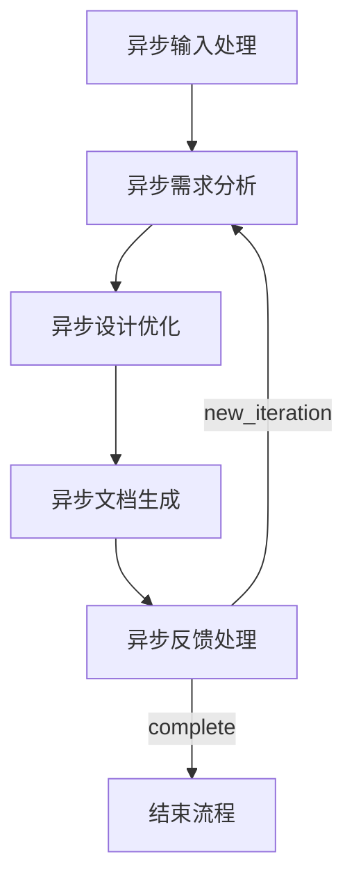

# GTPlanner: AI驱动的PRD生成工具

<p align="center">
  
</p>

<p align="center">
  <strong>一个智能的产品需求文档(PRD)生成工具，将自然语言描述转换为全面的技术文档</strong>
</p>

<p align="center">
  <a href="#-概述">概述</a> •
  <a href="#-功能特性">功能特性</a> •
  <a href="#-安装">安装</a> •
  <a href="#️-使用方法">使用方法</a> •
  <a href="#️-架构">架构</a> •
  <a href="#-多语言支持">多语言支持</a> •
  <a href="#-配置">配置</a> •
  <a href="#-贡献">贡献</a>
</p>

<p align="center">
  <strong>语言版本:</strong>
  <a href="README.md">🇺🇸 English</a> •
  <a href="README_zh-CN.md">🇨🇳 简体中文</a> •
  <a href="README_ja.md">🇯🇵 日本語</a>
</p>

---

## 🎯 概述

GTPlanner是一个先进的AI驱动工具，专为"氛围编程"而设计——将高层次的想法和需求转换为详细、结构化的技术文档。基于使用[PocketFlow](https://github.com/The-Pocket/PocketFlow)的异步节点架构构建，支持交互式CLI使用和程序化API访问。

该项目包含三个主要组件：
- **CLI界面**：用于需求处理的交互式命令行工具
- **FastAPI后端**：用于程序化访问的REST API服务
- **MCP服务**：模型上下文协议集成，实现与AI助手的无缝集成

## ✨ 功能特性

- **🗣️ 自然语言处理**：将自然语言需求转换为结构化PRD
- **🌍 多语言支持**：全面支持英语、中文、西班牙语、法语和日语，具有自动语言检测功能
- **📝 Markdown支持**：处理和集成现有的Markdown文档
- **⚡ 异步处理**：全异步管道，响应性能优异
- **🔄 多轮优化**：交互式反馈循环，用于迭代文档改进
- **📊 结构化输出**：生成标准化、可定制的技术文档
- **🧩 可扩展架构**：模块化节点设计，易于定制
- **🌐 多种接口**：支持CLI、FastAPI和MCP协议
- **🔧 LLM无关**：通过可配置端点兼容各种语言模型
- **📁 自动文件管理**：自动文件名生成和输出组织

## 截图

- 在Cherry Studio中：
  - 
- 在Cursor中：
  - 
---

## 📋 前置要求

- **Python**：3.10或更高版本
- **包管理器**：[uv](https://github.com/astral-sh/uv)（推荐）或pip
- **LLM API访问**：OpenAI兼容的API端点（OpenAI、Anthropic、本地模型等）

## 🚀 安装

### 1. 克隆仓库

```bash
git clone https://github.com/your-org/GTPlanner.git
cd GTPlanner
```

### 2. 安装依赖

使用uv（推荐）：
```bash
uv sync
```

使用pip：
```bash
pip install -r requirements.txt
```

### 3. 配置

GTPlanner使用[Dynaconf](https://www.dynaconf.com/)进行配置管理。通过编辑`settings.toml`配置您的LLM服务：

```toml
[default.llm]
base_url = "https://api.openai.com/v1"  # 您的LLM API端点
api_key = "your-api-key-here"           # 您的API密钥
model = "gpt-4"                         # 模型名称
```

#### 环境变量（替代方案）

您也可以使用环境变量：

```bash
export LLM_API_KEY="your-api-key-here"
export LLM_BASE_URL="https://api.openai.com/v1"
export LLM_MODEL="gpt-4"
```

---

## 🛠️ 使用方法

### 🖥️ CLI模式（交互式）

启动交互式CLI：

```bash
uv run python main.py
# 或在Windows上使用批处理脚本
start_cli.bat
```

**功能特性：**
- 交互式需求输入
- 可选的Markdown文件集成
- 多轮反馈和优化
- 自动保存到`output/`目录

**示例工作流程：**
1. 用自然语言输入您的项目需求
2. 可选择提供现有的Markdown文档
3. 查看生成的文档
4. 提供反馈进行迭代改进
5. 输入'q'保存并退出

### 🌐 FastAPI后端

启动REST API服务：

```bash
uv run fastapi_main.py
```

服务默认运行在`http://0.0.0.0:11211`。访问`http://0.0.0.0:11211/docs`查看交互式API文档。

**可用端点：**
- `POST /planning/short` - 生成简短规划流程
- `POST /planning/long` - 生成详细设计文档

### 🔌 MCP服务（推荐用于AI集成）

MCP服务提供与AI助手的无缝集成，支持直接函数调用。

1. 启动MCP服务：

```bash
cd mcp
uv sync
uv run python mcp_service.py
```

2. 配置您的MCP客户端：

```json
{
  "mcpServers": {
    "GT-planner": {
      "url": "http://127.0.0.1:8001/mcp"
    }
  }
}
```

**可用的MCP工具：**
- `generate_flow` - 从需求生成规划流程
- `generate_design_doc` - 创建详细设计文档

---

## 🏗️ 架构

GTPlanner使用基于PocketFlow的异步节点架构：

### 核心组件

1. **短规划流程**（`short_planner_flow.py`）
   - 生成高层次规划步骤
   - 支持迭代优化
   - 包含审查和最终确定节点

2. **主需求引擎**（`cli_flow.py`）
   - 完整文档生成管道
   - 带反馈循环的多阶段处理

3. **节点实现**（`nodes.py`）
   - `AsyncInputProcessingNode`：处理用户输入处理
   - `AsyncRequirementsAnalysisNode`：提取和分类需求
   - `AsyncDesignOptimizationNode`：建议改进和优化
   - `AsyncDocumentationGenerationNode`：创建结构化文档
   - `AsyncFeedbackProcessingNode`：管理迭代改进

### 流程图



### 工具函数（`utils/`）

- **`call_llm.py`**：带JSON修复的异步/同步LLM通信
- **`parse_markdown.py`**：Markdown文档处理和结构提取
- **`format_documentation.py`**：标准化文档格式
- **`store_conversation.py`**：带持久化的对话历史管理

---

## 📦 项目结构

```
GTPlanner/
├── main.py                    # 主CLI入口点
├── cli.py                     # 简化CLI入口点
├── cli_flow.py               # 主需求引擎流程定义
├── short_planner_flow.py     # 短规划流程实现
├── filename_flow.py          # 自动文件名生成
├── nodes.py                  # 核心异步节点实现
├── fastapi_main.py           # FastAPI后端服务
├── settings.toml             # 配置文件
├── pyproject.toml            # 项目元数据和依赖
├── requirements.txt          # Python依赖
├── start_cli.bat            # Windows批处理脚本
├── api/                      # API实现
│   └── v1/
│       └── planning.py       # 规划端点
├── mcp/                      # MCP服务
│   ├── mcp_service.py       # MCP服务器实现
│   └── pyproject.toml       # MCP特定依赖
├── utils/                    # 工具函数
│   ├── call_llm.py          # LLM通信
│   ├── parse_markdown.py    # Markdown处理
│   ├── format_documentation.py # 文档格式化
│   └── store_conversation.py   # 对话管理
├── docs/                     # 设计文档
│   ├── design.md            # 主架构设计
│   └── design-longplan.md   # 长规划API设计
├── output/                   # 生成的文档输出
└── assets/                   # 项目资源
    └── banner.png           # 项目横幅
```

---

## 🌍 多语言支持

GTPlanner提供全面的多语言功能，具有自动语言检测和文化适应性响应。

### 支持的语言

| 语言 | 代码 | 本地名称 | 状态 |
|------|------|----------|------|
| 英语 | `en` | English | ✅ 完全支持 |
| 中文 | `zh` | 中文 | ✅ 完全支持 |
| 西班牙语 | `es` | Español | ✅ 完全支持 |
| 法语 | `fr` | Français | ✅ 完全支持 |
| 日语 | `ja` | 日本語 | ✅ 完全支持 |

### 主要功能

- **🔍 自动语言检测**：从输入文本检测用户语言
- **🎯 智能回退**：需要时回退到默认语言
- **🌐 文化适应**：针对每种语言的文化背景调整提示
- **⚙️ 可配置**：易于配置默认语言和偏好设置

### 快速使用

```python
# 使用明确语言的API
response = requests.post("/planning/short", json={
    "requirement": "创建一个网站应用",
    "language": "zh"
})

# 自动检测（中文示例）
response = requests.post("/planning/short", json={
    "requirement": "创建一个网站应用"
})
```

详细的多语言配置和使用方法，请参阅[多语言指南](docs/multilingual-guide.md)。

---

## 🔧 配置

### LLM配置

GTPlanner支持任何OpenAI兼容的API。在`settings.toml`中配置：

```toml
[default]
debug = false

[default.llm]
base_url = "https://api.openai.com/v1"
api_key = "@format {env[LLM_API_KEY]}"
model = "gpt-4"
```

### 环境变量

```bash
# 必需
LLM_API_KEY=your-api-key-here

# 可选（默认为OpenAI）
LLM_BASE_URL=https://api.openai.com/v1
LLM_MODEL=gpt-4
```

### 多语言配置

```toml
[default.multilingual]
default_language = "zh"
auto_detect = true
supported_languages = ["en", "zh", "es", "fr", "ja"]
```

```bash
# 环境变量
GTPLANNER_DEFAULT_LANGUAGE=zh
GTPLANNER_AUTO_DETECT=true
```

---

## 📚 依赖

### 核心依赖
- **Python** >= 3.10
- **openai** >= 1.0.0 - LLM API通信
- **pocketflow** == 0.0.1 - 异步工作流引擎
- **dynaconf** >= 3.1.12 - 配置管理
- **aiohttp** >= 3.8.0 - 异步HTTP客户端
- **json-repair** >= 0.45.0 - JSON响应修复
- **python-dotenv** >= 1.0.0 - 环境变量加载

### API依赖
- **fastapi** == 0.115.9 - REST API框架
- **uvicorn** == 0.23.1 - ASGI服务器
- **pydantic** - 数据验证

### MCP依赖
- **fastmcp** - 模型上下文协议实现

---

## 🤝 贡献

1. Fork仓库
2. 创建功能分支（`git checkout -b feature/amazing-feature`）
3. 提交您的更改（`git commit -m 'Add amazing feature'`）
4. 推送到分支（`git push origin feature/amazing-feature`）
5. 打开Pull Request

## 📄 许可证

本项目采用MIT许可证 - 详见[LICENSE](LICENSE)文件。

## 🙏 致谢

- 基于[PocketFlow](https://github.com/The-Pocket/PocketFlow)异步工作流引擎构建
- 配置由[Dynaconf](https://www.dynaconf.com/)提供支持
- 设计用于通过MCP协议与AI助手无缝集成

---

**GTPlanner** - 用AI的力量将您的想法转换为结构化的技术文档。
