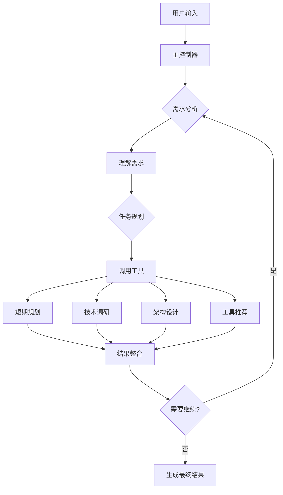

# GTPlanner: 智能任务规划系统

<p align="center">
  
</p>

<p align="center">
  <strong>GTPlanner (Graph Task Planner) 是一个智能任务规划系统，能够根据用户需求自动生成结构化的任务流程图和相关文档，专为现代AI辅助开发而设计。</strong>
</p>

<p align="center">
  <a href="#-概览">概览</a> •
  <a href="#-web-ui-推荐">Web UI</a> •
  <a href="#mcp集成">MCP集成</a> •
  <a href="#-功能特性">功能特性</a> •
  <a href="#-环境要求-后端和cli">环境要求</a> •
  <a href="#-安装-后端和cli">安装</a> •
  <a href="#️-使用方法">使用方法</a> •
  <a href="#️-系统架构">系统架构</a> •
  <a href="#-项目结构">项目结构</a> •
  <a href="#-依赖">依赖</a> •
  <a href="#-多语言支持">多语言支持</a> •
  <a href="#-参与贡献">参与贡献</a> •
  <a href="#-许可证">许可证</a> •
  <a href="#-致谢">致谢</a>
</p>

<p align="center">
  <strong>语言版本:</strong>
  <a href="README.md">🇺🇸 English</a> •
  <a href="README_zh-CN.md">🇨🇳 简体中文</a> •
  <a href="README_ja.md">🇯🇵 日本語</a>
</p>

---

## 🎯 概览

GTPlanner 是一个智能任务规划系统，专为现代AI辅助开发而设计。系统采用先进的Agent架构，能够智能地分析用户需求、执行技术调研、生成架构设计，并输出结构化的技术文档。

### 🚀 核心特性

- **🧠 智能推理**：提供智能化的任务分析和规划能力
- **🔄 流式响应体验**：原生支持Server-Sent Events (SSE)，提供实时的用户交互体验
- **⚡ 无状态架构**：支持高并发和水平扩展的无状态设计，适合生产环境部署
- **🛠️ Function Calling**：集成OpenAI Function Calling，支持智能工具调用和任务执行
- **🌐 多接口支持**：提供CLI、FastAPI REST API、MCP服务等多种集成方式

该项目包含两个核心部分：
- **💻 GTPlanner-frontend (Web UI)**：提供功能丰富、交互友好的在线规划体验。（推荐）[🚀 立刻体验 Live Demo!](https://the-agent-builder.com/)
- **⚙️ GTPlanner (Backend)**：基于Agent架构的强大后端引擎，提供 CLI、API 等多种集成方式。

## 💻 Web UI (推荐)

为了获得最佳且最便捷的体验，我们强烈建议您使用我们的 Web UI。它提供了一个为现代开发者量身打造的、流畅的 AI 规划工作流。


**核心优势:**
- **智能规划助手**: 通过 AI 辅助，快速生成复杂的系统架构和项目计划。
- **即时文档生成**: 从您的规划会话中自动创建全面的技术文档。
- **为 Vibe Coding 而生**: 优化输出，完美适配 Cursor、Windsurf、GitHub Copilot 等现代 AI 开发工具。
- **团队协作**: 支持多种格式导出，方便与团队共享和协作。

## mcp集成
GTPlanner 生成的计划可以直接在您最喜欢的 AI 编程工具中使用，无缝衔接您的开发流程：

- 在 Cherry Studio 中:
  - 
- 在 Cursor 中:
  - 


---

## ✨ 功能特性

### 🧠 智能Agent能力
- **🤖 智能推理**: 智能分析用户需求，提供专业的规划建议
- **🔧 Function Calling**: 集成OpenAI Function Calling，支持智能工具调用
- **📊 智能规划**: 短期规划、长期设计、架构设计等专业化规划能力
- **� 技术调研**: 基于Jina搜索的智能技术调研和信息收集
- **🛠️ 工具推荐**: 向量化工具推荐系统，智能匹配最适合的开发工具

### 🚀 现代化架构
- **⚡ 无状态设计**: 支持高并发和水平扩展的无状态架构
- **🔄 流式响应**: 原生支持Server-Sent Events (SSE)，提供实时用户体验
- **� 智能存储**: 基于SQLite的会话管理，支持智能压缩和数据持久化
- **📈 执行追踪**: 集成pocketflow-tracing和Langfuse进行详细的执行追踪

### 🌐 多接口支持
- **🖥️ 现代化CLI**: 支持会话管理、流式显示、多语言界面的命令行工具
- **🌐 REST API**: 基于FastAPI的高性能REST API服务
- **🔌 MCP集成**: 支持Model Context Protocol，与AI助手无缝集成
- **� Web UI**: 配合前端提供完整的Web用户界面

### 🌍 全球化支持
- **�️ 多语言支持**: 全面支持中文、英文、日文、西班牙文、法文，并具备自动语言检测
- **🎯 智能语言检测**: 自动识别用户语言并提供相应的本地化响应
- **🔧 LLM兼容性**: 支持各类大语言模型（OpenAI、Anthropic等）

---

## 📋 环境要求 (后端和CLI)

- **Python**: 3.10 或更高版本
- **包管理器**: [uv](https://github.com/astral-sh/uv) (推荐) 或 pip
- **LLM API 访问**: 任何兼容 OpenAI 的 API 端点 (例如 OpenAI, Anthropic, 或本地模型)

## 🚀 安装 (后端和CLI)

1. 克隆本仓库

```bash
git clone https://github.com/OpenSQZ/GTPlanner.git
cd GTPlanner
```

2. 安装依赖

使用 uv (推荐):
```bash
uv sync
```

使用 pip:
```bash
pip install -r requirements.txt
```

3. 配置

GTPlanner 支持任何兼容 OpenAI 的 API。您可以在 `settings.toml` 文件中配置您的 LLM、API 密钥、环境变量和语言。默认语言是英语。

```bash
export LLM_API_KEY="your-api-key-here"
```

## 🛠️ 使用方法

### 🖥️ CLI 模式

GTPlanner 提供基于新流式响应架构的现代化CLI，支持实时流式显示、会话管理和多语言界面。


#### 交互模式

启动交互式CLI进行对话式体验:
```bash
python gtplanner.py
# 或
python agent/cli/gtplanner_cli.py
```

**核心功能:**
- 🔄 **实时流式响应**: 实时查看AI思考和工具执行过程
- 💾 **会话管理**: 自动对话历史持久化，支持会话加载和切换
- 🤖 **Function Calling**: 原生OpenAI Function Calling支持
- 📊 **多种工具**: 需求分析、技术调研、架构设计等专业工具
- 🌍 **多语言界面**: 支持中文、英文、日文、西班牙文、法文界面

#### 直接执行模式

无需进入交互模式，直接处理需求:
```bash
python gtplanner.py "设计一个用户管理系统"
python agent/cli/gtplanner_cli.py "分析电商平台需求"
```

#### 会话管理

**加载现有会话:**
```bash
python gtplanner.py --load <session_id>
```

**交互模式中的可用命令:**
- `/help` - 显示可用命令
- `/new` - 创建新会话
- `/sessions` - 列出所有会话
- `/load <id>` - 加载指定会话
- `/delete <id>` - 删除指定会话
- `/stats` - 显示性能统计
- `/verbose` - 切换详细模式
- `/quit` - 退出CLI

**常用参数:**
- `--verbose, -v`: 显示详细处理信息
- `--load <session_id>`: 加载指定对话会话
- `--language <zh|en|ja|es|fr>`: 设置界面语言

### 🌐 FastAPI 后端

启动 REST API 服务:

```bash
uv run fastapi_main.py
```

服务默认运行在 `http://0.0.0.0:11211`。访问 `http://0.0.0.0:11211/docs` 可查看交互式 API 文档。

**核心特性:**
- **🔄 SSE流式响应**: 基于Server-Sent Events的实时数据传输
- **🤖 Agent API**: 使用StatelessGTPlanner提供无状态、高并发的处理能力
- **📊 实时工具调用**: 实时显示工具执行状态和进度
- **🌍 多语言支持**: API原生支持多语言处理和响应

**主要端点:**

*   **Agent流式聊天端点 (推荐)**
    *   `POST /api/chat/agent`: 基于SSE的流式Agent聊天端点，集成了智能推理、工具调用和实时响应功能。这是构建交互式应用的首选接口。

*   **健康检查端点**
    *   `GET /health`: 增强的健康检查端点，包含API状态信息
    *   `GET /api/status`: 获取详细的API状态信息


### 🔌 MCP 服务 (推荐用于AI集成)

MCP 服务可以与 AI 助手无缝集成，并支持直接函数调用。

1. 启动 MCP 服务。

```bash
cd mcp
uv sync
uv run python mcp_service.py
```

2. 配置您的 MCP 客户端。

```json
{
  "mcpServers": {
    "GT-planner": {
      "url": "http://127.0.0.1:8001/mcp"
    }
  }
}
```

**可用的 MCP 工具:**
- `generate_flow`: 从需求生成规划流程。
- `generate_design_doc`: 创建详细的 PRD。

---

## 🏗️ 系统架构

GTPlanner 采用现代化Agent架构，使用PocketFlow异步工作流引擎构建：

### 🧠 核心Agent架构

1.  **主控制器流程** (`agent/flows/react_orchestrator_refactored/`)
    -   智能任务编排和流程控制
    -   支持pocketflow_tracing执行追踪
    -   协调各个节点执行和上下文传递

2.  **StatelessGTPlanner** (`agent/stateless_planner.py`)
    -   完全无状态的GTPlanner实现，支持高并发
    -   原生流式响应支持
    -   纯函数式设计，每次调用完全独立

3.  **Function Calling System** (`agent/function_calling/`)
    -   集成OpenAI Function Calling的智能工具调用
    -   短期规划、技术调研、架构设计、工具推荐等专业工具
    -   支持异步工具执行和结果处理

4.  **Streaming System** (`agent/streaming/`)
    -   基于Server-Sent Events的流式响应系统
    -   支持实时消息传输和工具调用状态更新
    -   类型安全的流式事件处理

### 🔄 智能工作流程



### 🛠️ 专业化子流程

- **短期规划** (`agent/subflows/short_planning/`): 生成高层次的项目规划和任务分解
- **技术调研** (`agent/subflows/research/`): 基于Jina搜索的智能技术调研
- **架构设计** (`agent/subflows/architecture/`): 深度架构设计和技术选型
- **工具推荐** (`tools/`): 向量化工具推荐系统，支持API和Python包推荐

---

## 📦 项目结构

```
GTPlanner/
├── gtplanner.py               # 主CLI启动脚本
├── fastapi_main.py           # FastAPI后端服务
├── settings.toml             # 配置文件
├── pyproject.toml            # 项目元数据和依赖
├── agent/                     # 核心Agent系统
│   ├── __init__.py           # Agent模块入口
│   ├── gtplanner.py          # 有状态GTPlanner主控制器
│   ├── stateless_planner.py  # 无状态GTPlanner实现
│   ├── context_types.py      # 无状态数据类型定义
│   ├── pocketflow_factory.py # PocketFlow数据转换工厂
│   ├── flows/                # 主控制流程
│   │   └── react_orchestrator_refactored/ # 主控制器流程
│   ├── subflows/             # 专业Agent子流程
│   │   ├── short_planning/   # 短期规划子流程
│   │   ├── research/         # 技术调研子流程
│   │   └── architecture/     # 架构设计子流程
│   ├── nodes/                # 原子能力节点
│   │   ├── node_search.py    # 搜索引擎节点
│   │   ├── node_url.py       # URL解析节点
│   │   ├── node_compress.py  # 上下文压缩节点
│   │   └── node_output.py    # 输出文档节点
│   ├── function_calling/     # Function Calling工具
│   │   └── agent_tools.py    # Agent工具定义
│   ├── streaming/            # 流式响应系统
│   │   ├── stream_types.py   # 流式事件类型定义
│   │   ├── stream_interface.py # 流式会话接口
│   │   └── sse_handler.py    # SSE处理器
│   ├── api/                  # Agent API实现
│   │   └── agent_api.py      # SSE GTPlanner API
│   ├── cli/                  # 现代化CLI实现
│   │   ├── gtplanner_cli.py  # 主CLI实现
│   │   └── cli_text_manager.py # CLI多语言文本管理
│   └── persistence/          # 数据持久化
│       ├── sqlite_session_manager.py # SQLite会话管理
│       └── smart_compressor.py # 智能压缩器
├── mcp/                      # MCP服务
│   ├── mcp_service.py       # MCP服务器实现
│   └── pyproject.toml       # MCP特定依赖
├── tools/                    # 工具推荐系统
│   ├── apis/                # API类型工具定义
│   └── python_packages/     # Python包类型工具定义
├── utils/                    # 工具函数
│   └── config_manager.py    # 配置管理
├── docs/                     # 设计文档
└── assets/                   # 项目资源
```

---

## 📚 依赖

### 核心依赖
- **Python** >= 3.11 - 运行环境
- **openai** >= 1.0.0 - LLM API通信
- **pocketflow** == 0.0.3 - 异步工作流引擎
- **pocketflow-tracing** >= 0.1.4 - 执行追踪系统
- **dynaconf** >= 3.1.12 - 配置管理
- **aiohttp** >= 3.8.0 - 异步HTTP客户端
- **json-repair** >= 0.45.0 - JSON响应修复
- **python-dotenv** >= 1.0.0 - 环境变量加载

### API依赖
- **fastapi** == 0.115.9 - REST API框架
- **uvicorn** == 0.23.1 - ASGI服务器
- **pydantic** >= 2.5.0 - 数据验证

### CLI依赖
- **rich** >= 13.0.0 - 终端美化和交互

### MCP依赖
- **fastmcp** - 模型上下文协议（MCP）实现

### 开发依赖
- **pytest** >= 8.4.1 - 测试框架
- **pytest-asyncio** >= 1.1.0 - 异步测试支持

---

## 🌍 多语言支持

GTPlanner 提供全面的多语言支持，让全球开发者都能使用母语进行项目规划。

### 支持的语言

| 语言 | 代码 | 本地名称 |
|------|------|----------|
| 英语 | `en` | English |
| 中文 | `zh` | 中文 |
| 西班牙语 | `es` | Español |
| 法语 | `fr` | Français |
| 日语 | `ja` | 日本語 |

### 核心功能

- **🔍 自动语言检测**: 智能识别用户输入的语言
- **🎯 语言优先级系统**: 根据用户偏好和请求自动选择最合适的语言
- **📝 本地化提示模板**: 为每种语言提供文化适应的提示模板
- **🔄 智能回退机制**: 当请求的语言不可用时自动回退到默认语言

### 使用方式

#### CLI 模式
```bash
# 指定语言
python gtplanner.py --language zh "设计一个用户管理系统"

# 自动检测（输入中文会自动识别）
python gtplanner.py "设计一个用户管理系统"
```

#### API 模式
```python
# 显式指定语言
response = requests.post("/api/chat/agent", json={
    "session_id": "test-session",
    "dialogue_history": [{"role": "user", "content": "设计一个用户管理系统"}],
    "language": "zh"
})

# 自动检测
response = requests.post("/api/chat/agent", json={
    "session_id": "test-session",
    "dialogue_history": [{"role": "user", "content": "设计一个用户管理系统"}]
})
```

### 配置

在 `settings.toml` 中配置多语言设置：

```toml
[default.multilingual]
default_language = "en"
auto_detect = true
fallback_enabled = true
supported_languages = ["en", "zh", "es", "fr", "ja"]
```

详细的多语言功能说明和配置指南，请参阅 [多语言指南](docs/multilingual-guide.md)。

---

## 🤝 参与贡献

我们欢迎并高度赞赏贡献和协作。请查看[贡献指南](CONTRIBUTING.md)并参与其中。

### 🔧 贡献工具

GTPlanner包含一个智能工具推荐系统，支持社区贡献的工具。我们欢迎在两个类别中贡献高质量的工具：

#### 支持的工具类型

**🌐 API工具 (APIS)**
- Web API和REST服务
- 基于云的处理工具
- 外部服务集成
- 实时数据处理API

**📦 Python包工具 (PYTHON_PACKAGE)**
- PyPI包和库
- 本地处理工具
- 数据分析包
- 实用程序库

#### 如何贡献工具

1. **选择正确的模板**：使用我们的专门PR模板以获得更好的组织：
   - [API工具模板](.github/PULL_REQUEST_TEMPLATE/api_tool.md) - 用于Web API和服务
   - [Python包模板](.github/PULL_REQUEST_TEMPLATE/python_package_tool.md) - 用于PyPI包

2. **质量标准**：所有贡献的工具必须满足我们的质量标准：
   - ✅ 公开可访问且文档完善
   - ✅ 稳定且积极维护
   - ✅ 清晰的使用示例和集成指南
   - ✅ 适当的错误处理和安全实践
   - ✅ 与现有工具无重复功能

3. **工具信息格式**：每个工具需要：
   - 唯一标识符（例如，`org.tool-name`）
   - 全面的描述和用例
   - 完整的API规范或包详细信息
   - 工作示例和集成代码
   - 测试和验证结果

4. **审查流程**：所有工具贡献都经过：
   - 技术准确性审查
   - 质量和安全评估
   - 文档完整性检查
   - 社区反馈整合

#### 🛠️ 工具定义格式

所有工具都使用YAML格式定义，包含以下核心字段：

**通用字段：**
- **id**: 工具的唯一标识符
- **type**: 工具类型（"APIS" 或 "PYTHON_PACKAGE"）
- **summary**: 一句话功能概述
- **description**: 详细功能描述
- **examples**: 使用示例

**APIS类型额外字段：**
- **base_url**: API的基础URL地址
- **endpoints**: API端点定义数组
  - **summary**: 端点功能描述
  - **method**: HTTP方法（GET、POST、PUT、DELETE等）
  - **path**: 端点路径
  - **inputs**: 输入参数定义（JSON Schema格式）
  - **outputs**: 输出结果定义（JSON Schema格式）

**PYTHON_PACKAGE类型额外字段：**
- **requirement**: PyPI包安装要求（如："package-name==1.0.0"）

#### 示例工具

**API工具示例**
查看 `tools/apis/example_openweather.yml` 了解如何定义一个API工具。

**Python包示例**
查看 `tools/python_packages/example_yt_dlp.yml` 了解如何定义一个Python包工具。

#### 工具格式示例

**API工具示例：**
```yaml
id: "public.weather-api"
type: "APIS"
summary: "获取全球城市的实时天气信息。"
description: |
  通过公开天气API，可以查询指定城市的当前天气、温度、湿度、
  风速等详细气象数据。完全免费使用，无需注册或API密钥。
base_url: "https://api.open-meteo.com/v1"
endpoints:
  - method: "GET"
    path: "/forecast"
    summary: "根据经纬度坐标获取当前天气数据"
```

**Python包示例：**
```yaml
id: "pypi.yt-dlp"
type: "PYTHON_PACKAGE"
summary: "功能强大的视频下载工具，支持数千个视频网站。"
description: |
  yt-dlp是youtube-dl的功能增强分支，支持从YouTube、Bilibili、抖音等
  数千个视频网站下载视频和音频。
requirement: "yt-dlp"
```

有关详细的贡献指南，请参阅我们的[工具贡献模板](.github/PULL_REQUEST_TEMPLATE/)。

### 一般贡献流程

1. Fork仓库
2. 创建功能分支（`git checkout -b feature/amazing-feature`）
3. 提交您的更改（`git commit -m 'Add amazing feature'`）
4. 推送到分支（`git push origin feature/amazing-feature`）
5. 打开Pull Request

## 📄 许可证

本项目基于 MIT 许可证。详情请参阅 [LICENSE](LICENSE.md) 文件。

## 🙏 致谢

- 基于 [PocketFlow](https://github.com/The-Pocket/PocketFlow) 异步工作流引擎构建
- 配置管理由 [Dynaconf](https://www.dynaconf.com/) 提供支持
- 旨在通过 MCP 协议与 AI 助手无缝集成

---

**GTPlanner** - 智能任务规划系统，用AI的力量将您的想法转换为结构化的技术文档和可执行的项目计划。