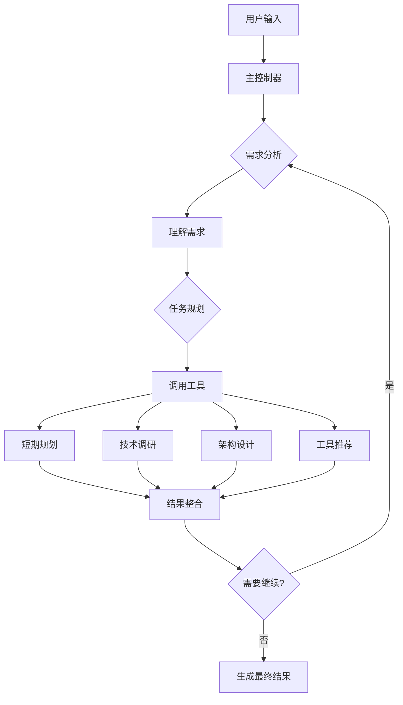

# GTPlanner: AI驱动的PRD生成工具

<p align="center">
  
</p>

<p align="center">
  <strong>一款智能产品需求文档（PRD）生成工具，能将自然语言描述转化为结构化的、适用于 Vibe coding 的技术文档。</strong>
</p>

<p align="center">
  <a href="#-概览">概览</a> •
  <a href="#-web-ui-推荐">Web UI</a> •
  <a href="#mcp集成">MCP集成</a> •
  <a href="#-快速开始">快速开始</a> •
  <a href="#-功能特性">功能特性</a> •
  <a href="#-环境要求-后端和cli">环境要求</a> •
  <a href="#-安装-后端和cli">安装</a> •
  <a href="#️-使用方法">使用方法</a> •
  <a href="#️-系统架构">系统架构</a> •
  <a href="#-项目结构">项目结构</a> •
  <a href="#-依赖">依赖</a> •
  <a href="#-多语言支持">多语言支持</a> •
  <a href="#-参与贡献">参与贡献</a> •
  <a href="#-许可证">许可证</a> •
  <a href="#-致谢">致谢</a>
</p>

<p align="center">
  <strong>语言版本:</strong>
  <a href="README.md">🇺🇸 English</a> •
  <a href="README_zh-CN.md">🇨🇳 简体中文</a> •
  <a href="README_ja.md">🇯🇵 日本語</a>
</p>

---

## 🎯 概览

GTPlanner 是一款专为 "vibe coding" 设计的先进 AI 工具，旨在将高层次的想法和需求，高效转化为结构清晰、内容详尽的技术文档。我们推荐通过我们现代化的 **Web 界面**来体验 GTPlanner 的全部功能。

对于希望进行深度集成和定制开发的开发者，我们同样提供了强大的后端引擎，采用异步、基于节点的架构，并支持交互式 CLI、REST API 以及 MCP 服务等多种使用方式。

### 🚀 核心特性

- **🧠 智能推理**：提供智能化的任务分析和规划能力
- **🔄 流式响应体验**：原生支持Server-Sent Events (SSE)，提供实时的用户交互体验
- **⚡ 无状态架构**：支持高并发和水平扩展的无状态设计，适合生产环境部署
- **🛠️ Function Calling**：集成OpenAI Function Calling，支持智能工具调用和任务执行
- **🌐 多接口支持**：提供CLI、FastAPI REST API、MCP服务等多种集成方式

该项目包含两个核心部分：
- **💻 GTPlanner-frontend (Web UI)**：提供功能丰富、交互友好的在线规划体验。（推荐）[🚀 立刻体验 Live Demo!](https://the-agent-builder.com/)
- **⚙️ GTPlanner (Backend)**：基于Agent架构的强大后端引擎，提供 CLI、API 等多种集成方式。

## 💻 Web UI (推荐)

为了获得最佳且最便捷的体验，我们强烈建议您使用我们的 Web UI。它提供了一个为现代开发者量身打造的、流畅的 AI 规划工作流。


**核心优势:**
- **智能规划助手**: 通过 AI 辅助，快速生成复杂的系统架构和项目计划。
- **即时文档生成**: 从您的规划会话中自动创建全面的技术文档。
- **为 Vibe Coding 而生**: 优化输出，完美适配 Cursor、Windsurf、GitHub Copilot 等现代 AI 开发工具。
- **团队协作**: 支持多种格式导出，方便与团队共享和协作。

## mcp集成
GTPlanner 生成的计划可以直接在您最喜欢的 AI 编程工具中使用，无缝衔接您的开发流程：

- 在 Cherry Studio 中:
  - 
- 在 Cursor 中:
  - 


---

## ⚡ 快速开始

下面是一条**最顺滑**、**开箱即用**的 GTPlanner 体验路径——从 0 到生成你的第一份 PRD，只需几条命令即可完成。


### 1) 在线极速体验（无需安装）

* 打开 Web UI 在线 Demo：[🚀 立刻体验 Live Demo!](https://the-agent-builder.com/)
  👉 适合"先感受下效果"的同学，所见即所得的规划与文档生成体验。


### 2) 本地运行（5 分钟上手）

#### 环境准备

* **Python ≥ 3.10**（推荐 3.11+）
* 包管理器用 **uv**（推荐）或 **pip**
* 准备一个兼容 OpenAI 的 LLM API Key（如 `OpenAI` / `Anthropic` / `Azure OpenAI` / 自建兼容端点）

#### 克隆与安装

```bash
git clone https://github.com/OpenSQZ/GTPlanner.git
cd GTPlanner

# 推荐：uv 一键安装
uv sync

# 或使用 pip
pip install -e .
```

#### 配置 API Key

GTPlanner 支持多种配置方式，**必需的环境变量**包括：

```bash
# 核心配置（必需）
export LLM_API_KEY="your-api-key-here"        # API 密钥
export LLM_BASE_URL="https://api.openai.com/v1"  # API 基础 URL
export LLM_MODEL="gpt-4"                       # 使用的模型名称

# Windows PowerShell 用户：
# $env:LLM_API_KEY="your-api-key-here"
# $env:LLM_BASE_URL="https://api.openai.com/v1"
# $env:LLM_MODEL="gpt-4"

# 可选配置
export JINA_API_KEY="your-jina-key"           # Jina AI 搜索服务密钥（用于网络搜索功能）

# Langfuse 配置（可选，用于 PocketFlow Tracing）
export LANGFUSE_SECRET_KEY="your-secret-key"  # Langfuse 密钥
export LANGFUSE_PUBLIC_KEY="your-public-key"  # Langfuse 公钥  
export LANGFUSE_HOST="https://cloud.langfuse.com"  # Langfuse 服务地址
```

##### 常见供应商配置示例

**OpenAI 官方：**
```bash
export LLM_API_KEY="sk-your-openai-key"
export LLM_BASE_URL="https://api.openai.com/v1"
export LLM_MODEL="gpt-4"
```

**Azure OpenAI：**
```bash
export LLM_API_KEY="your-azure-key"
export LLM_BASE_URL="https://your-resource.openai.azure.com/openai/deployments/your-deployment"
export LLM_MODEL="gpt-4"
```

**国内代理服务：**
```bash
export LLM_API_KEY="your-proxy-key"
export LLM_BASE_URL="https://your-proxy-provider.com/v1"
export LLM_MODEL="gpt-4"
```

**本地部署服务：**
```bash
export LLM_API_KEY="local-key"
export LLM_BASE_URL="http://localhost:8000/v1"
export LLM_MODEL="your-local-model"
```

##### Langfuse Tracing 配置（可选但推荐）

GTPlanner 集成了 PocketFlow Tracing，可以追踪执行过程。如需启用：

**方式 1：使用配置脚本（推荐）**
```bash
# 运行配置向导
bash configure_langfuse.sh
```

**方式 2：手动配置**
1. 访问 [Langfuse Cloud](https://cloud.langfuse.com) 注册账号
2. 创建新项目，获取 API 密钥
3. 设置环境变量：
   ```bash
   export LANGFUSE_SECRET_KEY="sk-lf-..."
   export LANGFUSE_PUBLIC_KEY="pk-lf-..."
   export LANGFUSE_HOST="https://cloud.langfuse.com"
   ```

**方式 3：临时禁用 Tracing**
如果暂时不需要追踪功能，可以忽略 Langfuse 配置。系统会自动跳过 tracing。

> 可在 `settings.toml` 中进一步配置其他参数。默认语言为英文，支持中文、日文、西班牙文、法文。


### 3) 方式 A：CLI 一键生成你的第一份 PRD（推荐）

#### 交互式对话

```bash
python gtplanner.py
# 或
python agent/cli/gtplanner_cli.py
```

进入后直接输入你的需求，例如：

```
为一个在线课程平台生成 PRD：用户注册登录、课程检索、试看、购买、学习进度与作业批改。
```

> CLI 自带会话管理（/sessions、/load）、流式输出与多语言界面。

#### 直接执行（免交互）

```bash
python gtplanner.py "设计一个支持SaaS计费和团队协作的项目管理平台，并输出PRD"
```


### 4) 方式 B：启动 REST API（适合接入你自己的前端/自动化）

#### 启动服务

```bash
uv run fastapi_main.py
# 默认: http://0.0.0.0:11211
# 文档: http://0.0.0.0:11211/docs
```

#### 一条 curl 就能跑通（SSE/流式 Agent 接口）

```bash
curl -X POST "http://127.0.0.1:11211/api/chat/agent" \
  -H "Content-Type: application/json" \
  -d '{
    "session_id": "quickstart-demo",
    "dialogue_history": [
      {"role":"user","content":"为一个电商平台生成PRD：SKU、购物车、优惠券、库存、支付与风控"}
    ],
    "language": "zh"
  }'
```

> 该端点基于 **SSE 流式**返回，后端使用 `StatelessGTPlanner`，并带有工具调用状态更新。


### 5) 方式 C：MCP 集成（接入你的 AI IDE / 助手）

#### 环境配置

MCP 服务需要与主服务相同的环境变量配置，请确保已设置：

```bash
# 必需的环境变量（与主服务相同）
export LLM_API_KEY="your-api-key-here"
export LLM_BASE_URL="https://api.openai.com/v1"
export LLM_MODEL="gpt-4"

# 可选配置
export JINA_API_KEY="your-jina-key"  # 用于网络搜索功能
```

#### 启动服务

1. 启动 MCP 服务

   ```bash
   cd mcp
   uv sync
   uv run python mcp_service.py
   ```

   > **注意**：MCP 服务运行在独立的环境中，但会继承主项目的配置。确保环境变量在启动前已正确设置。

2. 在 MCP 客户端中配置：

   ```json
   {
     "mcpServers": {
       "GT-planner": { 
         "command": "uv",
         "args": ["run", "python", "mcp_service.py"],
         "cwd": "/path/to/GTPlanner/mcp"
       }
     }
   }
   ```

   或直接连接到运行中的服务：

   ```json
   {
     "mcpServers": {
       "GT-planner": { "url": "http://127.0.0.1:8001/mcp" }
     }
   }
   ```

3. 可用工具：
   - `generate_flow`（从需求生成规划流程）
   - `generate_design_doc`（生成详细 PRD）
   
   支持多语言：`en`、`zh`、`ja`、`es`、`fr`


### 6) 成功校验（你应该能看到什么）

* **CLI**：在终端中实时流出"分析 → 规划 → 调研/架构 → 文档输出"的流式内容，并给出结构化的 PRD 片段。
* **API**：`/docs` 打开 Swagger，或用 `curl` 拿到流式/分段响应；返回体中包含最终文档内容与步骤化过程。
* **MCP**：在支持 MCP 的编辑器（如 Cursor / Cherry Studio）内直接调用对应工具生成规划/PRD。

### 7) 常见问题

* **网络/依赖问题**：优先使用 `uv sync`，能显著减少环境坑位。
* **模型与费用**：任何兼容 OpenAI 的服务端都可用；先用最小上下文与短输入试跑，验证链路后再扩写需求。
* **环境变量**：确保 `LLM_API_KEY`、`LLM_BASE_URL`、`LLM_MODEL` 三个核心变量都已正确设置。
* **MCP 服务配置**：MCP 服务需要与主服务相同的环境变量，启动前请确认环境配置正确。
* **Tracing 配置**：Langfuse 为可选配置，用于执行追踪。可运行 `bash configure_langfuse.sh` 快速配置，或暂时忽略。
* **语言**：`language` 可设 `zh | en | ja | es | fr`，或直接让系统自动检测。
* **兼容性**：支持 OpenAI、Azure OpenAI、Anthropic Claude（通过代理）、国内各大模型服务商。

---

## ✨ 功能特性

### 🧠 智能Agent能力
- **🤖 智能推理**: 智能分析用户需求，提供专业的规划建议
- **🔧 Function Calling**: 集成OpenAI Function Calling，支持智能工具调用
- **📊 智能规划**: 短期规划、长期设计、架构设计等专业化规划能力
- **🔍 技术调研**: 基于websearch搜索的智能技术调研和信息收集
- **🛠️ 工具推荐**: 向量化工具推荐系统，智能匹配最适合的开发工具

### 🚀 现代化架构
- **⚡ 无状态设计**: 支持高并发和水平扩展的无状态架构
- **🔄 流式响应**: 原生支持Server-Sent Events (SSE)，提供实时用户体验
- **💾 智能存储**: 基于SQLite的会话管理，支持智能压缩和数据持久化
- **📈 执行追踪**: 集成pocketflow-tracing和Langfuse进行详细的执行追踪

### 🌐 多接口支持
- **🖥️ 现代化CLI**: 支持会话管理、流式显示、多语言界面的命令行工具
- **🌐 REST API**: 基于FastAPI的高性能REST API服务
- **🔌 MCP集成**: 支持Model Context Protocol，与AI助手无缝集成
- **� Web UI**: 配合前端提供完整的Web用户界面

### 🌍 全球化支持
- **🌐 多语言支持**: 全面支持中文、英文、日文、西班牙文、法文，并具备自动语言检测
- **🎯 智能语言检测**: 自动识别用户语言并提供相应的本地化响应
- **🔧 LLM兼容性**: 支持各类大语言模型（OpenAI、Anthropic等）

---

## 📋 环境要求 (后端和CLI)

- **Python**: 3.10 或更高版本
- **包管理器**: [uv](https://github.com/astral-sh/uv) (推荐) 或 pip
- **LLM API 访问**: 任何兼容 OpenAI 的 API 端点 (例如 OpenAI, Anthropic, 或本地模型)

## 🚀 安装 (后端和CLI)

1. 克隆本仓库

```bash
git clone https://github.com/OpenSQZ/GTPlanner.git
cd GTPlanner
```

2. 安装依赖

使用 uv (推荐):
```bash
uv sync
```

使用 pip:
```bash
pip install -r requirements.txt
```

3. 配置

GTPlanner 支持任何兼容 OpenAI 的 API。您可以在 `settings.toml` 文件中配置您的 LLM、API 密钥、环境变量和语言。默认语言是英语。

```bash
export LLM_API_KEY="your-api-key-here"
```

## 🛠️ 使用方法

### 🖥️ CLI 模式

对于喜欢命令行的开发者，GTPlanner 提供了功能强大的命令行界面，支持**交互模式**和**直接执行模式**。


#### 交互模式

启动交互式CLI进行对话式体验:
```bash
python gtplanner.py
# 或
python agent/cli/gtplanner_cli.py
```

**核心功能:**
- 🔄 **实时流式响应**: 实时查看AI思考和工具执行过程
- 💾 **会话管理**: 自动对话历史持久化，支持会话加载和切换
- 🤖 **Function Calling**: 原生OpenAI Function Calling支持
- 📊 **多种工具**: 需求分析、技术调研、架构设计等专业工具
- 🌍 **多语言界面**: 支持中文、英文、日文、西班牙文、法文界面

#### 直接执行模式

无需进入交互模式，直接处理需求:
```bash
python gtplanner.py "设计一个用户管理系统"
python agent/cli/gtplanner_cli.py "分析电商平台需求"
```

#### 会话管理

**加载现有会话:**
```bash
python gtplanner.py --load <session_id>
```

**交互模式中的可用命令:**
- `/help` - 显示可用命令
- `/new` - 创建新会话
- `/sessions` - 列出所有会话
- `/load <id>` - 加载指定会话
- `/delete <id>` - 删除指定会话
- `/stats` - 显示性能统计
- `/verbose` - 切换详细模式
- `/quit` - 退出CLI

**常用参数:**
- `--verbose, -v`: 显示详细处理信息
- `--load <session_id>`: 加载指定对话会话
- `--language <zh|en|ja|es|fr>`: 设置界面语言

### 🌐 FastAPI 后端

启动 REST API 服务:

```bash
uv run fastapi_main.py
```

服务默认运行在 `http://0.0.0.0:11211`。访问 `http://0.0.0.0:11211/docs` 可查看交互式 API 文档。

**核心特性:**
- **🔄 SSE流式响应**: 基于Server-Sent Events的实时数据传输
- **🤖 Agent API**: 使用StatelessGTPlanner提供无状态、高并发的处理能力
- **📊 实时工具调用**: 实时显示工具执行状态和进度
- **🌍 多语言支持**: API原生支持多语言处理和响应

**主要端点:**

*   **Agent流式聊天端点 (推荐)**
    *   `POST /api/chat/agent`: 基于SSE的流式Agent聊天端点，集成了智能推理、工具调用和实时响应功能。这是构建交互式应用的首选接口。

*   **健康检查端点**
    *   `GET /health`: 增强的健康检查端点，包含API状态信息
    *   `GET /api/status`: 获取详细的API状态信息


### 🔌 MCP 服务 (推荐用于AI集成)

MCP 服务可以与 AI 助手无缝集成，并支持直接函数调用。

1. 启动 MCP 服务。

```bash
cd mcp
uv sync
uv run python mcp_service.py
```

2. 配置您的 MCP 客户端。

```json
{
  "mcpServers": {
    "GT-planner": {
      "url": "http://127.0.0.1:8001/mcp"
    }
  }
}
```

**可用的 MCP 工具:**
- `generate_flow`: 从需求生成规划流程。
- `generate_design_doc`: 创建详细的 PRD。

---

## 🏗️ 系统架构

GTPlanner 采用现代化Agent架构，使用PocketFlow异步工作流引擎构建：

### 🧠 核心Agent架构

1.  **主控制器流程** (`agent/flows/react_orchestrator_refactored/`)
    -   智能任务编排和流程控制
    -   支持pocketflow_tracing执行追踪
    -   协调各个节点执行和上下文传递

2.  **StatelessGTPlanner** (`agent/stateless_planner.py`)
    -   完全无状态的GTPlanner实现，支持高并发
    -   原生流式响应支持
    -   纯函数式设计，每次调用完全独立

3.  **Function Calling System** (`agent/function_calling/`)
    -   集成OpenAI Function Calling的智能工具调用
    -   短期规划、技术调研、架构设计、工具推荐等专业工具
    -   支持异步工具执行和结果处理

4.  **Streaming System** (`agent/streaming/`)
    -   基于Server-Sent Events的流式响应系统
    -   支持实时消息传输和工具调用状态更新
    -   类型安全的流式事件处理

### 🔄 智能工作流程



### 🛠️ 专业化子流程

- **短期规划** (`agent/subflows/short_planning/`): 生成高层次的项目规划和任务分解
- **技术调研** (`agent/subflows/research/`): 基于Jina搜索的智能技术调研
- **架构设计** (`agent/subflows/architecture/`): 深度架构设计和技术选型
- **工具推荐** (`tools/`): 向量化工具推荐系统，支持API和Python包推荐

---

## 📦 项目结构

```
GTPlanner/
├── gtplanner.py               # 主CLI启动脚本
├── fastapi_main.py           # FastAPI后端服务
├── settings.toml             # 配置文件
├── pyproject.toml            # 项目元数据和依赖
├── agent/                     # 核心Agent系统
│   ├── __init__.py           # Agent模块入口
│   ├── gtplanner.py          # 有状态GTPlanner主控制器
│   ├── stateless_planner.py  # 无状态GTPlanner实现
│   ├── context_types.py      # 无状态数据类型定义
│   ├── pocketflow_factory.py # PocketFlow数据转换工厂
│   ├── flows/                # 主控制流程
│   │   └── react_orchestrator_refactored/ # 主控制器流程
│   ├── subflows/             # 专业Agent子流程
│   │   ├── short_planning/   # 短期规划子流程
│   │   ├── research/         # 技术调研子流程
│   │   └── architecture/     # 架构设计子流程
│   ├── nodes/                # 原子能力节点
│   │   ├── node_search.py    # 搜索引擎节点
│   │   ├── node_url.py       # URL解析节点
│   │   ├── node_compress.py  # 上下文压缩节点
│   │   └── node_output.py    # 输出文档节点
│   ├── function_calling/     # Function Calling工具
│   │   └── agent_tools.py    # Agent工具定义
│   ├── streaming/            # 流式响应系统
│   │   ├── stream_types.py   # 流式事件类型定义
│   │   ├── stream_interface.py # 流式会话接口
│   │   └── sse_handler.py    # SSE处理器
│   ├── api/                  # Agent API实现
│   │   └── agent_api.py      # SSE GTPlanner API
│   ├── cli/                  # 现代化CLI实现
│   │   ├── gtplanner_cli.py  # 主CLI实现
│   │   └── cli_text_manager.py # CLI多语言文本管理
│   └── persistence/          # 数据持久化
│       ├── sqlite_session_manager.py # SQLite会话管理
│       └── smart_compressor.py # 智能压缩器
├── mcp/                      # MCP服务
│   ├── mcp_service.py       # MCP服务器实现
│   └── pyproject.toml       # MCP特定依赖
├── tools/                    # 工具推荐系统
│   ├── apis/                # API类型工具定义
│   └── python_packages/     # Python包类型工具定义
├── utils/                    # 工具函数
│   └── config_manager.py    # 配置管理
├── docs/                     # 设计文档
└── assets/                   # 项目资源
```

---

## 📚 依赖

### 核心依赖
- **Python** >= 3.11 - 运行环境
- **openai** >= 1.0.0 - LLM API通信
- **pocketflow** == 0.0.3 - 异步工作流引擎
- **pocketflow-tracing** >= 0.1.4 - 执行追踪系统
- **dynaconf** >= 3.1.12 - 配置管理
- **aiohttp** >= 3.8.0 - 异步HTTP客户端
- **json-repair** >= 0.45.0 - JSON响应修复
- **python-dotenv** >= 1.0.0 - 环境变量加载

### API依赖
- **fastapi** == 0.115.9 - REST API框架
- **uvicorn** == 0.23.1 - ASGI服务器
- **pydantic** >= 2.5.0 - 数据验证

### CLI依赖
- **rich** >= 13.0.0 - 终端美化和交互

### MCP依赖
- **fastmcp** - 模型上下文协议（MCP）实现

### 开发依赖
- **pytest** >= 8.4.1 - 测试框架
- **pytest-asyncio** >= 1.1.0 - 异步测试支持

---

## 🌍 多语言支持

GTPlanner 提供全面的多语言支持，让全球开发者都能使用母语进行项目规划。

### 支持的语言

| 语言 | 代码 | 本地名称 |
|------|------|----------|
| 英语 | `en` | English |
| 中文 | `zh` | 中文 |
| 西班牙语 | `es` | Español |
| 法语 | `fr` | Français |
| 日语 | `ja` | 日本語 |

### 核心功能

- **🔍 自动语言检测**: 智能识别用户输入的语言
- **🎯 语言优先级系统**: 根据用户偏好和请求自动选择最合适的语言
- **📝 本地化提示模板**: 为每种语言提供文化适应的提示模板
- **🔄 智能回退机制**: 当请求的语言不可用时自动回退到默认语言

### 使用方式

#### CLI 模式
```bash
# 指定语言
python gtplanner.py --language zh "设计一个用户管理系统"

# 自动检测（输入中文会自动识别）
python gtplanner.py "设计一个用户管理系统"
```

#### API 模式
```python
# 显式指定语言
response = requests.post("/api/chat/agent", json={
    "session_id": "test-session",
    "dialogue_history": [{"role": "user", "content": "设总结微信群聊记录并为成员创建用户画像"}],
    "language": "zh"
})

# 自动检测
response = requests.post("/api/chat/agent", json={
    "session_id": "test-session",
    "dialogue_history": [{"role": "user", "content": "总结微信群聊记录并为成员创建用户画像"}]
})
```

### 配置

在 `settings.toml` 中配置多语言设置：

```toml
[default.multilingual]
default_language = "en"
auto_detect = true
fallback_enabled = true
supported_languages = ["en", "zh", "es", "fr", "ja"]
```

详细的多语言功能说明和配置指南，请参阅 [多语言指南](docs/multilingual-guide.md)。

---

## 🤝 参与贡献

我们深信，一个卓越的工具，离不开社区的智慧与共建。GTPlanner 期待您的参与，共同塑造更强大的规划生态：

### 🔧 贡献工具 - 扩充规划器的知识库
帮助 GTPlanner 了解更多可用的解决方案，让它能在规划中进行精准推荐：
- **🌐 API工具** - Web API、REST服务、平台集成
- **📦 Python包** - PyPI库、数据分析包、实用工具
- **🔌 MCP服务** - 遵循MCP规范的私有服务

### 💻 贡献核心代码 - 用数据证明优化
通过评测驱动的开发方式，提升规划质量和系统性能。

### 📚 分享实践案例 - 启发社区经验
分享您的使用案例、教程和最佳实践，帮助社区发掘 GTPlanner 的全部潜力。

### 📖 详细指南
中文: 接受两种类型的贡献：工具规范或核心代码。
完整的贡献方式、技术规范和提交流程，请查看：
**[贡献指南](contribute_zh.md)** - 包含详细的贡献流程、模板和示例

## 📄 许可证

本项目基于 MIT 许可证。详情请参阅 [LICENSE](LICENSE.md) 文件。

## 🙏 致谢

- 基于 [PocketFlow](https://github.com/The-Pocket/PocketFlow) 异步工作流引擎构建
- 配置管理由 [Dynaconf](https://www.dynaconf.com/) 提供支持
- 旨在通过 MCP 协议与 AI 助手无缝集成

---

**GTPlanner** - 用AI的力量将您的想法转换为结构化的技术文档。