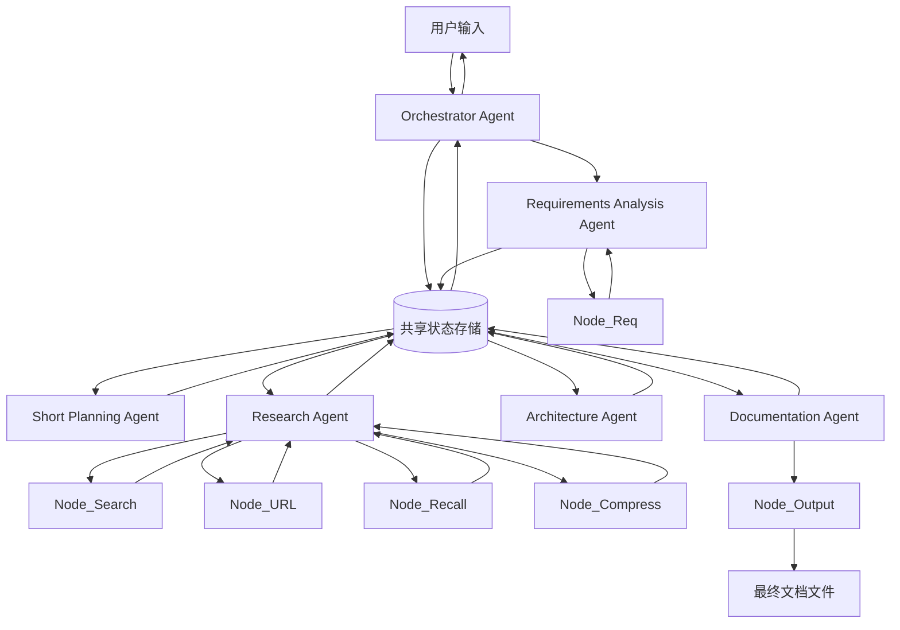
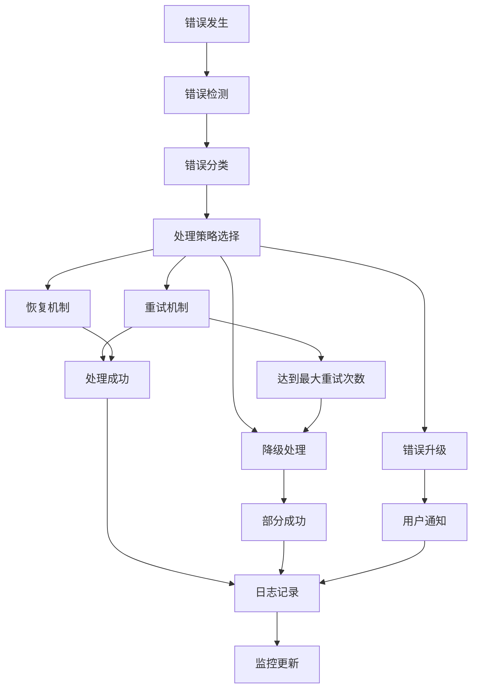

# GTPlanner 系统架构设计文档

## 文档概述

本文档详细描述了GTPlanner（Graph Task Planner）系统的完整架构设计，包括系统组件、数据流向、错误处理机制、性能优化策略等核心内容。GTPlanner是一个基于ReAct模式的智能任务规划系统，能够根据用户需求自动生成结构化的任务流程图和相关文档。

## 目录

1. [系统架构总览](#1-系统架构总览)
2. [原子能力节点详细规格](#2-原子能力节点详细规格)
3. [系统级共享变量详细定义](#3-系统级共享变量详细定义)
4. [专业Agent内部变量详细定义](#4-专业agent内部变量详细定义)
5. [数据流向详细设计](#5-数据流向详细设计)
6. [错误处理与异常管理机制](#6-错误处理与异常管理机制)
7. [性能优化与扩展性设计](#7-性能优化与扩展性设计)

## 系统特性

- **智能化需求分析**：自动从自然语言中提取结构化需求
- **多源信息研究**：整合网络搜索、知识库召回等多种信息源
- **自动化架构设计**：基于需求和研究结果生成Mermaid流程图
- **用户确认机制**：通过Short Planning Agent确保需求理解一致性
- **容错性设计**：完善的错误处理和恢复机制
- **高性能架构**：支持水平扩展和性能优化

---

## 1. 系统架构总览

### 1.1 整体架构图

```mermaid
---
config:
  layout: dagre
---
flowchart TD
 subgraph subGraph0["用户交互层 (User Interaction Layer)"]
        A["User"]
  end

 subgraph subGraph1["核心控制与状态管理 (The Core Loop - ReAct Powered)"]
    direction LR
    subgraph Orchestrator_ReAct_Loop ["Orchestrator Agent 内部 ReAct 循环"]
        direction TB
        Core_Thought["<b>Thought (思考)</b><br>1. 我的最终目标是什么?<br>2. 审视共享变量(State), 我已知什么?<br>3. 基于目标和已知信息, 下一步最佳行动是什么?<br><i>(e.g., '需求还不明确, 我需要先做需求分析')</i>"]
        Core_Action["<b>Action (行动)</b><br>执行思考后决定的动作:<br>- 调用一个专家Agent<br>- 向用户提问/确认<br>- 给出最终答案"]
        Core_Observation["<b>Observation (观察)</b><br>接收行动的结果:<br>- 专家Agent返回的数据<br>- 用户的回答<br>- 工具执行的错误信息"]

        Core_Thought -- "决定下一步行动" --> Core_Action
        Core_Observation -- "作为新信息, 喂给下一轮思考" --> Core_Thought
    end
    
    C[("<b>Session State / Shared Variables</b><br>(Single Source of Truth)<br>- dialogue_history<br>- user_intent<br>- structured_requirements<br>- research_findings<br>- architecture_draft: {mermaid, nodes, vars}")]
 end

 subgraph subGraph2["专业智能体 (Specialist Agents - 作为Orchestrator可调用的高级工具)"]
        D("<b>Requirements Analysis Agent</b><br>提炼/结构化需求<hr><b>内部变量:</b><br>- raw_text_input<br>- extracted_entities<br>- structured_output_draft")
        SP("<b>Short Planning Agent</b><br>生成简洁规划供用户确认<hr><b>内部变量:</b><br>- structured_requirements<br>- planning_draft<br>- confirmation_document")
        E["<b>Research Agent</b><br>信息搜集与分析<hr><b>内部变量:</b><br>- search_queries<br>- raw_search_results<br>- compressed_context<br>- synthesis_report_draft"]
        F("<b>Architecture Agent</b><br>设计图逻辑/节点/变量<hr><b>内部变量:</b><br>- design_constraints<br>- generated_mermaid_code<br>- generated_nodes_list<br>- generated_vars_list")
        G("<b>Documentation Agent</b><br>格式化并生成最终文档<hr><b>内部变量:</b><br>- final_data_input<br>- formatted_req_md<br>- formatted_mermaid_md<br>- formatted_nodes_json")
  end
  
 subgraph subGraph3["原子能力节点 (Tool Layer)"]
        Node_Req["需求解析节点"]
        Node_Search["搜索引擎节点"]
        Node_URL["URL解析节点"]
        Node_Recall["文档召回节点"]
        Node_Compress["上下文压缩节点"]
        Node_Output["输出文档节点"]
  end
  
 subgraph subGraph4["最终产出物 (Final Artifacts)"]
        Out_Desc[/"需求描述.md"/]
        Out_Mermaid[/"图编排.md"/]
        Out_Nodes[/"节点设计.json"/]
        Out_Vars[/"共享变量.json"/]
  end

  %% 详细工作流子图 (保持不变)
   subgraph subGraph_RA["Research Agent 内部详细工作流 (并行批处理版)"]
    direction LR
        RA_Input_Start(("Start"))
        RA_Parallel["2. 并行批处理 (For each keyword)"]
        RA_Aggregate["<b>3. 结果聚合</b>"]
        RA_Output_Data["<b>输出 (返回给 Orchestrator)</b><br>research_report: [{...}, {...}]"]
        RA_Output_End(("End"))
        subgraph RA_Parallel
            direction TB
            RA_P_Start("fa:fa-cogs Start Keyword Task")
            RA_P_Search["<b>2a. 调用搜索引擎节点</b>"]
            RA_P_SearchResult[("<b>首条搜索结果</b><br>{url, title}")]
            RA_P_URL["<b>2b. 调用URL解析节点</b>"]
            RA_P_Content[("raw_content: string")]
            RA_P_LLM["<b>2c. LLM分析模块</b>"]
            RA_P_Assemble["<b>2d. 单条结果组装</b>"]
            RA_P_Final_Item[("<b>单个关键词报告</b><br>{keyword, url, title, content, analysis}")]
            RA_Input_Data["<b>输入 (来自 Orchestrator)</b><br>- search_keywords: string[]<br>- analysis_requirements: string"]
        end
    end
 subgraph subGraph_DA["Requirements Analysis Agent 内部工作流"]
    direction TB
        DA_Input_Start(("Start"))
        DA_Input_Data["<b>输入 (来自 Orchestrator)</b><br>- dialogue_history: string<br>- user_intent: string"]
        DA_Node_Extract["<b>1. 调用需求解析节点</b><br>(Tool: Node_Req)"]
        DA_Extracted_Info[("<b>提取出的信息点</b><br>- 关键实体<br>- 功能点<br>- 非功能需求")]
        DA_LLM_Structure["<b>2. LLM 结构化模块</b><br>(Agent Core Logic)"]
        DA_Validation["<b>3. 内部格式校验</b>"]
        DA_Output_Data["<b>输出 (返回给 Orchestrator)</b><br>structured_requirements: {title, scope, ...}"]
        DA_Output_End(("End"))
  end
 subgraph subGraph_SP["Short Planning Agent 内部工作流"]
    direction TB
        SP_Input_Start(("Start"))
        SP_Input_Data["<b>输入 (来自 Orchestrator)</b><br>- structured_requirements: object<br>- dialogue_history: string"]
        SP_Analysis["<b>1. 需求理解与分析</b><br>解析结构化需求，识别核心目标"]
        SP_Planning["<b>2. 生成简洁规划</b><br>创建清晰的执行步骤和预期产出"]
        SP_Format["<b>3. 格式化确认文档</b><br>生成用户友好的确认文档"]
        SP_Validation["<b>4. 内容校验</b><br>确保规划完整且易于理解"]
        SP_Output_Data["<b>输出 (返回给 Orchestrator)</b><br>confirmation_document: string"]
        SP_Output_End(("End"))
  end
 subgraph subGraph_AA["Architecture Agent 内部工作流 (蓝图优先版)"]
    direction TB
        AA_Input_Start(("Start"))
        AA_Input_Data["<b>输入 (来自 Orchestrator)</b><br>- structured_requirements<br>- research_findings"]
        AA_Design_Phase["<b>1. LLM 核心设计阶段</b><br>构思流程、识别原子节点和数据流"]
        AA_Step2["2.生成设计蓝图 (并行)"]
        AA_Validation["<b>3.蓝图交叉校验</b><br>确保图、节点、变量三者一致且无遗漏"]
        AA_Assemble_Output["<b>4. 组装架构草稿</b>"]
        AA_Output_Data["<b>输出 (返回给 Orchestrator)</b><br>architecture_draft: {mermaid, nodes, vars}"]
        AA_Output_End(("End"))
        subgraph AA_Step2
            direction TB
            AA_Generate_Mermaid["<b>2a. 生成Mermaid图</b><br>将构思的流程可视化为节点编排图"]
            subgraph AA_Define_Group[" "]
                direction LR
                AA_Define_Nodes["<b>2b. 定义原子化节点</b><br>为图中每个节点创建结构化描述 (JSON)"]
                AA_Define_Vars["<b>2c. 定义共享变量</b><br>识别并定义节点间传递的数据 (JSON)"]
            end
        end
    end
 subgraph subGraph_G["Documentation Agent 内部工作流"]
    direction TB
        G_Input_Start(("Start"))
        G_Input_Data["<b>输入 (来自 Orchestrator)</b><br>- architecture_draft: {mermaid, nodes, vars}<br>- structured_requirements: object<br>- research_findings: object"]
        G_Format_Requirements["<b>1. 格式化需求文档</b><br>将结构化需求转换为Markdown格式"]
        G_Format_Mermaid["<b>2. 格式化Mermaid图</b><br>优化和美化架构图代码"]
        G_Format_Nodes["<b>3. 格式化节点设计</b><br>生成标准化的JSON节点描述"]
        G_Format_Variables["<b>4. 格式化共享变量</b><br>生成标准化的JSON变量定义"]
        G_Generate_Files["<b>5. 调用输出节点生成文件</b><br>使用Node_Output生成最终文档"]
        G_Output_Data["<b>输出 (返回给 Orchestrator)</b><br>completion_signal: string"]
        G_Output_End(("End"))
    end

  %% --- 核心连接关系 (体现ReAct模式) ---
  A -- "用户输入 / 目标" --> Core_Thought
  Core_Action -- "Action: 向用户提问/呈现草稿" --> A
  A -- "Observation: 用户反馈/确认" --> Core_Observation

  Core_Thought -- "读取状态, 作为思考依据" --> C
  Core_Observation -- "将新观察结果写入State" --> C

  Core_Action -- "Action: 委派 [需求分析]" --> D
  D -- "Observation: 返回 [结构化需求]" --> Core_Observation
  Core_Action -- "Action: 委派 [短规划生成]" --> SP
  SP -- "Observation: 返回 [规划确认文档]" --> Core_Observation
  Core_Action -- "Action: 委派 [信息研究]" --> E
  E -- "Observation: 返回 [研究报告]" --> Core_Observation
  Core_Action -- "Action: 委派 [架构设计]" --> F
  F -- "Observation: 返回 [架构草稿]" --> Core_Observation
  Core_Action -- "Action: 委派 [文档生成]" --> G
  G -- "Observation: 返回 [完成信号]" --> Core_Observation

  G -- "当被调用生成完整文档时" --> Node_Output
  Node_Output -- "生成最终文件" --> Out_Desc & Out_Mermaid & Out_Nodes & Out_Vars

  %% --- 内部工作流的连接 (保持不变) ---
   D -. "内部工作流" .-> DA_Input_Start
   SP -. "内部工作流" .-> SP_Input_Start
   E -. "内部工作流" .-> RA_Input_Start
   F -. "内部工作流" .-> AA_Input_Start
   G -. "内部工作流" .-> G_Input_Start
   
   RA_P_Start -- keyword --> RA_P_Search & RA_P_Assemble; RA_P_Search --> RA_P_SearchResult; RA_P_SearchResult -- url --> RA_P_URL; RA_P_URL --> RA_P_Content; RA_P_Content -- raw_content --> RA_P_LLM; RA_Input_Data -- analysis_requirements --> RA_P_LLM; RA_P_SearchResult -- url, title --> RA_P_Assemble; RA_P_Content -- content --> RA_P_Assemble; RA_P_LLM -- analysis --> RA_P_Assemble; RA_P_Assemble --> RA_P_Final_Item; RA_Input_Start --> RA_Input_Data; RA_Input_Data -- search_keywords --> RA_Parallel; RA_P_Final_Item --> RA_Aggregate; RA_Aggregate --> RA_Output_Data; RA_Output_Data --> RA_Output_End;
   DA_Input_Start --> DA_Input_Data; DA_Input_Data --> DA_Node_Extract; DA_Node_Extract --> DA_Extracted_Info; DA_Input_Data -- 原始对话作为上下文 --> DA_LLM_Structure; DA_Extracted_Info -- 结构化处理 --> DA_LLM_Structure; DA_LLM_Structure --> DA_Validation; DA_Validation --> DA_Output_Data; DA_Output_Data --> DA_Output_End;
   SP_Input_Start --> SP_Input_Data; SP_Input_Data --> SP_Analysis; SP_Analysis --> SP_Planning; SP_Planning --> SP_Format; SP_Format --> SP_Validation; SP_Validation --> SP_Output_Data; SP_Output_Data --> SP_Output_End;
   AA_Input_Start --> AA_Input_Data; AA_Input_Data --> AA_Design_Phase; AA_Design_Phase --> AA_Step2; AA_Step2 --> AA_Validation; AA_Generate_Mermaid --> AA_Validation; AA_Define_Group --> AA_Validation; AA_Validation --> AA_Assemble_Output; AA_Assemble_Output --> AA_Output_Data; AA_Output_Data --> AA_Output_End; AA_Step2 --> AA_Define_Group; AA_Design_Phase --> AA_Generate_Mermaid;
   G_Input_Start --> G_Input_Data; G_Input_Data --> G_Format_Requirements; G_Format_Requirements --> G_Format_Mermaid; G_Format_Mermaid --> G_Format_Nodes; G_Format_Nodes --> G_Format_Variables; G_Format_Variables --> G_Generate_Files; G_Generate_Files --> G_Output_Data; G_Output_Data --> G_Output_End;

  %% --- 样式定义 (Style Definitions) ---
    classDef orchestrator fill:#f9f,stroke:#333,stroke-width:2px
    classDef state fill:#ff9,stroke:#333,stroke-width:1px,stroke-dasharray: 5 5
    classDef specialist fill:#cff,stroke:#333,stroke-width:1px
    classDef tool fill:#fcc,stroke:#333,stroke-width:1px
    classDef user fill:#9f9,stroke:#333,stroke-width:2px
    classDef output fill:#bbf,stroke:#333,stroke-width:1px
    classDef sub_input fill:#cde4ff,stroke:#555,stroke-width:1px
    classDef sub_output fill:#d4edda,stroke:#555,stroke-width:1px
    classDef sub_process fill:#fff3cd,stroke:#555,stroke-width:1px
    classDef sub_parallel fill:#e9ecef,stroke:#555,stroke-width:1px,stroke-dasharray: 3 3
    
  %% --- 样式应用 (Class Applications) ---
     A:::user
     Core_Thought:::orchestrator
     Core_Action:::orchestrator
     Core_Observation:::orchestrator
     C:::state
     D:::specialist
     SP:::specialist
     E:::specialist
     F:::specialist
     G:::specialist
     Node_Req:::tool
     Node_Search:::tool
     Node_URL:::tool
     Node_Recall:::tool
     Node_Compress:::tool
     Node_Output:::tool
     Out_Desc:::output
     Out_Mermaid:::output
     Out_Nodes:::output
     Out_Vars:::output
     RA_P_Start:::sub_process
     RA_P_Search:::sub_process
     RA_P_SearchResult:::sub_process
     RA_P_URL:::sub_process
     RA_P_Content:::sub_process
     RA_P_LLM:::sub_process
     RA_P_Assemble:::sub_process
     RA_P_Final_Item:::sub_process
     RA_Input_Data:::sub_input
     RA_Input_Start:::sub_input
     RA_Parallel:::sub_parallel
     RA_Aggregate:::sub_process
     RA_Output_Data:::sub_output
     RA_Output_End:::sub_output
     DA_Input_Start:::sub_input
     DA_Input_Data:::sub_input
     DA_Node_Extract:::sub_process
     DA_Extracted_Info:::sub_process
     DA_LLM_Structure:::sub_process
     DA_Validation:::sub_process
     DA_Output_Data:::sub_output
     DA_Output_End:::sub_output
     SP_Input_Start:::sub_input
     SP_Input_Data:::sub_input
     SP_Analysis:::sub_process
     SP_Planning:::sub_process
     SP_Format:::sub_process
     SP_Validation:::sub_process
     SP_Output_Data:::sub_output
     SP_Output_End:::sub_output
     AA_Define_Nodes:::sub_process
     AA_Define_Vars:::sub_process
     AA_Generate_Mermaid:::sub_process
     AA_Define_Group:::sub_process
     AA_Input_Start:::sub_input
     AA_Input_Data:::sub_input
     AA_Design_Phase:::sub_process
     AA_Step2:::sub_process
     AA_Validation:::sub_process
     AA_Assemble_Output:::sub_process
     AA_Output_Data:::sub_output
     AA_Output_End:::sub_output
     G_Input_Start:::sub_input
     G_Input_Data:::sub_input
     G_Format_Requirements:::sub_process
     G_Format_Mermaid:::sub_process
     G_Format_Nodes:::sub_process
     G_Format_Variables:::sub_process
     G_Generate_Files:::sub_process
     G_Output_Data:::sub_output
     G_Output_End:::sub_output
```



### 1.2 架构说明

GTPlanner系统采用分层架构设计，主要包含以下几个层次：

1. **用户交互层**：处理用户输入和输出展示
2. **核心控制层**：基于ReAct模式的Orchestrator Agent，负责整体流程控制
3. **专业智能体层**：包含5个专业Agent，各自负责特定的处理任务
4. **原子能力层**：提供基础的工具和服务能力
5. **数据存储层**：管理共享状态和持久化数据

系统的核心特点是通过Orchestrator Agent的ReAct循环（思考-行动-观察）来协调各个专业Agent的工作，确保整个处理流程的智能化和自适应性。

---

## 2. 原子能力节点详细规格 (Tool Layer Specifications)

本章节详细定义了系统底层的6个原子能力节点，这些节点为上层的专业Agent提供基础的处理能力。每个节点都有明确的输入输出规格和内部处理逻辑。

### 1.1 需求解析节点 (Node_Req)

**功能描述：** 从自然语言对话中提取结构化的需求信息

**输入规格：**
```json
{
  "dialogue_text": "string",           // 用户对话原文
  "context_history": "string[]",       // 历史对话上下文
  "extraction_focus": "string[]"       // 提取重点：["entities", "functions", "constraints"]
}
```

**输出规格：**
```json
{
  "extracted_entities": {
    "business_objects": "string[]",     // 业务对象
    "actors": "string[]",               // 参与者/角色
    "systems": "string[]"               // 相关系统
  },
  "functional_requirements": {
    "core_features": "string[]",        // 核心功能
    "user_stories": "string[]",         // 用户故事
    "workflows": "string[]"             // 工作流程
  },
  "non_functional_requirements": {
    "performance": "string[]",          // 性能要求
    "security": "string[]",             // 安全要求
    "scalability": "string[]"           // 扩展性要求
  },
  "confidence_score": "number"          // 提取置信度 0-1
}
```

**内部处理逻辑：**
1. 文本预处理和分词
2. 实体识别和分类
3. 意图识别和功能点提取
4. 约束条件识别
5. 结果结构化和置信度评估

### 1.2 搜索引擎节点 (Node_Search)

**功能描述：** 基于关键词进行网络搜索，返回相关结果

**输入规格：**
```json
{
  "search_keywords": "string[]",       // 搜索关键词列表
  "search_type": "string",             // 搜索类型："web" | "academic" | "technical"
  "max_results": "number",             // 最大结果数量，默认10
  "language": "string"                 // 搜索语言，默认"zh-CN"
}
```

**输出规格：**
```json
{
  "search_results": [
    {
      "title": "string",               // 页面标题
      "url": "string",                 // 页面URL
      "snippet": "string",             // 页面摘要
      "relevance_score": "number",     // 相关性评分 0-1
      "source_type": "string"          // 来源类型："official" | "blog" | "forum" | "docs"
    }
  ],
  "total_found": "number",             // 总找到结果数
  "search_time": "number"              // 搜索耗时(ms)
}
```

**内部处理逻辑：**
1. 关键词优化和组合
2. 多搜索引擎API调用
3. 结果去重和排序
4. 相关性评分计算
5. 结果格式标准化

### 1.3 URL解析节点 (Node_URL)

**功能描述：** 解析网页内容，提取有用信息

**输入规格：**
```json
{
  "url": "string",                     // 目标URL
  "extraction_type": "string",         // 提取类型："full" | "summary" | "specific"
  "target_selectors": "string[]",      // CSS选择器（可选）
  "max_content_length": "number"       // 最大内容长度，默认10000字符
}
```

**输出规格：**
```json
{
  "url": "string",                     // 原始URL
  "title": "string",                   // 页面标题
  "content": "string",                 // 提取的文本内容
  "metadata": {
    "author": "string",                // 作者
    "publish_date": "string",          // 发布日期
    "tags": "string[]",                // 标签
    "description": "string"            // 页面描述
  },
  "extracted_sections": {
    "headings": "string[]",            // 标题列表
    "key_points": "string[]",          // 关键点
    "code_blocks": "string[]"          // 代码块
  },
  "processing_status": "string"        // 处理状态："success" | "partial" | "failed"
}
```

**内部处理逻辑：**
1. URL有效性验证
2. 网页内容抓取
3. HTML解析和清理
4. 文本提取和结构化
5. 元数据提取和验证

### 1.4 文档召回节点 (Node_Recall)

**功能描述：** 从知识库中召回相关文档和信息

**输入规格：**
```json
{
  "query": "string",                   // 查询文本
  "knowledge_base": "string",          // 知识库标识
  "similarity_threshold": "number",    // 相似度阈值，默认0.7
  "max_results": "number",             // 最大返回结果数，默认5
  "result_type": "string"              // 结果类型："documents" | "snippets" | "both"
}
```

**输出规格：**
```json
{
  "recalled_documents": [
    {
      "document_id": "string",         // 文档ID
      "title": "string",               // 文档标题
      "content": "string",             // 文档内容或摘要
      "similarity_score": "number",    // 相似度评分
      "source": "string",              // 来源信息
      "last_updated": "string"         // 最后更新时间
    }
  ],
  "total_matches": "number",           // 总匹配数量
  "recall_time": "number"              // 召回耗时(ms)
}
```

**内部处理逻辑：**
1. 查询文本向量化
2. 向量相似度计算
3. 结果排序和过滤
4. 内容摘要生成
5. 相关性验证

### 1.5 上下文压缩节点 (Node_Compress)

**功能描述：** 压缩长文本内容，保留关键信息

**输入规格：**
```json
{
  "content": "string",                 // 原始内容
  "compression_ratio": "number",       // 压缩比例 0.1-0.8，默认0.3
  "focus_keywords": "string[]",        // 重点关键词
  "preserve_structure": "boolean",     // 是否保留结构，默认true
  "output_format": "string"            // 输出格式："summary" | "bullets" | "structured"
}
```

**输出规格：**
```json
{
  "compressed_content": "string",     // 压缩后内容
  "key_points": "string[]",           // 关键点列表
  "preserved_sections": "string[]",   // 保留的重要段落
  "compression_stats": {
    "original_length": "number",       // 原始长度
    "compressed_length": "number",     // 压缩后长度
    "compression_ratio": "number",     // 实际压缩比
    "information_density": "number"    // 信息密度评分
  }
}
```

**内部处理逻辑：**
1. 文本分段和结构分析
2. 重要性评分计算
3. 关键信息提取
4. 内容重组和压缩
5. 质量评估和优化

### 1.6 输出文档节点 (Node_Output)

**功能描述：** 生成最终的文档文件

**输入规格：**
```json
{
  "requirements_md": "string",        // 需求描述Markdown
  "mermaid_code": "string",           // Mermaid图代码
  "nodes_json": "object",             // 节点设计JSON
  "variables_json": "object",         // 共享变量JSON
  "output_config": {
    "file_format": "string[]",        // 输出格式：["md", "json", "html"]
    "include_metadata": "boolean",    // 是否包含元数据
    "template_style": "string"        // 模板样式："standard" | "detailed" | "minimal"
  }
}
```

**输出规格：**
```json
{
  "generated_files": [
    {
      "filename": "string",           // 文件名
      "content": "string",            // 文件内容
      "file_type": "string",          // 文件类型
      "file_size": "number"           // 文件大小(bytes)
    }
  ],
  "generation_summary": {
    "total_files": "number",          // 生成文件总数
    "generation_time": "number",      // 生成耗时(ms)
    "validation_status": "string"     // 验证状态："passed" | "warnings" | "failed"
  }
}
```

**内部处理逻辑：**
1. 输入数据验证和预处理
2. 模板选择和加载
3. 内容格式化和渲染
4. 文件生成和验证
5. 元数据添加和打包

---

## 3. 系统级共享变量详细定义 (Orchestrator Shared Variables)

本章节定义了Orchestrator层面管理的共享变量结构。这些变量作为系统的"单一数据源"，在整个处理流程中被各个Agent读取和更新，确保数据的一致性和完整性。

### 2.1 会话状态变量 (Session State)

**dialogue_history** - 对话历史记录
```json
{
  "session_id": "string",              // 会话唯一标识
  "start_time": "string",              // 会话开始时间 ISO 8601
  "messages": [
    {
      "timestamp": "string",           // 消息时间戳
      "role": "string",                // 角色："user" | "assistant" | "system"
      "content": "string",             // 消息内容
      "message_type": "string",        // 消息类型："text" | "confirmation" | "error"
      "metadata": {
        "agent_source": "string",      // 来源Agent（如果是assistant）
        "processing_time": "number",   // 处理耗时(ms)
        "confidence": "number"         // 置信度 0-1
      }
    }
  ],
  "total_messages": "number",          // 消息总数
  "last_activity": "string"            // 最后活动时间
}
```

**user_intent** - 用户意图分析
```json
{
  "primary_goal": "string",            // 主要目标
  "intent_category": "string",         // 意图分类："planning" | "analysis" | "design" | "research"
  "confidence_level": "number",        // 意图识别置信度 0-1
  "extracted_keywords": "string[]",   // 提取的关键词
  "domain_context": "string",          // 领域上下文
  "complexity_level": "string",        // 复杂度："simple" | "medium" | "complex"
  "estimated_effort": "string",        // 预估工作量："low" | "medium" | "high"
  "last_updated": "string"             // 最后更新时间
}
```

### 2.2 需求分析结果 (Requirements Analysis Results)

**structured_requirements** - 结构化需求
```json
{
  "project_overview": {
    "title": "string",                 // 项目标题
    "description": "string",           // 项目描述
    "scope": "string",                 // 项目范围
    "objectives": "string[]",          // 项目目标
    "success_criteria": "string[]"     // 成功标准
  },
  "functional_requirements": {
    "core_features": [
      {
        "feature_id": "string",        // 功能ID
        "name": "string",              // 功能名称
        "description": "string",       // 功能描述
        "priority": "string",          // 优先级："high" | "medium" | "low"
        "user_stories": "string[]",    // 用户故事
        "acceptance_criteria": "string[]" // 验收标准
      }
    ],
    "workflows": [
      {
        "workflow_id": "string",       // 工作流ID
        "name": "string",              // 工作流名称
        "steps": "string[]",           // 步骤列表
        "actors": "string[]",          // 参与者
        "triggers": "string[]"         // 触发条件
      }
    ]
  },
  "non_functional_requirements": {
    "performance": {
      "response_time": "string",       // 响应时间要求
      "throughput": "string",          // 吞吐量要求
      "scalability": "string"          // 扩展性要求
    },
    "security": {
      "authentication": "string[]",   // 认证要求
      "authorization": "string[]",     // 授权要求
      "data_protection": "string[]"    // 数据保护要求
    },
    "usability": {
      "user_experience": "string[]",  // 用户体验要求
      "accessibility": "string[]",    // 可访问性要求
      "internationalization": "string[]" // 国际化要求
    }
  },
  "constraints": {
    "technical": "string[]",          // 技术约束
    "business": "string[]",           // 业务约束
    "regulatory": "string[]"          // 法规约束
  },
  "analysis_metadata": {
    "created_by": "string",           // 创建者
    "created_at": "string",           // 创建时间
    "version": "string",              // 版本号
    "validation_status": "string"     // 验证状态
  }
}
```

### 2.3 研究发现结果 (Research Findings)

**research_findings** - 研究调研结果
```json
{
  "research_summary": {
    "total_sources": "number",         // 总信息源数量
    "research_duration": "number",     // 研究耗时(ms)
    "coverage_areas": "string[]",      // 覆盖领域
    "confidence_level": "number"       // 整体置信度 0-1
  },
  "findings_by_topic": [
    {
      "topic": "string",               // 主题
      "sources": [
        {
          "source_id": "string",       // 信息源ID
          "title": "string",           // 标题
          "url": "string",             // 来源URL
          "content_summary": "string", // 内容摘要
          "relevance_score": "number", // 相关性评分 0-1
          "credibility_score": "number", // 可信度评分 0-1
          "extracted_insights": "string[]", // 提取的洞察
          "key_data_points": "string[]" // 关键数据点
        }
      ],
      "topic_synthesis": "string",     // 主题综合分析
      "recommendations": "string[]"    // 建议
    }
  ],
  "cross_topic_insights": "string[]", // 跨主题洞察
  "knowledge_gaps": "string[]",       // 知识缺口
  "research_metadata": {
    "search_strategy": "string",      // 搜索策略
    "quality_filters": "string[]",   // 质量过滤器
    "last_updated": "string"         // 最后更新时间
  }
}
```

### 2.4 架构设计草稿 (Architecture Draft)

**architecture_draft** - 架构设计结果
```json
{
  "mermaid_diagram": {
    "diagram_code": "string",         // Mermaid图代码
    "diagram_type": "string",         // 图类型："flowchart" | "sequence" | "class"
    "complexity_level": "string",     // 复杂度："simple" | "medium" | "complex"
    "node_count": "number",           // 节点数量
    "connection_count": "number",     // 连接数量
    "validation_status": "string"     // 验证状态："valid" | "warnings" | "errors"
  },
  "nodes_definition": [
    {
      "node_id": "string",            // 节点ID
      "node_name": "string",          // 节点名称
      "node_type": "string",          // 节点类型："input" | "process" | "output" | "decision"
      "description": "string",        // 节点描述
      "input_variables": "string[]",  // 输入变量
      "output_variables": "string[]", // 输出变量
      "processing_logic": "string",   // 处理逻辑
      "error_handling": "string",     // 错误处理
      "performance_requirements": {
        "max_processing_time": "number", // 最大处理时间(ms)
        "memory_limit": "number",     // 内存限制(MB)
        "concurrent_limit": "number"  // 并发限制
      },
      "dependencies": "string[]",     // 依赖关系
      "metadata": {
        "created_at": "string",       // 创建时间
        "complexity_score": "number", // 复杂度评分 0-1
        "reusability_score": "number" // 可复用性评分 0-1
      }
    }
  ],
  "shared_variables": [
    {
      "variable_id": "string",        // 变量ID
      "variable_name": "string",      // 变量名称
      "data_type": "string",          // 数据类型
      "description": "string",        // 变量描述
      "scope": "string",              // 作用域："global" | "local" | "session"
      "default_value": "any",         // 默认值
      "validation_rules": "string[]", // 验证规则
      "access_pattern": "string",     // 访问模式："read-only" | "write-only" | "read-write"
      "lifecycle": "string",          // 生命周期："session" | "request" | "persistent"
      "security_level": "string"      // 安全级别："public" | "internal" | "confidential"
    }
  ],
  "design_metadata": {
    "design_principles": "string[]",  // 设计原则
    "architecture_patterns": "string[]", // 架构模式
    "quality_attributes": "string[]", // 质量属性
    "trade_offs": "string[]",        // 权衡考虑
    "version": "string",             // 版本号
    "last_modified": "string"        // 最后修改时间
  }
}
```

---

## 4. 专业Agent内部变量详细定义 (Specialist Agents Internal Variables)

本章节详细定义了每个专业Agent的内部状态变量和中间处理变量。这些变量用于管理Agent内部的处理状态，支持复杂的处理逻辑和错误恢复机制。

### 3.1 Requirements Analysis Agent 内部变量

**raw_text_input** - 原始文本输入处理
```json
{
  "original_text": "string",          // 原始输入文本
  "preprocessed_text": "string",      // 预处理后文本
  "text_statistics": {
    "character_count": "number",       // 字符数
    "word_count": "number",           // 词数
    "sentence_count": "number",       // 句子数
    "complexity_score": "number"      // 复杂度评分 0-1
  },
  "language_detection": {
    "primary_language": "string",     // 主要语言
    "confidence": "number",           // 检测置信度
    "mixed_languages": "string[]"     // 混合语言
  },
  "processing_metadata": {
    "input_timestamp": "string",      // 输入时间戳
    "processing_time": "number",      // 处理耗时(ms)
    "encoding": "string"              // 文本编码
  }
}
```

**extracted_entities** - 实体提取结果
```json
{
  "business_entities": [
    {
      "entity_id": "string",          // 实体ID
      "entity_name": "string",        // 实体名称
      "entity_type": "string",        // 实体类型："object" | "actor" | "system" | "process"
      "confidence": "number",         // 提取置信度 0-1
      "context": "string",            // 上下文
      "attributes": "string[]",       // 属性列表
      "relationships": [
        {
          "related_entity": "string", // 关联实体
          "relationship_type": "string", // 关系类型
          "strength": "number"        // 关系强度 0-1
        }
      ]
    }
  ],
  "extraction_statistics": {
    "total_entities": "number",       // 总实体数
    "unique_types": "number",         // 唯一类型数
    "avg_confidence": "number",       // 平均置信度
    "extraction_coverage": "number"   // 提取覆盖率 0-1
  },
  "validation_results": {
    "consistency_check": "boolean",   // 一致性检查
    "completeness_score": "number",   // 完整性评分 0-1
    "quality_issues": "string[]"      // 质量问题列表
  }
}
```

**structured_output_draft** - 结构化输出草稿
```json
{
  "draft_version": "string",          // 草稿版本
  "completeness_level": "number",     // 完整度 0-1
  "sections": {
    "project_overview": {
      "status": "string",             // 状态："complete" | "partial" | "missing"
      "content": "object",            // 内容对象
      "confidence": "number",         // 置信度 0-1
      "issues": "string[]"            // 问题列表
    },
    "functional_requirements": {
      "status": "string",
      "content": "object",
      "confidence": "number",
      "issues": "string[]"
    },
    "non_functional_requirements": {
      "status": "string",
      "content": "object",
      "confidence": "number",
      "issues": "string[]"
    }
  },
  "validation_checklist": [
    {
      "check_item": "string",          // 检查项
      "status": "string",             // 状态："passed" | "failed" | "warning"
      "details": "string"             // 详细信息
    }
  ],
  "improvement_suggestions": "string[]", // 改进建议
  "draft_metadata": {
    "created_at": "string",           // 创建时间
    "last_updated": "string",         // 最后更新时间
    "iteration_count": "number"       // 迭代次数
  }
}
```

### 3.2 Short Planning Agent 内部变量

**structured_requirements** - 输入的结构化需求（引用）
```json
{
  "reference_id": "string",           // 引用ID，指向系统级shared_variables
  "local_copy": "object",             // 本地副本（用于处理）
  "processing_notes": "string[]",     // 处理注释
  "interpretation": {
    "key_objectives": "string[]",     // 关键目标
    "scope_boundaries": "string[]",   // 范围边界
    "priority_ranking": "string[]",   // 优先级排序
    "complexity_assessment": "string" // 复杂度评估
  }
}
```

**planning_draft** - 规划草稿
```json
{
  "planning_approach": "string",      // 规划方法："waterfall" | "agile" | "hybrid"
  "execution_phases": [
    {
      "phase_id": "string",           // 阶段ID
      "phase_name": "string",         // 阶段名称
      "description": "string",        // 阶段描述
      "deliverables": "string[]",     // 交付物
      "estimated_duration": "string", // 预估时长
      "dependencies": "string[]",     // 依赖关系
      "risks": "string[]",            // 风险点
      "success_criteria": "string[]"  // 成功标准
    }
  ],
  "resource_requirements": {
    "human_resources": "string[]",    // 人力资源需求
    "technical_resources": "string[]", // 技术资源需求
    "external_dependencies": "string[]" // 外部依赖
  },
  "timeline_overview": {
    "total_estimated_time": "string", // 总预估时间
    "critical_path": "string[]",      // 关键路径
    "milestone_dates": "object",      // 里程碑日期
    "buffer_time": "string"           // 缓冲时间
  },
  "quality_assurance": {
    "review_points": "string[]",      // 评审点
    "testing_strategy": "string",     // 测试策略
    "validation_methods": "string[]"  // 验证方法
  }
}
```

**confirmation_document** - 确认文档
```json
{
  "document_structure": {
    "executive_summary": "string",    // 执行摘要
    "project_scope": "string",        // 项目范围
    "key_deliverables": "string[]",   // 关键交付物
    "timeline_summary": "string",     // 时间线摘要
    "resource_overview": "string",    // 资源概览
    "risk_assessment": "string",      // 风险评估
    "next_steps": "string[]"          // 下一步行动
  },
  "presentation_format": {
    "format_type": "string",          // 格式类型："markdown" | "html" | "pdf"
    "visual_elements": "string[]",    // 视觉元素
    "interactive_elements": "string[]", // 交互元素
    "accessibility_features": "string[]" // 可访问性特性
  },
  "user_interaction": {
    "confirmation_points": [
      {
        "point_id": "string",         // 确认点ID
        "question": "string",         // 确认问题
        "options": "string[]",        // 选项
        "importance": "string"        // 重要性："critical" | "important" | "optional"
      }
    ],
    "feedback_mechanisms": "string[]", // 反馈机制
    "modification_options": "string[]" // 修改选项
  },
  "document_metadata": {
    "version": "string",              // 文档版本
    "created_at": "string",           // 创建时间
    "review_status": "string",        // 评审状态
    "approval_required": "boolean"    // 是否需要批准
  }
}
```

### 3.3 Research Agent 内部变量

**search_queries** - 搜索查询管理
```json
{
  "query_generation": {
    "base_keywords": "string[]",      // 基础关键词
    "expanded_queries": "string[]",   // 扩展查询
    "query_strategies": "string[]",   // 查询策略
    "language_variants": "string[]"   // 语言变体
  },
  "query_execution": [
    {
      "query_id": "string",           // 查询ID
      "query_text": "string",        // 查询文本
      "search_engine": "string",      // 搜索引擎
      "execution_time": "string",     // 执行时间
      "results_count": "number",      // 结果数量
      "execution_status": "string",   // 执行状态："success" | "partial" | "failed"
      "error_details": "string"       // 错误详情（如有）
    }
  ],
  "query_optimization": {
    "performance_metrics": "object",  // 性能指标
    "relevance_feedback": "object",   // 相关性反馈
    "query_refinements": "string[]"   // 查询优化建议
  }
}
```

**raw_search_results** - 原始搜索结果
```json
{
  "results_by_query": [
    {
      "query_id": "string",           // 对应查询ID
      "raw_results": [
        {
          "result_id": "string",      // 结果ID
          "title": "string",          // 标题
          "url": "string",            // URL
          "snippet": "string",        // 摘要
          "source_metadata": {
            "domain": "string",       // 域名
            "publish_date": "string", // 发布日期
            "author": "string",       // 作者
            "content_type": "string"  // 内容类型
          },
          "retrieval_metadata": {
            "retrieved_at": "string", // 检索时间
            "search_rank": "number",  // 搜索排名
            "relevance_score": "number" // 相关性评分
          }
        }
      ]
    }
  ],
  "deduplication": {
    "duplicate_groups": "object[]",   // 重复组
    "unique_results": "number",       // 唯一结果数
    "dedup_strategy": "string"        // 去重策略
  },
  "quality_filtering": {
    "filter_criteria": "string[]",    // 过滤标准
    "filtered_count": "number",       // 过滤数量
    "quality_scores": "object"        // 质量评分
  }
}
```

**compressed_context** - 压缩上下文
```json
{
  "compression_strategy": "string",   // 压缩策略
  "content_hierarchy": [
    {
      "level": "number",              // 层级
      "content_type": "string",       // 内容类型
      "summary": "string",            // 摘要
      "key_points": "string[]",       // 关键点
      "supporting_evidence": "string[]", // 支撑证据
      "confidence_level": "number"    // 置信度
    }
  ],
  "cross_references": [
    {
      "topic": "string",              // 主题
      "related_sources": "string[]", // 相关来源
      "correlation_strength": "number" // 关联强度
    }
  ],
  "compression_metrics": {
    "original_content_size": "number", // 原始内容大小
    "compressed_size": "number",      // 压缩后大小
    "information_retention": "number", // 信息保留率
    "processing_time": "number"       // 处理时间
  }
}
```

**synthesis_report_draft** - 综合报告草稿
```json
{
  "report_structure": {
    "executive_summary": "string",    // 执行摘要
    "methodology": "string",          // 研究方法
    "key_findings": "string[]",       // 关键发现
    "detailed_analysis": "object",    // 详细分析
    "recommendations": "string[]",    // 建议
    "limitations": "string[]",        // 局限性
    "future_research": "string[]"     // 未来研究方向
  },
  "evidence_mapping": [
    {
      "claim": "string",              // 声明
      "supporting_sources": "string[]", // 支撑来源
      "evidence_strength": "string",  // 证据强度
      "contradictory_evidence": "string[]", // 矛盾证据
      "confidence_assessment": "number" // 置信度评估
    }
  ],
  "quality_assessment": {
    "source_credibility": "number",   // 来源可信度
    "information_completeness": "number", // 信息完整性
    "bias_analysis": "string[]",      // 偏见分析
    "fact_checking_status": "string"  // 事实核查状态
  },
  "report_metadata": {
    "draft_version": "string",        // 草稿版本
    "last_updated": "string",         // 最后更新
    "review_status": "string",        // 评审状态
    "word_count": "number"            // 字数统计
  }
}
```

### 3.4 Architecture Agent 内部变量

**design_constraints** - 设计约束
```json
{
  "technical_constraints": {
    "platform_requirements": "string[]", // 平台要求
    "technology_stack": "string[]",    // 技术栈
    "performance_limits": "object",    // 性能限制
    "security_requirements": "string[]", // 安全要求
    "compliance_standards": "string[]" // 合规标准
  },
  "business_constraints": {
    "budget_limitations": "string",    // 预算限制
    "timeline_constraints": "string",  // 时间约束
    "resource_availability": "string[]", // 资源可用性
    "stakeholder_requirements": "string[]", // 利益相关者要求
    "market_considerations": "string[]" // 市场考虑
  },
  "architectural_constraints": {
    "scalability_requirements": "object", // 扩展性要求
    "integration_requirements": "string[]", // 集成要求
    "data_constraints": "object",      // 数据约束
    "user_experience_constraints": "string[]", // 用户体验约束
    "maintenance_requirements": "string[]" // 维护要求
  }
}
```

**generated_mermaid_code** - 生成的Mermaid代码
```json
{
  "diagram_versions": [
    {
      "version_id": "string",          // 版本ID
      "mermaid_code": "string",        // Mermaid代码
      "diagram_type": "string",        // 图表类型
      "complexity_metrics": {
        "node_count": "number",        // 节点数
        "edge_count": "number",        // 边数
        "depth_levels": "number",      // 深度层级
        "branching_factor": "number"   // 分支因子
      },
      "validation_results": {
        "syntax_valid": "boolean",     // 语法有效性
        "semantic_valid": "boolean",   // 语义有效性
        "rendering_test": "boolean",   // 渲染测试
        "issues": "string[]"           // 问题列表
      },
      "creation_metadata": {
        "created_at": "string",        // 创建时间
        "generation_method": "string", // 生成方法
        "iteration_number": "number"   // 迭代次数
      }
    }
  ],
  "optimization_history": [
    {
      "optimization_type": "string",   // 优化类型
      "before_metrics": "object",      // 优化前指标
      "after_metrics": "object",       // 优化后指标
      "improvement_ratio": "number"    // 改进比率
    }
  ]
}
```

**generated_nodes_list** - 生成的节点列表
```json
{
  "node_catalog": [
    {
      "node_definition": "object",     // 节点定义（引用系统级结构）
      "design_rationale": "string",    // 设计理由
      "alternative_designs": "string[]", // 替代设计
      "implementation_notes": "string[]", // 实现注释
      "testing_considerations": "string[]", // 测试考虑
      "performance_analysis": {
        "expected_load": "string",     // 预期负载
        "bottleneck_analysis": "string[]", // 瓶颈分析
        "optimization_opportunities": "string[]" // 优化机会
      }
    }
  ],
  "node_relationships": [
    {
      "source_node": "string",        // 源节点
      "target_node": "string",        // 目标节点
      "relationship_type": "string",  // 关系类型
      "data_flow": "object",          // 数据流
      "dependency_strength": "number", // 依赖强度
      "failure_impact": "string"      // 失败影响
    }
  ],
  "design_patterns": [
    {
      "pattern_name": "string",       // 模式名称
      "applicable_nodes": "string[]", // 适用节点
      "implementation_details": "string", // 实现细节
      "benefits": "string[]",         // 优势
      "trade_offs": "string[]"        // 权衡
    }
  ]
}
```

**generated_vars_list** - 生成的变量列表
```json
{
  "variable_catalog": [
    {
      "variable_definition": "object", // 变量定义（引用系统级结构）
      "usage_patterns": [
        {
          "usage_context": "string",  // 使用上下文
          "access_frequency": "string", // 访问频率
          "modification_pattern": "string", // 修改模式
          "performance_impact": "string" // 性能影响
        }
      ],
      "data_lineage": {
        "source_systems": "string[]",  // 源系统
        "transformation_steps": "string[]", // 转换步骤
        "destination_systems": "string[]", // 目标系统
        "quality_checkpoints": "string[]" // 质量检查点
      }
    }
  ],
  "variable_dependencies": [
    {
      "primary_variable": "string",   // 主变量
      "dependent_variables": "string[]", // 依赖变量
      "dependency_type": "string",    // 依赖类型
      "impact_analysis": "string"     // 影响分析
    }
  ],
  "data_governance": {
    "privacy_classification": "object", // 隐私分类
    "retention_policies": "object",   // 保留策略
    "access_controls": "object",      // 访问控制
    "audit_requirements": "string[]"  // 审计要求
  }
}
```

### 3.5 Documentation Agent 内部变量

**final_data_input** - 最终数据输入
```json
{
  "input_sources": {
    "requirements_data": "object",    // 需求数据（引用）
    "research_data": "object",        // 研究数据（引用）
    "architecture_data": "object",    // 架构数据（引用）
    "metadata": "object"              // 元数据
  },
  "data_validation": {
    "completeness_check": "object",   // 完整性检查
    "consistency_check": "object",    // 一致性检查
    "quality_assessment": "object",   // 质量评估
    "validation_errors": "string[]"   // 验证错误
  },
  "processing_context": {
    "generation_purpose": "string",   // 生成目的
    "target_audience": "string[]",    // 目标受众
    "output_requirements": "object",  // 输出要求
    "formatting_preferences": "object" // 格式偏好
  }
}
```

**formatted_req_md** - 格式化需求Markdown
```json
{
  "document_structure": {
    "header_hierarchy": "object",     // 标题层次结构
    "section_organization": "string[]", // 章节组织
    "content_flow": "string[]",       // 内容流程
    "cross_references": "object"      // 交叉引用
  },
  "formatting_applied": {
    "markdown_features": "string[]",  // 使用的Markdown特性
    "styling_conventions": "object",  // 样式约定
    "accessibility_features": "string[]", // 可访问性特性
    "responsive_elements": "string[]" // 响应式元素
  },
  "content_optimization": {
    "readability_score": "number",    // 可读性评分
    "information_density": "number",  // 信息密度
    "navigation_aids": "string[]",    // 导航辅助
    "visual_enhancements": "string[]" // 视觉增强
  },
  "version_control": {
    "document_version": "string",     // 文档版本
    "change_log": "string[]",         // 变更日志
    "review_status": "string",        // 评审状态
    "approval_workflow": "object"     // 审批工作流
  }
}
```

**formatted_mermaid_md** - 格式化Mermaid Markdown
```json
{
  "diagram_presentation": {
    "diagram_title": "string",       // 图表标题
    "description": "string",         // 图表描述
    "legend": "object",              // 图例
    "annotations": "string[]"        // 注释
  },
  "code_formatting": {
    "syntax_highlighting": "boolean", // 语法高亮
    "code_comments": "string[]",     // 代码注释
    "formatting_style": "string",    // 格式化样式
    "line_numbering": "boolean"      // 行号
  },
  "interactive_features": {
    "zoom_controls": "boolean",      // 缩放控制
    "pan_navigation": "boolean",     // 平移导航
    "node_tooltips": "object",       // 节点提示
    "click_interactions": "object"   // 点击交互
  },
  "export_options": {
    "supported_formats": "string[]", // 支持的格式
    "resolution_settings": "object", // 分辨率设置
    "color_schemes": "string[]",     // 颜色方案
    "print_optimization": "boolean"  // 打印优化
  }
}
```

**formatted_nodes_json** - 格式化节点JSON
```json
{
  "json_structure": {
    "schema_version": "string",      // 模式版本
    "data_organization": "string",   // 数据组织方式
    "indexing_strategy": "string",   // 索引策略
    "validation_schema": "object"    // 验证模式
  },
  "formatting_standards": {
    "naming_conventions": "object",  // 命名约定
    "data_types": "object",         // 数据类型
    "required_fields": "string[]",  // 必需字段
    "optional_fields": "string[]"   // 可选字段
  },
  "documentation_metadata": {
    "generation_timestamp": "string", // 生成时间戳
    "generator_version": "string",   // 生成器版本
    "data_lineage": "object",       // 数据血缘
    "quality_metrics": "object"     // 质量指标
  },
  "usage_guidelines": {
    "integration_instructions": "string[]", // 集成说明
    "api_documentation": "object",  // API文档
    "example_usage": "string[]",    // 使用示例
    "troubleshooting": "string[]"   // 故障排除
  }
}
```

---

## 5. 数据流向详细设计 (Data Flow Architecture)

本章节描述了数据在系统各个组件间的流转路径和转换过程。通过详细的数据流设计，确保信息在处理过程中的完整性、一致性和可追溯性。

### 4.1 整体数据流概览



### 4.2 详细数据流转路径

#### 4.2.1 用户输入处理流程

**数据流路径：** User → Orchestrator → SharedState
```json
{
  "flow_stage": "user_input_processing",
  "data_transformations": [
    {
      "step": 1,
      "source": "User",
      "target": "Orchestrator.Core_Thought",
      "data_type": "raw_user_input",
      "transformation": "input_validation_and_parsing",
      "output_format": "structured_user_message"
    },
    {
      "step": 2,
      "source": "Orchestrator.Core_Thought",
      "target": "SharedState.dialogue_history",
      "data_type": "structured_user_message",
      "transformation": "message_enrichment_and_storage",
      "output_format": "dialogue_history_entry"
    },
    {
      "step": 3,
      "source": "Orchestrator.Core_Thought",
      "target": "SharedState.user_intent",
      "data_type": "raw_user_input",
      "transformation": "intent_analysis_and_classification",
      "output_format": "user_intent_object"
    }
  ],
  "data_quality_checks": [
    "input_sanitization",
    "encoding_validation",
    "content_length_check",
    "malicious_content_detection"
  ],
  "error_handling": [
    "invalid_input_recovery",
    "encoding_error_handling",
    "timeout_management"
  ]
}
```

#### 4.2.2 需求分析数据流程

**数据流路径：** SharedState → Requirements Analysis Agent → Node_Req → SharedState
```json
{
  "flow_stage": "requirements_analysis",
  "data_transformations": [
    {
      "step": 1,
      "source": "SharedState.dialogue_history",
      "target": "ReqAgent.raw_text_input",
      "data_type": "dialogue_history",
      "transformation": "context_extraction_and_preprocessing",
      "output_format": "preprocessed_text_input"
    },
    {
      "step": 2,
      "source": "ReqAgent.raw_text_input",
      "target": "Node_Req",
      "data_type": "preprocessed_text_input",
      "transformation": "requirement_extraction_preparation",
      "output_format": "node_req_input_format"
    },
    {
      "step": 3,
      "source": "Node_Req",
      "target": "ReqAgent.extracted_entities",
      "data_type": "extraction_results",
      "transformation": "entity_structuring_and_validation",
      "output_format": "structured_entities"
    },
    {
      "step": 4,
      "source": "ReqAgent.extracted_entities",
      "target": "ReqAgent.structured_output_draft",
      "data_type": "structured_entities",
      "transformation": "requirement_synthesis_and_organization",
      "output_format": "requirements_draft"
    },
    {
      "step": 5,
      "source": "ReqAgent.structured_output_draft",
      "target": "SharedState.structured_requirements",
      "data_type": "requirements_draft",
      "transformation": "final_validation_and_formatting",
      "output_format": "finalized_requirements"
    }
  ],
  "data_validation_points": [
    "entity_consistency_check",
    "requirement_completeness_validation",
    "business_logic_verification",
    "stakeholder_alignment_check"
  ],
  "quality_metrics": [
    "extraction_accuracy",
    "requirement_coverage",
    "clarity_score",
    "actionability_index"
  ]
}
```

#### 4.2.3 短规划确认数据流程

**数据流路径：** SharedState → Short Planning Agent → SharedState
```json
{
  "flow_stage": "short_planning_confirmation",
  "data_transformations": [
    {
      "step": 1,
      "source": "SharedState.structured_requirements",
      "target": "PlanAgent.structured_requirements",
      "data_type": "finalized_requirements",
      "transformation": "requirements_interpretation_and_analysis",
      "output_format": "planning_context"
    },
    {
      "step": 2,
      "source": "PlanAgent.structured_requirements",
      "target": "PlanAgent.planning_draft",
      "data_type": "planning_context",
      "transformation": "execution_planning_and_strategy_design",
      "output_format": "detailed_execution_plan"
    },
    {
      "step": 3,
      "source": "PlanAgent.planning_draft",
      "target": "PlanAgent.confirmation_document",
      "data_type": "detailed_execution_plan",
      "transformation": "user_friendly_presentation_formatting",
      "output_format": "confirmation_document"
    },
    {
      "step": 4,
      "source": "PlanAgent.confirmation_document",
      "target": "Orchestrator.Core_Action",
      "data_type": "confirmation_document",
      "transformation": "user_presentation_preparation",
      "output_format": "user_confirmation_request"
    }
  ],
  "user_interaction_points": [
    "plan_review_and_feedback",
    "scope_adjustment_requests",
    "priority_reordering",
    "resource_constraint_discussions"
  ],
  "feedback_processing": [
    "user_approval_handling",
    "modification_request_processing",
    "scope_change_impact_analysis",
    "plan_refinement_iterations"
  ]
}
```

#### 4.2.4 研究调研数据流程

**数据流路径：** SharedState → Research Agent → Multiple Tools → SharedState
```json
{
  "flow_stage": "research_and_investigation",
  "parallel_processing_flows": [
    {
      "flow_name": "search_engine_flow",
      "data_transformations": [
        {
          "step": 1,
          "source": "SharedState.structured_requirements",
          "target": "ResAgent.search_queries",
          "data_type": "requirements_keywords",
          "transformation": "keyword_extraction_and_query_generation",
          "output_format": "optimized_search_queries"
        },
        {
          "step": 2,
          "source": "ResAgent.search_queries",
          "target": "Node_Search",
          "data_type": "search_query_batch",
          "transformation": "search_execution_preparation",
          "output_format": "search_api_requests"
        },
        {
          "step": 3,
          "source": "Node_Search",
          "target": "ResAgent.raw_search_results",
          "data_type": "search_results_batch",
          "transformation": "result_aggregation_and_deduplication",
          "output_format": "consolidated_search_results"
        }
      ]
    },
    {
      "flow_name": "content_extraction_flow",
      "data_transformations": [
        {
          "step": 1,
          "source": "ResAgent.raw_search_results",
          "target": "Node_URL",
          "data_type": "url_list",
          "transformation": "url_prioritization_and_batch_processing",
          "output_format": "content_extraction_requests"
        },
        {
          "step": 2,
          "source": "Node_URL",
          "target": "ResAgent.raw_search_results",
          "data_type": "extracted_content",
          "transformation": "content_enrichment_and_metadata_addition",
          "output_format": "enriched_content_results"
        }
      ]
    },
    {
      "flow_name": "knowledge_recall_flow",
      "data_transformations": [
        {
          "step": 1,
          "source": "SharedState.structured_requirements",
          "target": "Node_Recall",
          "data_type": "domain_keywords",
          "transformation": "knowledge_base_query_preparation",
          "output_format": "recall_queries"
        },
        {
          "step": 2,
          "source": "Node_Recall",
          "target": "ResAgent.raw_search_results",
          "data_type": "recalled_documents",
          "transformation": "knowledge_integration_and_cross_referencing",
          "output_format": "integrated_knowledge_results"
        }
      ]
    }
  ],
  "synthesis_flow": [
    {
      "step": 1,
      "source": "ResAgent.raw_search_results",
      "target": "Node_Compress",
      "data_type": "comprehensive_content_collection",
      "transformation": "content_compression_and_summarization",
      "output_format": "compressed_insights"
    },
    {
      "step": 2,
      "source": "Node_Compress",
      "target": "ResAgent.compressed_context",
      "data_type": "compressed_insights",
      "transformation": "context_structuring_and_organization",
      "output_format": "structured_research_context"
    },
    {
      "step": 3,
      "source": "ResAgent.compressed_context",
      "target": "ResAgent.synthesis_report_draft",
      "data_type": "structured_research_context",
      "transformation": "research_synthesis_and_analysis",
      "output_format": "comprehensive_research_report"
    },
    {
      "step": 4,
      "source": "ResAgent.synthesis_report_draft",
      "target": "SharedState.research_findings",
      "data_type": "comprehensive_research_report",
      "transformation": "final_validation_and_quality_assurance",
      "output_format": "validated_research_findings"
    }
  ]
}
```

#### 4.2.5 架构设计数据流程

**数据流路径：** SharedState → Architecture Agent → SharedState
```json
{
  "flow_stage": "architecture_design",
  "data_transformations": [
    {
      "step": 1,
      "source": "SharedState.structured_requirements + SharedState.research_findings",
      "target": "ArchAgent.design_constraints",
      "data_type": "combined_requirements_and_research",
      "transformation": "constraint_analysis_and_design_context_preparation",
      "output_format": "comprehensive_design_constraints"
    },
    {
      "step": 2,
      "source": "ArchAgent.design_constraints",
      "target": "ArchAgent.generated_mermaid_code",
      "data_type": "design_requirements",
      "transformation": "visual_architecture_design_and_mermaid_generation",
      "output_format": "mermaid_diagram_with_metadata"
    },
    {
      "step": 3,
      "source": "ArchAgent.design_constraints",
      "target": "ArchAgent.generated_nodes_list",
      "data_type": "functional_requirements",
      "transformation": "atomic_node_identification_and_specification",
      "output_format": "detailed_node_specifications"
    },
    {
      "step": 4,
      "source": "ArchAgent.design_constraints",
      "target": "ArchAgent.generated_vars_list",
      "data_type": "data_flow_requirements",
      "transformation": "shared_variable_design_and_data_modeling",
      "output_format": "comprehensive_variable_definitions"
    },
    {
      "step": 5,
      "source": "ArchAgent.generated_mermaid_code + ArchAgent.generated_nodes_list + ArchAgent.generated_vars_list",
      "target": "SharedState.architecture_draft",
      "data_type": "complete_architecture_components",
      "transformation": "architecture_integration_and_validation",
      "output_format": "validated_architecture_draft"
    }
  ],
  "design_validation_checks": [
    "architectural_consistency_verification",
    "scalability_analysis",
    "performance_feasibility_check",
    "security_compliance_validation",
    "maintainability_assessment"
  ],
  "optimization_processes": [
    "node_efficiency_optimization",
    "data_flow_streamlining",
    "resource_utilization_optimization",
    "bottleneck_identification_and_resolution"
  ]
}
```

#### 4.2.6 文档生成数据流程

**数据流路径：** SharedState → Documentation Agent → Node_Output → Final Files
```json
{
  "flow_stage": "documentation_generation",
  "data_transformations": [
    {
      "step": 1,
      "source": "SharedState.structured_requirements + SharedState.research_findings + SharedState.architecture_draft",
      "target": "DocAgent.final_data_input",
      "data_type": "complete_project_data",
      "transformation": "comprehensive_data_aggregation_and_validation",
      "output_format": "validated_complete_dataset"
    },
    {
      "step": 2,
      "source": "DocAgent.final_data_input.requirements_data",
      "target": "DocAgent.formatted_req_md",
      "data_type": "structured_requirements",
      "transformation": "markdown_formatting_and_documentation_enhancement",
      "output_format": "professional_requirements_document"
    },
    {
      "step": 3,
      "source": "DocAgent.final_data_input.architecture_data.mermaid_diagram",
      "target": "DocAgent.formatted_mermaid_md",
      "data_type": "mermaid_code_with_metadata",
      "transformation": "diagram_presentation_optimization_and_annotation",
      "output_format": "enhanced_mermaid_documentation"
    },
    {
      "step": 4,
      "source": "DocAgent.final_data_input.architecture_data.nodes_definition",
      "target": "DocAgent.formatted_nodes_json",
      "data_type": "node_specifications",
      "transformation": "json_structuring_and_api_documentation_generation",
      "output_format": "standardized_node_documentation"
    },
    {
      "step": 5,
      "source": "DocAgent.final_data_input.architecture_data.shared_variables",
      "target": "DocAgent.formatted_nodes_json",
      "data_type": "variable_definitions",
      "transformation": "variable_documentation_and_usage_guide_creation",
      "output_format": "comprehensive_variable_documentation"
    },
    {
      "step": 6,
      "source": "DocAgent.formatted_req_md + DocAgent.formatted_mermaid_md + DocAgent.formatted_nodes_json",
      "target": "Node_Output",
      "data_type": "complete_formatted_documentation",
      "transformation": "multi_format_file_generation_and_packaging",
      "output_format": "final_deliverable_files"
    }
  ],
  "output_file_generation": [
    {
      "file_type": "requirements_description.md",
      "content_source": "DocAgent.formatted_req_md",
      "formatting_standards": "markdown_best_practices",
      "quality_checks": ["readability", "completeness", "accuracy"]
    },
    {
      "file_type": "architecture_diagram.md",
      "content_source": "DocAgent.formatted_mermaid_md",
      "formatting_standards": "mermaid_documentation_standards",
      "quality_checks": ["syntax_validation", "visual_clarity", "annotation_completeness"]
    },
    {
      "file_type": "node_specifications.json",
      "content_source": "DocAgent.formatted_nodes_json",
      "formatting_standards": "json_schema_compliance",
      "quality_checks": ["schema_validation", "data_integrity", "api_compatibility"]
    },
    {
      "file_type": "shared_variables.json",
      "content_source": "DocAgent.formatted_nodes_json",
      "formatting_standards": "data_modeling_standards",
      "quality_checks": ["type_safety", "constraint_validation", "usage_documentation"]
    }
  ]
}
```

---

## 6. 错误处理与异常管理机制 (Error Handling & Exception Management)

本章节设计了完善的错误处理、重试机制和异常情况的处理流程。通过多层次的错误处理策略，确保系统在面对各种异常情况时能够优雅降级并快速恢复。

### 5.1 系统级错误处理架构



### 5.2 错误分类与处理策略

#### 5.2.1 系统级错误类型

```json
{
  "error_categories": {
    "infrastructure_errors": {
      "description": "基础设施和系统级错误",
      "error_types": [
        {
          "error_code": "INFRA_001",
          "error_name": "network_connectivity_failure",
          "description": "网络连接失败",
          "severity": "high",
          "retry_strategy": "exponential_backoff",
          "max_retries": 3,
          "fallback_action": "use_cached_data",
          "user_notification": "network_issue_message"
        },
        {
          "error_code": "INFRA_002",
          "error_name": "service_unavailable",
          "description": "外部服务不可用",
          "severity": "high",
          "retry_strategy": "linear_backoff",
          "max_retries": 5,
          "fallback_action": "alternative_service",
          "user_notification": "service_degradation_message"
        },
        {
          "error_code": "INFRA_003",
          "error_name": "resource_exhaustion",
          "description": "系统资源耗尽",
          "severity": "critical",
          "retry_strategy": "none",
          "max_retries": 0,
          "fallback_action": "graceful_degradation",
          "user_notification": "system_overload_message"
        }
      ]
    },
    "data_processing_errors": {
      "description": "数据处理相关错误",
      "error_types": [
        {
          "error_code": "DATA_001",
          "error_name": "invalid_input_format",
          "description": "输入数据格式无效",
          "severity": "medium",
          "retry_strategy": "none",
          "max_retries": 0,
          "fallback_action": "input_sanitization",
          "user_notification": "input_format_guidance"
        },
        {
          "error_code": "DATA_002",
          "error_name": "data_validation_failure",
          "description": "数据验证失败",
          "severity": "medium",
          "retry_strategy": "none",
          "max_retries": 0,
          "fallback_action": "partial_processing",
          "user_notification": "validation_error_details"
        },
        {
          "error_code": "DATA_003",
          "error_name": "transformation_error",
          "description": "数据转换错误",
          "severity": "high",
          "retry_strategy": "immediate_retry",
          "max_retries": 2,
          "fallback_action": "alternative_transformation",
          "user_notification": "processing_issue_message"
        }
      ]
    },
    "agent_execution_errors": {
      "description": "Agent执行相关错误",
      "error_types": [
        {
          "error_code": "AGENT_001",
          "error_name": "agent_timeout",
          "description": "Agent执行超时",
          "severity": "high",
          "retry_strategy": "extended_timeout_retry",
          "max_retries": 2,
          "fallback_action": "simplified_processing",
          "user_notification": "processing_delay_message"
        },
        {
          "error_code": "AGENT_002",
          "error_name": "agent_internal_error",
          "description": "Agent内部处理错误",
          "severity": "high",
          "retry_strategy": "clean_state_retry",
          "max_retries": 3,
          "fallback_action": "alternative_agent",
          "user_notification": "processing_error_message"
        },
        {
          "error_code": "AGENT_003",
          "error_name": "agent_resource_conflict",
          "description": "Agent资源冲突",
          "severity": "medium",
          "retry_strategy": "delayed_retry",
          "max_retries": 5,
          "fallback_action": "sequential_processing",
          "user_notification": "resource_contention_message"
        }
      ]
    }
  }
}
```

### 5.3 重试机制详细设计

#### 5.3.1 重试策略实现

```json
{
  "retry_strategies": {
    "exponential_backoff": {
      "description": "指数退避重试策略",
      "implementation": {
        "base_delay": 1000,
        "max_delay": 30000,
        "multiplier": 2,
        "jitter": true,
        "jitter_range": 0.1
      },
      "calculation_formula": "delay = min(base_delay * (multiplier ^ attempt) + jitter, max_delay)",
      "use_cases": ["network_failures", "external_api_errors", "temporary_service_unavailability"]
    },
    "linear_backoff": {
      "description": "线性退避重试策略",
      "implementation": {
        "base_delay": 2000,
        "increment": 1000,
        "max_delay": 10000,
        "jitter": false
      },
      "calculation_formula": "delay = min(base_delay + (increment * attempt), max_delay)",
      "use_cases": ["rate_limited_apis", "resource_contention", "queue_processing"]
    },
    "immediate_retry": {
      "description": "立即重试策略",
      "implementation": {
        "delay": 0,
        "max_attempts": 3,
        "circuit_breaker": true
      },
      "calculation_formula": "delay = 0",
      "use_cases": ["transient_errors", "data_processing_glitches", "temporary_locks"]
    },
    "extended_timeout_retry": {
      "description": "扩展超时重试策略",
      "implementation": {
        "base_timeout": 30000,
        "timeout_multiplier": 1.5,
        "max_timeout": 120000,
        "delay_between_retries": 5000
      },
      "calculation_formula": "timeout = min(base_timeout * (timeout_multiplier ^ attempt), max_timeout)",
      "use_cases": ["long_running_operations", "complex_computations", "large_data_processing"]
    }
  }
}
```

#### 5.3.2 Circuit Breaker 机制

```json
{
  "circuit_breaker_config": {
    "failure_threshold": 5,
    "recovery_timeout": 60000,
    "half_open_max_calls": 3,
    "states": {
      "closed": {
        "description": "正常状态，允许所有请求通过",
        "behavior": "monitor_failure_rate",
        "transition_condition": "failure_count >= failure_threshold"
      },
      "open": {
        "description": "熔断状态，拒绝所有请求",
        "behavior": "immediate_failure_response",
        "transition_condition": "recovery_timeout_elapsed"
      },
      "half_open": {
        "description": "半开状态，允许少量请求测试服务恢复",
        "behavior": "limited_request_passthrough",
        "transition_condition": "success_rate_evaluation"
      }
    },
    "monitoring_metrics": [
      "request_count",
      "failure_count",
      "success_rate",
      "average_response_time",
      "last_failure_time"
    ]
  }
}
```

### 5.4 降级处理机制

#### 5.4.1 服务降级策略

```json
{
  "degradation_strategies": {
    "graceful_degradation": {
      "description": "优雅降级，保持核心功能",
      "levels": [
        {
          "level": 1,
          "name": "feature_reduction",
          "description": "减少非核心功能",
          "actions": [
            "disable_advanced_analytics",
            "reduce_search_result_count",
            "simplify_output_format"
          ],
          "performance_impact": "minimal"
        },
        {
          "level": 2,
          "name": "quality_reduction",
          "description": "降低处理质量",
          "actions": [
            "use_cached_results",
            "reduce_processing_depth",
            "skip_optional_validations"
          ],
          "performance_impact": "moderate"
        },
        {
          "level": 3,
          "name": "minimal_service",
          "description": "最小化服务",
          "actions": [
            "basic_text_processing_only",
            "template_based_responses",
            "manual_intervention_required"
          ],
          "performance_impact": "significant"
        }
      ]
    },
    "alternative_service": {
      "description": "使用替代服务",
      "fallback_options": [
        {
          "primary_service": "external_search_api",
          "fallback_service": "local_knowledge_base",
          "quality_difference": "moderate",
          "latency_difference": "improved"
        },
        {
          "primary_service": "advanced_nlp_processing",
          "fallback_service": "rule_based_processing",
          "quality_difference": "significant",
          "latency_difference": "improved"
        },
        {
          "primary_service": "real_time_analysis",
          "fallback_service": "batch_processing",
          "quality_difference": "minimal",
          "latency_difference": "degraded"
        }
      ]
    }
  }
}
```

### 5.5 恢复机制与状态管理

#### 5.5.1 状态恢复策略

```json
{
  "recovery_mechanisms": {
    "checkpoint_recovery": {
      "description": "基于检查点的状态恢复",
      "implementation": {
        "checkpoint_frequency": "per_agent_completion",
        "checkpoint_storage": "persistent_state_store",
        "recovery_granularity": "agent_level",
        "rollback_capability": true
      },
      "checkpoint_data": [
        "shared_variables_snapshot",
        "agent_internal_state",
        "processing_progress",
        "user_interaction_history"
      ],
      "recovery_process": [
        "identify_last_valid_checkpoint",
        "restore_system_state",
        "validate_data_consistency",
        "resume_processing_from_checkpoint"
      ]
    },
    "progressive_recovery": {
      "description": "渐进式恢复机制",
      "phases": [
        {
          "phase": 1,
          "name": "immediate_recovery",
          "duration": "0-30 seconds",
          "actions": [
            "restart_failed_component",
            "clear_error_state",
            "restore_basic_functionality"
          ]
        },
        {
          "phase": 2,
          "name": "data_recovery",
          "duration": "30 seconds - 2 minutes",
          "actions": [
            "restore_from_checkpoint",
            "validate_data_integrity",
            "rebuild_corrupted_state"
          ]
        },
        {
          "phase": 3,
          "name": "full_recovery",
          "duration": "2-10 minutes",
          "actions": [
            "complete_system_restart",
            "full_state_reconstruction",
            "comprehensive_validation"
          ]
        }
      ]
    }
  }
}
```

#### 5.5.2 健康检查与监控

```json
{
  "health_monitoring": {
    "system_health_checks": {
      "orchestrator_health": {
        "check_interval": 30,
        "metrics": [
          "react_loop_response_time",
          "shared_state_consistency",
          "agent_communication_latency",
          "memory_usage"
        ],
        "thresholds": {
          "response_time_warning": 5000,
          "response_time_critical": 15000,
          "memory_usage_warning": 0.8,
          "memory_usage_critical": 0.95
        }
      },
      "agent_health": {
        "check_interval": 60,
        "metrics": [
          "processing_success_rate",
          "average_execution_time",
          "error_frequency",
          "resource_utilization"
        ],
        "thresholds": {
          "success_rate_warning": 0.9,
          "success_rate_critical": 0.7,
          "execution_time_warning": 30000,
          "execution_time_critical": 60000
        }
      },
      "tool_health": {
        "check_interval": 120,
        "metrics": [
          "api_availability",
          "response_accuracy",
          "rate_limit_status",
          "error_rate"
        ],
        "thresholds": {
          "availability_warning": 0.95,
          "availability_critical": 0.8,
          "error_rate_warning": 0.05,
          "error_rate_critical": 0.15
        }
      }
    },
    "alerting_system": {
      "alert_channels": [
        "system_logs",
        "monitoring_dashboard",
        "admin_notifications",
        "user_status_updates"
      ],
      "alert_severity_levels": {
        "info": {
          "description": "信息性通知",
          "response_time": "none",
          "escalation": false
        },
        "warning": {
          "description": "警告级别，需要关注",
          "response_time": "1 hour",
          "escalation": true
        },
        "critical": {
          "description": "严重问题，需要立即处理",
          "response_time": "5 minutes",
          "escalation": true
        }
      }
    }
  }
}
```

### 5.6 用户通知与错误报告

#### 5.6.1 用户友好的错误消息

```json
{
  "user_error_messages": {
    "message_templates": {
      "network_issue_message": {
        "title": "网络连接问题",
        "message": "抱歉，当前网络连接不稳定。我们正在尝试重新连接，请稍等片刻。",
        "suggested_actions": [
          "请检查您的网络连接",
          "稍后重试",
          "如果问题持续，请联系技术支持"
        ],
        "estimated_resolution_time": "1-3 分钟"
      },
      "processing_error_message": {
        "title": "处理过程中遇到问题",
        "message": "在处理您的请求时遇到了一些技术问题。我们正在尝试其他方法来完成您的任务。",
        "suggested_actions": [
          "请稍等，我们正在处理",
          "您可以尝试简化您的请求",
          "或者稍后重新提交"
        ],
        "estimated_resolution_time": "2-5 分钟"
      },
      "input_format_guidance": {
        "title": "输入格式需要调整",
        "message": "您的输入格式可能需要一些调整以便我们更好地理解。",
        "suggested_actions": [
          "请尝试更详细地描述您的需求",
          "使用更具体的术语",
          "提供更多上下文信息"
        ],
        "estimated_resolution_time": "立即"
      }
    },
    "progressive_disclosure": {
      "basic_message": "简洁的错误描述",
      "detailed_explanation": "详细的技术说明（可展开）",
      "troubleshooting_steps": "具体的解决步骤",
      "contact_information": "技术支持联系方式"
    }
  }
}
```

---

## 7. 性能优化与扩展性设计 (Performance Optimization & Scalability)

本章节补充了系统的性能优化点、扩展性设计和资源管理策略。通过系统性的性能优化和扩展性设计，确保GTPlanner能够在不同规模的使用场景下保持高性能和稳定性。

### 6.1 性能优化策略

#### 6.1.1 系统级性能优化

```json
{
  "performance_optimization": {
    "orchestrator_optimization": {
      "react_loop_optimization": {
        "strategies": [
          {
            "name": "intelligent_caching",
            "description": "智能缓存机制",
            "implementation": {
              "cache_levels": ["memory", "redis", "persistent"],
              "cache_policies": ["LRU", "TTL", "content_based"],
              "cache_keys": [
                "user_intent_hash",
                "requirements_fingerprint",
                "research_query_results",
                "architecture_patterns"
              ]
            },
            "expected_improvement": "30-50% response time reduction"
          },
          {
            "name": "parallel_agent_execution",
            "description": "并行Agent执行",
            "implementation": {
              "parallelizable_agents": ["research_agent", "multiple_tool_calls"],
              "dependency_management": "DAG_based_scheduling",
              "resource_allocation": "dynamic_thread_pool",
              "synchronization_points": ["shared_state_updates", "user_confirmations"]
            },
            "expected_improvement": "40-60% total processing time reduction"
          },
          {
            "name": "predictive_preloading",
            "description": "预测性预加载",
            "implementation": {
              "prediction_models": ["user_behavior_patterns", "request_sequences"],
              "preload_targets": ["common_research_topics", "template_architectures"],
              "trigger_conditions": ["user_session_start", "intent_classification"]
            },
            "expected_improvement": "20-30% perceived response time improvement"
          }
        ]
      },
      "state_management_optimization": {
        "strategies": [
          {
            "name": "incremental_state_updates",
            "description": "增量状态更新",
            "implementation": {
              "update_granularity": "field_level",
              "change_tracking": "event_sourcing",
              "conflict_resolution": "last_writer_wins_with_versioning"
            }
          },
          {
            "name": "state_compression",
            "description": "状态压缩",
            "implementation": {
              "compression_algorithms": ["gzip", "lz4", "custom_json_compression"],
              "compression_triggers": ["state_size_threshold", "memory_pressure"],
              "decompression_strategy": "lazy_loading"
            }
          }
        ]
      }
    },
    "agent_level_optimization": {
      "requirements_analysis_agent": {
        "optimizations": [
          {
            "name": "nlp_model_optimization",
            "techniques": ["model_quantization", "batch_processing", "gpu_acceleration"],
            "expected_improvement": "50% faster entity extraction"
          },
          {
            "name": "entity_caching",
            "techniques": ["semantic_similarity_matching", "fuzzy_lookup"],
            "expected_improvement": "70% reduction in repeated analysis"
          }
        ]
      },
      "research_agent": {
        "optimizations": [
          {
            "name": "search_result_caching",
            "techniques": ["query_normalization", "result_deduplication", "temporal_caching"],
            "expected_improvement": "80% reduction in external API calls"
          },
          {
            "name": "parallel_content_extraction",
            "techniques": ["concurrent_url_processing", "connection_pooling", "rate_limiting"],
            "expected_improvement": "60% faster content gathering"
          }
        ]
      },
      "architecture_agent": {
        "optimizations": [
          {
            "name": "template_based_generation",
            "techniques": ["pattern_library", "component_reuse", "incremental_generation"],
            "expected_improvement": "40% faster diagram generation"
          },
          {
            "name": "validation_optimization",
            "techniques": ["schema_caching", "parallel_validation", "early_termination"],
            "expected_improvement": "30% faster validation"
          }
        ]
      }
    }
  }
}
```

### 6.2 扩展性架构设计

#### 6.2.1 水平扩展策略

```json
{
  "scalability_design": {
    "horizontal_scaling": {
      "orchestrator_scaling": {
        "scaling_approach": "stateless_orchestrator_instances",
        "load_balancing": {
          "algorithm": "weighted_round_robin",
          "health_check_based": true,
          "session_affinity": "user_session_based"
        },
        "shared_state_management": {
          "storage_backend": "distributed_redis_cluster",
          "consistency_model": "eventual_consistency",
          "conflict_resolution": "vector_clocks"
        },
        "auto_scaling_triggers": [
          "cpu_utilization > 70%",
          "memory_usage > 80%",
          "request_queue_length > 100",
          "average_response_time > 10s"
        ]
      },
      "agent_scaling": {
        "agent_pool_management": {
          "pool_size_strategy": "dynamic_sizing",
          "min_instances_per_agent_type": 2,
          "max_instances_per_agent_type": 10,
          "scaling_metrics": [
            "agent_utilization_rate",
            "queue_wait_time",
            "processing_success_rate"
          ]
        },
        "agent_distribution": {
          "distribution_strategy": "capability_based_routing",
          "load_balancing": "least_connections",
          "failover_mechanism": "automatic_instance_replacement"
        }
      },
      "tool_scaling": {
        "tool_instance_management": {
          "scaling_approach": "on_demand_instantiation",
          "resource_pooling": "shared_connection_pools",
          "rate_limiting": "distributed_rate_limiter"
        },
        "external_service_management": {
          "api_quota_management": "distributed_quota_tracking",
          "service_discovery": "dynamic_endpoint_resolution",
          "circuit_breaker": "per_service_instance"
        }
      }
    },
    "vertical_scaling": {
      "resource_optimization": {
        "memory_management": {
          "strategies": [
            "garbage_collection_tuning",
            "memory_pool_optimization",
            "large_object_heap_management"
          ],
          "monitoring": [
            "heap_utilization",
            "gc_frequency",
            "memory_leak_detection"
          ]
        },
        "cpu_optimization": {
          "strategies": [
            "thread_pool_tuning",
            "cpu_affinity_optimization",
            "numa_awareness"
          ],
          "monitoring": [
            "cpu_utilization_per_core",
            "context_switch_frequency",
            "thread_contention"
          ]
        }
      }
    }
  }
}
```

#### 6.2.2 微服务架构考虑

```json
{
  "microservices_architecture": {
    "service_decomposition": {
      "core_services": [
        {
          "service_name": "orchestrator_service",
          "responsibilities": ["request_routing", "state_management", "user_interaction"],
          "scaling_characteristics": "stateless_horizontal",
          "dependencies": ["state_store", "agent_services"]
        },
        {
          "service_name": "requirements_analysis_service",
          "responsibilities": ["text_processing", "entity_extraction", "requirement_structuring"],
          "scaling_characteristics": "cpu_intensive_vertical",
          "dependencies": ["nlp_models", "knowledge_base"]
        },
        {
          "service_name": "research_service",
          "responsibilities": ["information_gathering", "content_analysis", "synthesis"],
          "scaling_characteristics": "io_intensive_horizontal",
          "dependencies": ["search_apis", "content_extractors", "cache_service"]
        },
        {
          "service_name": "architecture_service",
          "responsibilities": ["design_generation", "validation", "optimization"],
          "scaling_characteristics": "compute_intensive_vertical",
          "dependencies": ["template_library", "validation_engines"]
        },
        {
          "service_name": "documentation_service",
          "responsibilities": ["document_generation", "formatting", "file_output"],
          "scaling_characteristics": "memory_intensive_vertical",
          "dependencies": ["template_engines", "file_storage"]
        }
      ],
      "supporting_services": [
        {
          "service_name": "cache_service",
          "responsibilities": ["distributed_caching", "cache_invalidation", "cache_warming"],
          "scaling_characteristics": "memory_intensive_horizontal"
        },
        {
          "service_name": "monitoring_service",
          "responsibilities": ["metrics_collection", "health_monitoring", "alerting"],
          "scaling_characteristics": "data_intensive_horizontal"
        },
        {
          "service_name": "configuration_service",
          "responsibilities": ["dynamic_configuration", "feature_flags", "environment_management"],
          "scaling_characteristics": "low_latency_replicated"
        }
      ]
    },
    "inter_service_communication": {
      "synchronous_communication": {
        "protocol": "HTTP/2_with_gRPC",
        "load_balancing": "client_side_load_balancing",
        "timeout_management": "adaptive_timeouts",
        "retry_policies": "exponential_backoff_with_jitter"
      },
      "asynchronous_communication": {
        "message_broker": "Apache_Kafka",
        "event_sourcing": "event_store_based",
        "saga_pattern": "choreography_based",
        "dead_letter_handling": "automatic_retry_with_manual_intervention"
      }
    }
  }
}
```

### 6.3 资源管理与优化

#### 6.3.1 资源分配策略

```json
{
  "resource_management": {
    "compute_resource_allocation": {
      "cpu_allocation": {
        "orchestrator_service": {
          "base_allocation": "2 cores",
          "max_allocation": "8 cores",
          "scaling_trigger": "cpu_utilization > 60%",
          "priority": "high"
        },
        "agent_services": {
          "base_allocation": "1 core per instance",
          "max_allocation": "4 cores per instance",
          "scaling_trigger": "processing_queue_length > 10",
          "priority": "medium"
        },
        "tool_services": {
          "base_allocation": "0.5 cores per instance",
          "max_allocation": "2 cores per instance",
          "scaling_trigger": "response_time > 5s",
          "priority": "low"
        }
      },
      "memory_allocation": {
        "orchestrator_service": {
          "base_allocation": "4 GB",
          "max_allocation": "16 GB",
          "scaling_trigger": "memory_usage > 75%",
          "gc_strategy": "G1GC with low latency"
        },
        "agent_services": {
          "base_allocation": "2 GB per instance",
          "max_allocation": "8 GB per instance",
          "scaling_trigger": "memory_usage > 80%",
          "gc_strategy": "parallel_gc"
        },
        "cache_service": {
          "base_allocation": "8 GB",
          "max_allocation": "32 GB",
          "scaling_trigger": "cache_hit_ratio < 80%",
          "eviction_policy": "LRU with TTL"
        }
      }
    },
    "network_resource_management": {
      "bandwidth_allocation": {
        "external_api_calls": {
          "max_concurrent_connections": 100,
          "rate_limiting": "1000 requests/minute",
          "connection_pooling": "persistent_connections",
          "timeout_configuration": "adaptive_timeouts"
        },
        "inter_service_communication": {
          "max_concurrent_connections": 500,
          "compression": "gzip_compression",
          "keep_alive": "enabled",
          "multiplexing": "http2_multiplexing"
        }
      },
      "traffic_shaping": {
        "priority_queues": [
          {
            "priority": "critical",
            "traffic_types": ["user_interactions", "error_responses"],
            "bandwidth_allocation": "40%"
          },
          {
            "priority": "high",
            "traffic_types": ["agent_communications", "state_updates"],
            "bandwidth_allocation": "35%"
          },
          {
            "priority": "normal",
            "traffic_types": ["tool_operations", "background_tasks"],
            "bandwidth_allocation": "25%"
          }
        ]
      }
    },
    "storage_resource_management": {
      "data_storage_strategy": {
        "hot_data": {
          "storage_type": "SSD_with_high_IOPS",
          "data_types": ["active_sessions", "recent_cache", "user_preferences"],
          "retention_period": "24 hours",
          "backup_frequency": "real_time_replication"
        },
        "warm_data": {
          "storage_type": "standard_SSD",
          "data_types": ["historical_sessions", "processed_results", "analytics_data"],
          "retention_period": "30 days",
          "backup_frequency": "daily_snapshots"
        },
        "cold_data": {
          "storage_type": "object_storage",
          "data_types": ["archived_sessions", "audit_logs", "long_term_analytics"],
          "retention_period": "1 year",
          "backup_frequency": "weekly_archives"
        }
      },
      "data_lifecycle_management": {
        "automated_tiering": {
          "hot_to_warm_trigger": "data_age > 24 hours AND access_frequency < 10/day",
          "warm_to_cold_trigger": "data_age > 30 days AND access_frequency < 1/week",
          "cold_data_archival": "data_age > 1 year"
        },
        "compression_strategies": {
          "real_time_compression": "lz4_for_hot_data",
          "batch_compression": "gzip_for_warm_data",
          "archive_compression": "bzip2_for_cold_data"
        }
      }
    }
  }
}
```

#### 6.3.2 性能监控与调优

```json
{
  "performance_monitoring": {
    "key_performance_indicators": {
      "system_level_kpis": [
        {
          "metric": "end_to_end_response_time",
          "target": "< 30 seconds for 95th percentile",
          "measurement": "user_request_to_final_output",
          "alerting_threshold": "> 45 seconds"
        },
        {
          "metric": "system_throughput",
          "target": "> 100 concurrent users",
          "measurement": "successful_requests_per_minute",
          "alerting_threshold": "< 80 requests/minute"
        },
        {
          "metric": "system_availability",
          "target": "> 99.5% uptime",
          "measurement": "successful_requests / total_requests",
          "alerting_threshold": "< 99% over 5 minutes"
        }
      ],
      "component_level_kpis": [
        {
          "component": "orchestrator",
          "metrics": [
            "react_loop_latency < 1 second",
            "state_update_frequency < 100ms",
            "agent_dispatch_time < 500ms"
          ]
        },
        {
          "component": "agents",
          "metrics": [
            "processing_success_rate > 95%",
            "average_processing_time < 10 seconds",
            "resource_utilization < 80%"
          ]
        },
        {
          "component": "tools",
          "metrics": [
            "api_response_time < 3 seconds",
            "error_rate < 2%",
            "rate_limit_compliance > 98%"
          ]
        }
      ]
    },
    "automated_tuning": {
      "adaptive_algorithms": [
        {
          "name": "dynamic_thread_pool_sizing",
          "description": "根据负载动态调整线程池大小",
          "parameters": ["current_load", "response_time", "cpu_utilization"],
          "adjustment_frequency": "every_30_seconds"
        },
        {
          "name": "cache_size_optimization",
          "description": "基于命中率和内存使用优化缓存大小",
          "parameters": ["hit_ratio", "memory_pressure", "eviction_rate"],
          "adjustment_frequency": "every_5_minutes"
        },
        {
          "name": "timeout_adaptation",
          "description": "根据历史性能数据调整超时设置",
          "parameters": ["historical_response_times", "error_rates", "service_health"],
          "adjustment_frequency": "every_hour"
        }
      ]
    }
  }
}
```

---

## 8. 总结与维护指南

### 8.1 系统架构总结

GTPlanner系统通过以下关键设计实现了智能化的任务规划能力：

1. **ReAct驱动的智能控制**：Orchestrator Agent采用思考-行动-观察的循环模式，实现自适应的流程控制
2. **专业化分工协作**：5个专业Agent各司其职，通过明确的接口和数据流协作完成复杂任务
3. **用户确认机制**：Short Planning Agent确保LLM与用户在需求理解上达成共识
4. **完善的错误处理**：多层次的错误处理和恢复机制保证系统稳定性
5. **高性能架构**：支持水平扩展和性能优化，适应不同规模的使用场景

### 8.2 文档维护指南

#### 8.2.1 版本管理

- **文档版本**：当前版本 v1.0
- **更新频率**：随系统架构变更同步更新
- **版本控制**：使用Git进行版本管理，重要变更需要创建标签

#### 8.2.2 更新流程

1. **架构变更评估**：评估变更对整体架构的影响
2. **文档更新**：更新相关章节的内容和图表
3. **一致性检查**：确保各章节间的一致性
4. **评审确认**：技术团队评审确认变更内容
5. **版本发布**：更新版本号并发布新版本

#### 8.2.3 维护责任

- **架构师**：负责整体架构设计和重大变更
- **开发团队**：负责具体实现细节的更新
- **技术文档团队**：负责文档格式和可读性优化
- **质量保证团队**：负责文档准确性验证

### 8.3 扩展建议

#### 8.3.1 短期扩展（3-6个月）

- **增强用户交互**：支持更丰富的用户输入格式（文件上传、语音输入等）
- **优化性能**：实现更智能的缓存策略和并行处理优化
- **扩展工具集**：增加更多的原子能力节点（如代码生成、数据分析等）

#### 8.3.2 中期扩展（6-12个月）

- **多模态支持**：支持图像、视频等多媒体输入
- **个性化定制**：基于用户历史行为的个性化推荐
- **协作功能**：支持多用户协作和团队项目管理

#### 8.3.3 长期扩展（1-2年）

- **AI能力增强**：集成更先进的AI模型和算法
- **生态系统建设**：构建插件生态和第三方集成
- **企业级功能**：支持企业级的权限管理、审计和合规

---

**文档编制**：GTPlanner架构团队
**最后更新**：2024年8月
**文档版本**：v1.0
**联系方式**：architecture@gtplanner.com
```
```
```
```
```
```
```
```
```
```
```
```
```
```
```
```