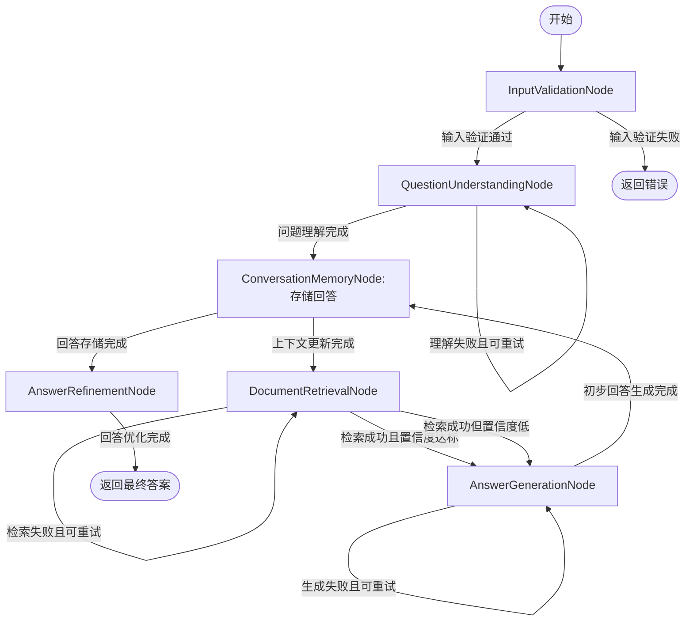

# Flow设计结果

## Flow概述
- **Flow名称**: RAG问答处理流水线
- **Flow描述**: 基于RAG技术的问答处理流程，实现从用户问题输入到生成准确自然答案的完整处理链路
- **起始节点**: InputValidationNode

## Flow图表

## 节点连接关系

### 连接 1
- **源节点**: InputValidationNode
- **目标节点**: QuestionUnderstandingNode
- **触发Action**: default
- **转换条件**: 输入验证通过
- **传递数据**: 验证后的问题文本、结构化对话上下文

### 连接 2
- **源节点**: QuestionUnderstandingNode
- **目标节点**: ConversationMemoryNode
- **触发Action**: update_context
- **转换条件**: 问题理解完成
- **传递数据**: 问题文本、对话历史、问题意图标签、关键实体

### 连接 3
- **源节点**: ConversationMemoryNode
- **目标节点**: DocumentRetrievalNode
- **触发Action**: retrieve_documents
- **转换条件**: 上下文更新完成
- **传递数据**: 优化后的查询向量、关键实体、上下文摘要

### 连接 4
- **源节点**: DocumentRetrievalNode
- **目标节点**: AnswerGenerationNode
- **触发Action**: generate_answer
- **转换条件**: 检索成功且置信度达标
- **传递数据**: 问题文本、相关文档片段列表、结构化对话上下文

### 连接 5
- **源节点**: AnswerGenerationNode
- **目标节点**: ConversationMemoryNode
- **触发Action**: store_answer
- **转换条件**: 初步回答生成完成
- **传递数据**: 问题文本、对话历史、初步回答文本

### 连接 6
- **源节点**: ConversationMemoryNode
- **目标节点**: AnswerRefinementNode
- **触发Action**: refine_answer
- **转换条件**: 回答存储完成
- **传递数据**: 初步回答文本、引用来源信息、更新后的对话历史

### 连接 7
- **源节点**: AnswerRefinementNode
- **目标节点**: END
- **触发Action**: return_result
- **转换条件**: 回答优化完成
- **传递数据**: 格式化的最终答案、置信度评分、引用来源信息

### 连接 8
- **源节点**: InputValidationNode
- **目标节点**: END
- **触发Action**: return_error
- **转换条件**: 输入验证失败
- **传递数据**: 错误信息

### 连接 9
- **源节点**: DocumentRetrievalNode
- **目标节点**: AnswerGenerationNode
- **触发Action**: generate_fallback
- **转换条件**: 检索成功但置信度低
- **传递数据**: 问题文本、有限文档片段、结构化对话上下文

### 连接 10
- **源节点**: QuestionUnderstandingNode
- **目标节点**: QuestionUnderstandingNode
- **触发Action**: retry
- **转换条件**: 理解失败且可重试
- **传递数据**: 验证后的问题文本、结构化对话上下文

### 连接 11
- **源节点**: DocumentRetrievalNode
- **目标节点**: DocumentRetrievalNode
- **触发Action**: retry
- **转换条件**: 检索失败且可重试
- **传递数据**: 优化后的查询向量、关键实体、上下文摘要

### 连接 12
- **源节点**: AnswerGenerationNode
- **目标节点**: AnswerGenerationNode
- **触发Action**: retry
- **转换条件**: 生成失败且可重试
- **传递数据**: 问题文本、相关文档片段、结构化对话上下文

## 执行流程

### 步骤 1
- **节点**: InputValidationNode
- **描述**: 验证用户输入格式有效性，过滤无效请求，准备对话历史上下文
- **输入数据**: 用户输入的自然语言问题、对话历史
- **输出数据**: 传递给QuestionUnderstandingNode的验证后问题文本和结构化对话上下文

### 步骤 2
- **节点**: QuestionUnderstandingNode
- **描述**: 解析问题意图，提取关键实体，生成优化后的查询向量
- **输入数据**: InputValidationNode提供的验证后问题文本和结构化对话上下文
- **输出数据**: 传递给ConversationMemoryNode的问题意图标签、关键实体和优化后的查询向量

### 步骤 3
- **节点**: ConversationMemoryNode
- **描述**: 更新对话历史，生成上下文摘要辅助后续处理
- **输入数据**: QuestionUnderstandingNode提供的问题信息和原始对话历史
- **输出数据**: 传递给DocumentRetrievalNode的上下文摘要和更新后的对话历史

### 步骤 4
- **节点**: DocumentRetrievalNode
- **描述**: 基于查询向量和上下文信息从知识库检索相关文档片段
- **输入数据**: ConversationMemoryNode提供的查询向量、关键实体和上下文摘要
- **输出数据**: 传递给AnswerGenerationNode的相关文档片段列表和检索置信度

### 步骤 5
- **节点**: AnswerGenerationNode
- **描述**: 结合问题、上下文和检索文档生成初步自然语言回答
- **输入数据**: DocumentRetrievalNode提供的相关文档片段和结构化对话上下文
- **输出数据**: 传递给ConversationMemoryNode的初步回答文本和引用来源信息

### 步骤 6
- **节点**: ConversationMemoryNode
- **描述**: 存储新生成的回答到对话历史中
- **输入数据**: AnswerGenerationNode提供的初步回答文本和当前对话历史
- **输出数据**: 传递给AnswerRefinementNode的更新后对话历史

### 步骤 7
- **节点**: AnswerRefinementNode
- **描述**: 优化回答准确性，格式化输出结构，添加引用标记
- **输入数据**: AnswerGenerationNode提供的初步回答文本和ConversationMemoryNode提供的更新后对话历史
- **输出数据**: 返回给用户的格式化最终答案和置信度评分

## 设计理由
1. 采用流水线架构实现RAG问答的完整流程，确保数据流转的逻辑性和完整性；2. 引入ConversationMemoryNode实现多轮对话上下文的有效管理，支持连贯对话；3. 对关键节点(QuestionUnderstandingNode、DocumentRetrievalNode、AnswerGenerationNode)设置重试机制，提高系统鲁棒性；4. 设计分支逻辑处理不同置信度的检索结果，优化回答生成策略；5. 通过AnswerRefinementNode确保输出答案的准确性和格式规范性；6. 所有节点严格遵循输入输出规范，确保数据流的顺畅传递和各节点功能的有效衔接。

---
*生成时间: 2025-08-06 09:56:26*
