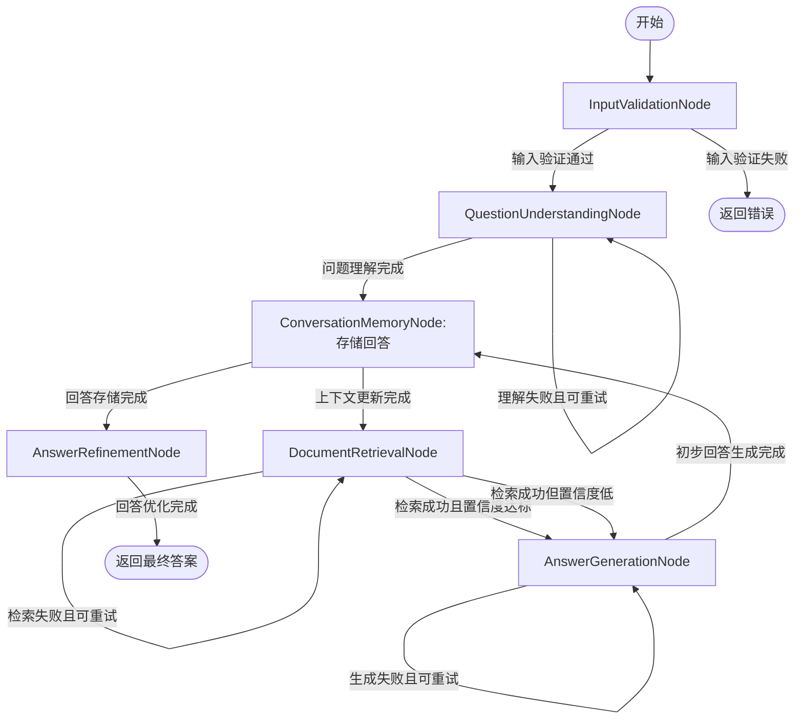

# 智能问答Agent

## 项目需求

智能问答Agent旨在基于RAG（检索增强生成）技术，实现对用户自然语言问题的准确理解、相关知识检索和高质量回答生成。该Agent能够处理多轮对话，维护上下文信息，从知识库中检索相关文档片段，并基于检索结果生成自然、准确的回答。

### 核心功能需求
- **问题理解**：解析用户自然语言问题，提取关键信息和意图
- **文档检索**：基于问题关键信息从知识库向量数据库中检索相关文档片段
- **答案生成**：结合检索到的文档片段和问题上下文生成准确自然的回答
- **对话记忆管理**：维护多轮对话上下文信息，支持连贯对话

### 关键挑战
- 文档分块策略优化
- 向量检索准确性提升
- 长文档上下文理解
- 多轮对话上下文管理

### 成功标准
- 答案准确率达到预期阈值
- 检索相关文档片段准确率高
- 多轮对话上下文连贯性好
- 响应时间在可接受范围内

## 工具函数

| 函数名称 | 描述 | 参数 | 返回值 | 调用节点 |
|---------|------|------|--------|---------|
| `llm_call()` | 调用大语言模型处理自然语言任务 | `prompt`, `model_name`, `params` | `response_text`, `tokens_used` | QuestionUnderstandingNode, AnswerGenerationNode |
| `vector_db_search()` | 向量数据库相似性检索 | `query_vector`, `top_k`, `filters` | `documents`, `scores`, `metadata` | DocumentRetrievalNode |
| `embedding_generate()` | 生成文本的向量表示 | `text`, `model_name` | `vector` | QuestionUnderstandingNode |
| `text_cleaning()` | 文本清洗和预处理 | `text`, `options` | `cleaned_text` | InputValidationNode |
| `entity_extraction()` | 从文本中提取实体 | `text`, `model_name` | `entities`, `confidence` | QuestionUnderstandingNode |
| `intent_classification()` | 识别问题意图 | `text`, `context` | `intent_label`, `confidence` | QuestionUnderstandingNode |
| `citation_formatting()` | 格式化引用来源 | `sources`, `format` | `formatted_citations` | AnswerRefinementNode |

## Flow设计

### 整体设计思路

智能问答Agent采用流水线架构实现RAG问答的完整流程，确保数据流转的逻辑性和完整性。Flow设计遵循以下原则：

1. **模块化设计**：将复杂流程分解为独立的功能节点，每个节点负责单一职责
2. **上下文管理**：引入ConversationMemoryNode实现多轮对话上下文的有效管理
3. **鲁棒性保障**：对关键节点设置重试机制，提高系统容错能力
4. **灵活分支处理**：设计分支逻辑处理不同置信度的检索结果，优化回答生成策略
5. **标准化接口**：所有节点严格遵循输入输出规范，确保数据流顺畅传递

### 节点连接和Action驱动的转换逻辑

Flow通过明确的Action定义实现节点间的状态转换，主要Action包括：

- **default**：标准流程推进
- **return_error**：返回错误信息
- **update_context**：更新对话上下文
- **retrieve_documents**：检索相关文档
- **generate_answer**：生成标准回答
- **generate_fallback**：生成降级回答
- **store_answer**：存储生成的回答
- **refine_answer**：优化回答
- **return_result**：返回最终结果
- **retry**：重试当前节点

### 完整的执行流程描述

1. **InputValidationNode**：验证用户输入格式有效性，过滤无效请求，准备对话历史上下文
2. **QuestionUnderstandingNode**：解析问题意图，提取关键实体，生成优化后的查询向量
3. **ConversationMemoryNode**：更新对话历史，生成上下文摘要辅助后续处理
4. **DocumentRetrievalNode**：基于查询向量和上下文信息从知识库检索相关文档片段
5. **AnswerGenerationNode**：结合问题、上下文和检索文档生成初步自然语言回答
6. **ConversationMemoryNode**：存储新生成的回答到对话历史中
7. **AnswerRefinementNode**：优化回答准确性，格式化输出结构，添加引用标记

### Flow图表

## 数据结构

### 共享存储结构

共享存储(shared)用于在各节点间传递和共享关键数据，包含输入数据、中间处理结果、对话上下文和系统状态信息。

#### 主要字段定义

| 字段名称 | 数据类型 | 描述 | 读写节点 | 示例值 |
|---------|---------|------|---------|--------|
| `raw_user_input` | str | 用户原始输入的自然语言问题 | 写入:FlowInitiator 读取:InputValidationNode | "什么是人工智能的发展历程？" |
| `raw_conversation_history` | list | 原始对话历史记录 | 写入:FlowInitiator 读取:InputValidationNode | [{"role": "user", "content": "..."}] |
| `validated_question` | str | 经过验证和预处理的问题文本 | 写入:InputValidationNode 读取:QuestionUnderstandingNode | "什么是人工智能的发展历程？" |
| `structured_conversation_context` | dict | 结构化的对话上下文信息 | 写入:InputValidationNode 读取:QuestionUnderstandingNode, AnswerGenerationNode | {"history": [...], "turn_count": 1} |
| `question_intent` | str | 用户问题的意图分类标签 | 写入:QuestionUnderstandingNode 读取:DocumentRetrievalNode | "development_history" |
| `extracted_entities` | list | 从问题中提取的关键实体列表 | 写入:QuestionUnderstandingNode 读取:DocumentRetrievalNode | [{"entity": "人工智能", "type": "concept"}] |
| `optimized_query_vector` | list | 优化后的问题查询向量 | 写入:QuestionUnderstandingNode 读取:DocumentRetrievalNode | [0.123, 0.456, -0.789] |
| `updated_conversation_history` | list | 更新后的完整对话历史 | 写入:ConversationMemoryNode 读取:AnswerGenerationNode | [{"role": "user", "content": "..."}, ...] |
| `context_summary` | str | 对话上下文的摘要信息 | 写入:ConversationMemoryNode 读取:DocumentRetrievalNode | "用户之前询问了人工智能的定义..." |
| `retrieved_documents` | list | 检索到的相关文档片段列表 | 写入:DocumentRetrievalNode 读取:AnswerGenerationNode | [{"id": "doc123", "content": "...", "score": 0.92}] |
| `retrieval_confidence` | float | 文档检索结果的整体置信度 | 写入:DocumentRetrievalNode 读取:AnswerGenerationNode | 0.87 |
| `initial_answer` | str | 初步生成的自然语言回答 | 写入:AnswerGenerationNode 读取:ConversationMemoryNode, AnswerRefinementNode | "人工智能的发展历程可以分为..." |
| `citation_sources` | list | 回答引用的来源信息列表 | 写入:AnswerGenerationNode 读取:AnswerRefinementNode | [{"doc_id": "doc123", "quote": "..."}] |
| `final_answer` | str | 经过优化和格式化的最终回答 | 写入:AnswerRefinementNode 读取:FlowTerminator | "人工智能的发展历程可分为以下阶段..." |
| `answer_confidence` | float | 最终回答的置信度评分 | 写入:AnswerRefinementNode 读取:FlowTerminator | 0.89 |
| `error_info` | dict | 错误信息，包含错误类型和描述 | 写入:各节点 读取:FlowTerminator | {"error_type": "validation_error", "message": "..."} |
| `node_execution_status` | dict | 各节点的执行状态信息 | 写入:各节点 读取:所有节点 | {"InputValidationNode": "completed", ...} |

#### 数据流转模式

1. **输入验证与预处理流程**
   - 涉及字段: `raw_user_input`, `raw_conversation_history`, `validated_question`, `structured_conversation_context`
   - 流转路径: `raw_user_input → InputValidationNode → validated_question`
             `raw_conversation_history → InputValidationNode → structured_conversation_context`

2. **问题理解与上下文管理流程**
   - 涉及字段: `validated_question`, `structured_conversation_context`, `question_intent`, `extracted_entities`, `optimized_query_vector`, `updated_conversation_history`, `context_summary`
   - 流转路径: `validated_question+structured_conversation_context → QuestionUnderstandingNode → question_intent+extracted_entities+optimized_query_vector → ConversationMemoryNode → updated_conversation_history+context_summary`

3. **文档检索与回答生成流程**
   - 涉及字段: `optimized_query_vector`, `extracted_entities`, `context_summary`, `retrieved_documents`, `retrieval_confidence`, `initial_answer`, `citation_sources`
   - 流转路径: `optimized_query_vector+extracted_entities+context_summary → DocumentRetrievalNode → retrieved_documents+retrieval_confidence → AnswerGenerationNode → initial_answer+citation_sources`

4. **回答优化与最终输出流程**
   - 涉及字段: `initial_answer`, `citation_sources`, `updated_conversation_history`, `final_answer`, `answer_confidence`
   - 流转路径: `initial_answer+citation_sources+updated_conversation_history → AnswerRefinementNode → final_answer+answer_confidence`

## Node设计

### InputValidationNode

#### 基本信息
- **Node类型**: Node
- **Purpose**: 验证和预处理用户输入，确保输入格式有效，过滤无效请求，准备结构化对话上下文
- **Complexity Level**: 简单
- **Processing Type**: 数据预处理
- **Retry Recommended**: false

#### Data Access
- **读取共享数据**: `raw_user_input`, `raw_conversation_history`
- **写入共享数据**: `validated_question`, `structured_conversation_context`, `error_info`, `node_execution_status`
- **临时变量**: `cleaned_question`, `validation_errors`, `structured_context`

#### 详细设计

**prep_stage**
- **描述**: 从共享存储读取原始输入数据，验证数据完整性和基本格式
- **输入验证逻辑**:
  1. 检查user_input是否存在且为非空字符串
  2. 验证conversation_history是否为数组类型（允许为空数组）
  3. 检查输入数据是否符合系统处理要求的基本格式
- **准备步骤**:
  1. 从shared中提取用户输入和对话历史
  2. 验证必要输入字段是否存在
  3. 对输入数据进行类型检查和格式初步验证
  4. 准备结构化的输入数据供exec阶段使用
- **输出**: 包含原始用户输入文本和对话历史的对象，验证失败则包含错误信息

**exec_stage**
- **描述**: 执行输入内容的深度验证和预处理，包括文本清洗、长度检查、敏感内容过滤
- **处理步骤**:
  1. 执行文本清洗：去除多余空格、特殊字符和控制字符
  2. 验证文本长度：确保问题长度在有效范围内(1-500字符)
  3. 检查敏感内容：过滤包含违规词汇的输入
  4. 构建结构化对话上下文：将原始对话历史转换为标准化格式
- **错误处理**:
  1. 文本清洗失败时返回格式错误
  2. 长度超出范围时返回长度错误
  3. 检测到敏感内容时返回内容违规错误
  4. 对话历史格式转换失败时返回历史格式错误
- **输出**: 包含验证后问题文本、结构化对话上下文和验证状态的对象

**post_stage**
- **描述**: 根据exec阶段的验证结果决定后续Action，更新共享存储
- **结果处理**:
  1. 若验证通过，整理cleaned_question和structured_context
  2. 若验证失败，格式化错误信息并记录失败原因
- **Action逻辑**:
  - 当exec_res.is_valid为true时，返回'default' Action
  - 当exec_res.is_valid为false时，返回'return_error' Action
- **可能的Action**: 'default', 'return_error'

### QuestionUnderstandingNode

#### 基本信息
- **Node类型**: AsyncNode
- **Purpose**: 解析问题并提取关键信息，包括问题意图识别、实体提取和查询优化
- **Complexity Level**: 中等
- **Processing Type**: 核心计算
- **Retry Recommended**: true

#### Data Access
- **读取共享数据**: `validated_question`, `structured_conversation_context`, `retry_count`
- **写入共享数据**: `question_intent`, `extracted_entities`, `optimized_query_vector`, `understanding_confidence`, `error_info`, `node_execution_status`
- **临时变量**: `conversation_context`, `model_parameters`, `intent_result`, `entity_result`, `query_vector`

#### 详细设计

**prep_stage**
- **描述**: 准备问题理解所需的输入数据，验证数据完整性和格式
- **输入验证逻辑**:
  1. 检查validated_question是否为非空字符串
  2. 验证structured_conversation_context是否包含必要的对话历史字段
  3. 确认retry_count为非负整数
- **准备步骤**:
  1. 从structured_conversation_context中提取最近3轮对话历史作为上下文参考
  2. 格式化问题文本与上下文信息为模型输入格式
  3. 初始化重试计数器（如不存在）
  4. 根据重试次数动态调整模型参数（如temperature）
- **输出**: 包含原始问题文本、格式化的对话上下文、当前重试次数和模型参数的对象

**exec_stage**
- **描述**: 执行问题理解的核心处理，包括意图识别、实体提取和查询优化
- **处理步骤**:
  1. 调用意图识别模型识别问题类型和意图标签
  2. 使用实体提取模型从问题中提取关键实体及其类型
  3. 结合上下文信息解析指代关系和省略信息
  4. 生成优化后的查询文本和向量表示
  5. 计算理解结果的置信度分数
- **错误处理**:
  1. 捕获模型调用异常并返回特定错误类型
  2. 当置信度低于阈值时标记为低置信度结果
  3. 实体提取失败时返回空实体列表而非错误
- **输出**: 包含问题意图标签、理解置信度、提取的实体列表、优化后的查询文本和向量表示的对象

**post_stage**
- **描述**: 处理问题理解结果，更新共享数据，并决定下一步行动
- **结果处理**:
  1. 过滤低置信度的实体
  2. 格式化实体列表为标准化结构
  3. 基于置信度分数和错误信息评估理解质量
- **Action逻辑**:
  - 如果理解置信度 >= 阈值(0.7)且无关键错误，返回'update_context'动作
  - 如果置信度 < 阈值但 > 最低重试阈值(0.4)且重试次数 < 最大重试次数，返回'retry'动作
  - 如果置信度 <= 最低重试阈值或达到最大重试次数，返回'handle_failed_understanding'动作
- **可能的Action**: 'update_context', 'retry', 'handle_failed_understanding'

#### 重试配置
- **max_retries**: 3
- **wait**: 1.0秒
- **retry_conditions**: 
  - 理解置信度在0.4-0.7之间
  - 模型返回暂时性错误
  - 实体提取不完整但存在部分结果
  - 检测到可解决的歧义

### ConversationMemoryNode

#### 基本信息
- **Node类型**: Node
- **Purpose**: 管理多轮对话上下文，更新对话历史并生成上下文摘要，支持连贯的多轮对话处理
- **Complexity Level**: 简单
- **Processing Type**: 数据处理
- **Retry Recommended**: false

#### Data Access
- **读取共享数据**: `question_text`, `dialogue_history`, `intent_label`, `key_entities`, `preliminary_answer`, `current_action`
- **写入共享数据**: `updated_conversation_history`, `context_summary`, `node_execution_status`
- **临时变量**: `action_type`, `context_params`, `summary_prompt`, `updated_history`

#### 详细设计

**prep_stage**
- **描述**: 准备阶段：验证输入数据完整性，加载当前对话历史，为上下文处理做准备
- **输入验证逻辑**:
  1. 验证输入数据格式和完整性
  2. 检查对话历史结构是否有效
  3. 确认当前action是'update_context'或'store_answer'之一
- **准备步骤**:
  1. 解析当前action类型确定处理模式
  2. 加载并验证对话历史数据结构
  3. 提取与当前action相关的输入参数
  4. 初始化上下文处理所需的临时变量
- **输出**: 包含action类型、有效输入标记、对话历史、上下文处理参数和错误信息的对象

**exec_stage**
- **描述**: 执行阶段：根据action类型执行上下文更新或回答存储操作
- **处理步骤**:
  1. 如果action_type是'update_context'：
     - 合并新问题到对话历史
     - 生成上下文摘要
     - 优化查询向量
  2. 如果action_type是'store_answer'：
     - 合并初步回答到对话历史
     - 更新对话状态
  3. 应用对话历史长度限制策略，确保上下文窗口大小可控
  4. 生成或更新上下文相关元数据
- **错误处理**:
  1. 对话历史合并冲突时保留最新记录并记录冲突日志
  2. 上下文摘要生成失败时使用原始历史文本
  3. 查询向量优化失败时回退到基础问题向量
- **输出**: 包含更新后的对话历史、上下文摘要、优化后的查询向量和操作完成状态的对象

**post_stage**
- **描述**: 后置阶段：根据执行结果更新共享数据，决定后续Action
- **结果处理**:
  1. 格式化更新后的对话历史为标准结构
  2. 准备上下文摘要供后续节点使用
  3. 记录上下文处理元数据
- **Action逻辑**:
  - 如果action_type是'update_context'且成功完成，返回'retrieve_documents'动作
  - 如果action_type是'store_answer'且成功完成，返回'refine_answer'动作
  - 如果处理失败，返回'return_error'动作
- **可能的Action**: 'retrieve_documents', 'refine_answer', 'return_error'

### DocumentRetrievalNode

#### 基本信息
- **Node类型**: AsyncNode
- **Purpose**: 从知识库检索与用户问题相关的文档片段，为后续回答生成提供依据
- **Complexity Level**: 中等
- **Processing Type**: IO操作
- **Retry Recommended**: true

#### Data Access
- **读取共享数据**: `optimized_query_vector`, `extracted_entities`, `context_summary`, `retrieval_thresholds`, `retry_count`
- **写入共享数据**: `retrieved_documents`, `retrieval_confidence`, `retrieval_status`, `error_info`, `node_execution_status`
- **临时变量**: `vector_search_results`, `keyword_search_results`, `merged_results`, `filtered_results`, `composite_retrieval_condition`

#### 详细设计

**prep_stage**
- **描述**: 准备检索所需的输入数据，验证数据完整性和有效性
- **输入验证逻辑**:
  1. 验证query_vector不为空且维度正确
  2. 验证extracted_entities为非空列表
  3. 验证context_summary为有效字符串
  4. 检查重试次数是否在允许范围内
- **准备步骤**:
  1. 从shared中提取检索所需的核心参数
  2. 验证所有必要输入数据的存在性和格式
  3. 准备检索配置参数(如top_k、score_threshold等)
  4. 构建复合检索条件(向量+关键词)
  5. 初始化检索结果存储结构
- **输出**: 包含验证后的query_vector、key_entities列表、context_summary字符串、检索配置参数和复合检索条件的对象

**exec_stage**
- **描述**: 执行文档检索操作，从知识库获取相关文档片段并计算置信度
- **处理步骤**:
  1. 执行向量检索，获取top_k相似文档
  2. 执行关键词检索，基于key_entities获取相关文档
  3. 融合两种检索结果，去除重复文档
  4. 根据相似度分数和实体匹配度重新排序
  5. 过滤低于置信度阈值的文档
  6. 提取文档关键片段，添加元数据
  7. 计算整体检索置信度
  8. 记录检索统计信息(耗时、召回率等)
- **错误处理**:
  1. 捕获数据库连接错误，记录详细错误信息
  2. 处理检索超时情况，返回部分结果(如可用)
  3. 处理空结果情况，标记为检索失败
  4. 对不同错误类型应用不同重试策略
- **输出**: 包含检索到的文档列表、检索置信度分数、检索状态、错误信息和检索统计信息的对象

**post_stage**
- **描述**: 处理检索结果，更新shared状态，根据检索结果和置信度决定后续Action
- **结果处理**:
  1. 处理检索文档格式，提取关键信息
  2. 计算并标准化整体置信度分数
  3. 对检索文档进行截断或格式化以适应后续处理
- **Action逻辑**:
  - 如果retrieval_status为成功且retrieval_confidence >= threshold，触发'generate_answer'
  - 如果retrieval_status为成功但retrieval_confidence < threshold，触发'generate_fallback'
  - 如果retrieval_status为失败且retry_count < max_retries，触发'retry'
  - 如果retrieval_status为失败且retry_count >= max_retries，触发'generate_fallback'
- **可能的Action**: 'generate_answer', 'generate_fallback', 'retry'

#### 重试配置
- **max_retries**: 3
- **wait**: 1.5秒
- **backoff_strategy**: 指数退避
- **jitter**: true
- **retry_conditions**:
  - 数据库连接错误
  - 检索超时但未返回任何结果
  - 服务暂时不可用错误
  - 网络连接问题
  - 服务器内部错误(5xx)

### AnswerGenerationNode

#### 基本信息
- **Node类型**: AsyncNode
- **Purpose**: 生成准确自然的回答，根据检索结果的置信度采用不同生成策略，并处理生成失败的重试逻辑
- **Complexity Level**: 复杂
- **Processing Type**: 核心计算
- **Retry Recommended**: true

#### Data Access
- **读取共享数据**: `question_text`, `retrieved_documents`, `structured_conversation_context`, `retrieval_confidence`, `retry_count`
- **写入共享数据**: `initial_answer`, `citation_sources`, `generation_status`, `error_info`, `node_execution_status`
- **临时变量**: `generation_pattern`, `processed_documents`, `prompt`, `model_params`, `raw_answer`, `citation_markers`

#### 详细设计

**prep_stage**
- **描述**: 准备生成回答所需的所有输入数据，验证数据完整性和格式
- **输入验证逻辑**:
  1. 验证question_text不为空且为字符串类型
  2. 验证structured_context包含必要的对话历史信息
  3. 对generate_answer和retry action验证retrieved_documents为非空列表
  4. 验证retrieval_confidence（如存在）为0-1之间的数值
- **准备步骤**:
  1. 根据incoming action确定生成模式（标准生成/降级生成/重试）
  2. 过滤和排序相关文档片段，按相关性和时效性排序
  3. 根据文档数量和长度进行截断，确保不超过模型上下文限制
  4. 构建符合当前生成模式的提示词模板
  5. 准备模型调用参数，设置temperature、top_p等超参数
- **输出**: 包含生成模式、处理后的文档片段、构建的提示词、模型参数和重试计数的对象

**exec_stage**
- **描述**: 基于prep阶段准备的材料调用大语言模型生成回答
- **处理步骤**:
  1. 根据生成模式选择合适的语言模型
  2. 调用模型API，传入准备好的提示词和文档片段
  3. 处理模型返回的流式响应，拼接生成结果
  4. 监控生成过程中的异常和超时情况
  5. 对生成结果进行初步质量检查，过滤明显不相关内容
- **错误处理**:
  1. 捕获API调用异常，区分网络错误、超时错误和模型错误
  2. 实现模型输出截断保护，防止生成过长内容
  3. 对质量检查失败的结果标记为生成失败
  4. 记录错误详情和上下文用于调试和重试优化
- **输出**: 包含生成的原始回答、生成状态、错误信息、生成用时和引用标记的对象

**post_stage**
- **描述**: 处理生成结果，评估生成质量，决定后续Action
- **结果处理**:
  1. 清理生成的原始回答，去除多余空格和重复内容
  2. 提取和规范化引用标记，关联到原始文档来源
  3. 对生成回答进行初步质量评分（流畅度、相关性、完整性）
  4. 为降级生成模式的回答添加适当的不确定性提示
- **Action逻辑**:
  - 如果生成成功(status=success)，触发'store_answer' action
  - 如果生成失败且当前重试次数小于最大重试次数，触发'retry' action
  - 如果生成失败且达到最大重试次数，触发'store_answer' action但标记为降级回答
- **可能的Action**: 'store_answer', 'retry'

#### 重试配置
- **max_retries**: 3
- **wait**: 1.5秒
- **retry_conditions**:
  - 网络连接错误
  - API超时错误
  - 模型内部错误
  - 生成内容为空
  - 质量评分低于阈值(0.3)

### AnswerRefinementNode

#### 基本信息
- **Node类型**: Node
- **Purpose**: 优化和格式化最终答案，提升回答质量、结构清晰度和引用规范性
- **Complexity Level**: 中等
- **Processing Type**: 结果后处理
- **Retry Recommended**: false

#### Data Access
- **读取共享数据**: `initial_answer`, `citation_sources`, `conversation_history`, `retrieval_confidence`
- **写入共享数据**: `final_answer`, `answer_confidence`, `formatted_citations`, `node_execution_status`
- **临时变量**: `preliminary_answer`, `sorted_citations`, `refinement_prompt`, `formatted_output`

#### 详细设计

**prep_stage**
- **描述**: 准备阶段：验证输入数据完整性，提取必要信息，为执行阶段做准备
- **输入验证逻辑**:
  1. 验证preliminary_answer不为空且为字符串类型
  2. 验证citation_sources为数组且包含必要字段(id, content, similarity_score)
  3. 验证retrieval_confidence存在且在0-1范围内
- **准备步骤**:
  1. 提取初步回答文本内容
  2. 整理引用来源信息并按相关性排序
  3. 提取最近3轮对话历史作为上下文参考
  4. 初始化优化参数和格式模板
- **输出**: 包含初步回答文本、排序后的引用来源列表、上下文对话历史和优化配置参数的对象

**exec_stage**
- **描述**: 执行阶段：执行回答优化和格式化的核心逻辑
- **处理步骤**:
  1. 回答内容优化：修正语法错误，提升表达流畅度，确保逻辑连贯
  2. 引用整合：将相关引用来源与回答内容关联，添加内联引用标记
  3. 结构格式化：按照预设模板组织回答结构，区分主要内容和引用部分
  4. 置信度校准：基于引用质量和内容匹配度调整置信度评分
- **错误处理**:
  1. 若优化过程中出现NLP处理错误，使用原始回答文本继续后续步骤
  2. 若引用整合失败，单独列出引用来源部分
  3. 若置信度计算异常，使用原始置信度并添加警告标记
- **输出**: 包含优化后的回答文本、格式化的输出内容、最终引用列表、最终置信度评分和优化状态的对象

**post_stage**
- **描述**: 后置阶段：处理执行结果，更新shared数据，决定后续Action
- **结果处理**:
  1. 验证exec_res中的refinement_status是否为成功状态
  2. 提取formatted_output作为最终呈现给用户的内容
  3. 整理final_citations为标准格式
  4. 记录优化前后的置信度变化
- **Action逻辑**:
  - 当refinement_status为'success'时，触发'return_result' Action
  - 若出现非致命错误但仍生成可用结果，同样触发'return_result'但在metadata中记录警告
  - 若发生严重错误导致无法生成有效回答，触发'error_recovery' Action
- **可能的Action**: 'return_result', 'error_recovery'

---

本设计文档详细描述了智能问答Agent的架构和实现细节，遵循pocketflow的最佳实践，体现了关注点分离原则，包含完整的Action驱动逻辑和清晰的数据流设计。通过模块化的节点设计和灵活的Flow控制，该Agent能够高效处理用户问题，提供准确、自然的回答，并支持连贯的多轮对话。