# Research Agent 架构图

## 整体架构

## 数据流架构

## 节点详细架构

### NodeSearch (搜索节点)

### NodeURL (URL解析节点)

### LLMAnalysisNode (LLM分析节点)

### ResultAssemblyNode (结果组装节点)

## 并发处理架构

## 错误处理架构

## 配置架构

## 测试架构（已验证）

```mermaid
graph TB
    subgraph "测试层级"
        A[单元测试]
        B[集成测试]
        C[端到端测试]
    end

    subgraph "测试文件"
        D[test_complete_research_agent.py]
    end

    subgraph "测试内容 ✅"
        H[配置和导入测试]
        I[ProcessResearch prep方法测试]
        J[单个关键词子流程测试]
        K[并发研究流程测试]
        L[ProcessResearch完整流程测试]
    end

    subgraph "验证结果"
        M[5/5测试通过]
        N[真实API调用成功]
        O[pocketflow最佳实践验证]
        P[并发处理验证]
        Q[数据流完整性验证]
    end

    A --> D
    B --> D
    C --> D

    D --> H
    D --> I
    D --> J
    D --> K
    D --> L

    H --> M
    I --> N
    J --> O
    K --> P
    L --> Q
```

### 测试执行结果

**测试状态**: ✅ 全部通过 (5/5)
**测试时间**: 2024年12月1日
**成功率**: 100%
**关键词处理**: 5/5成功
**API调用**: 正常工作
**并发处理**: 稳定可靠

## 部署架构

---

*本文档提供了 Research Agent 的完整架构视图，包括数据流、并发处理、错误处理、配置管理、测试和部署等各个方面。*
