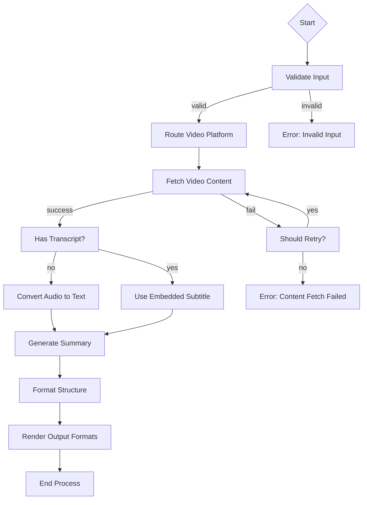

# YouTube Summary System Design

## Project Requirements

This project implements a system to summarize YouTube videos by extracting audio/subtitles, converting to text if needed, generating summaries, structuring the output, and delivering in multiple formats (text, Markdown, JSON, HTML). The system supports error handling, extensible video source architecture, asynchronous processing, and structured output.

---

## Utility Functions

1. **Video Content Fetching** (`utils/video_fetcher.py`)
   - Abstract interface `VideoContentFetcher` for platform-independent content retrieval
   - Default implementation: `YouTubeAudioFetcher` using `youtube_audio_fetch`

2. **ASR Service** (`utils/asr_adapter.py`)
   - Adapter interface `ASRProvider` for speech-to-text conversion
   - Default implementation: `ASRMCPAdapter` using ASR_MCP engine

3. **Summarizer** (`utils/summarizer_adapter.py`)
   - Interface `TextSummarizer` for flexible NLP backend integration
   - Default: `NLPModelAdapter` using generic NLP summarization model

4. **Structure Formatter** (`utils/structure_formatter.py`)
   - Converts raw summary into standardized JSON structure

5. **Output Generator** (`utils/output_generator.py`)
   - Multi-format renderer supporting text, markdown, JSON, HTML based on unified schema

6. **Auth & Rate Limiting** (`utils/auth_handler.py`)
   - Support JWT/OAuth2 authentication and Redis-based rate limiting

---

## Flow Design

The system is designed as an AsyncFlow combining core synchronous operations with optional asynchronous execution for long-running tasks. It uses nested flows to encapsulate logical stages and employs batch operations where appropriate.

### Key Flow Stages:

1. **Input Validation & Platform Routing**
2. **Content Acquisition (sync or async)**
3. **Text Extraction (optional ASR stage)**
4. **Summary Generation (parallelizable via BatchNode)**
5. **Structured Formatting**
6. **Multi-format Output Rendering**

### Flow Diagram



### Error Handling Branches

Each major node includes fallback mechanisms:
- `fetchContent` retries up to 3 times with exponential backoff
- Fallback to alternative platforms when primary fetch fails
- If ASR fails but transcript exists, proceed with available text
- Summary generation has fallback to bullet-point extraction if full summarization fails

---

## Data Structure

Shared memory structure maintains all state between nodes:

```python
shared = {
    "input": {
        "url": str,
        "platform": str,         # 'youtube', 'bilibili', etc.
        "request_id": str,
        "user_id": str           # Optional
    },
    "metadata": {
        "video_id": str,
        "title": str,
        "duration_sec": int,
        "timestamp": float       # When content was fetched
    },
    "content": {
        "raw_text": str,         # Raw transcript/audio conversion
        "cleaned_text": str,     # Preprocessed for summarization
        "source_type": str,      # 'embedded_subs', 'auto_gen', 'asr', 'user_upload'
        "language": str
    },
    "summary": {
        "raw": str,              # Unstructured summary
        "structured": {          # Structured summary per chapter/topic
            "chapters": [
                {
                    "title": str,
                    "start_time": float,
                    "key_points": [str]
                }
            ],
            "highlights": [str]
        },
        "fallback_used": bool    # Whether fallback mechanism was triggered
    },
    "output": {
        "text": str,
        "markdown": str,
        "json": dict,
        "html": str
    },
    "status": {
        "current_step": str,     # Current processing stage
        "errors": list,          # List of error objects
        "retries_left": int
    }
}
```

---

## Node Designs

### 1. ValidateInput
- **Purpose**: Ensure input conforms to expected format and requirements
- **Design**: Regular Node
- **Parameters**: 
  - `max_retries=0` (validation should not retry)
- **Data Access**:
  - Read: `input.url`, `input.platform`
  - Write: Validated input metadata to shared store
- **Methods**:  
  ```python
  def prep(self, shared):
      return {"url": shared["input"]["url"], "platform": shared.get("input", {}).get("platform", "youtube")}
  
  def exec(self, prep_res):
      if not prep_res["url"]:
          raise ValueError("Missing URL")
      if prep_res["platform"] not in ["youtube", "bilibili", "vimeo"]:
          raise ValueError(f"Unsupported platform: {prep_res['platform']}")
      return {"valid": True}
  
  def post(self, shared, prep_res, exec_res):
      if exec_res["valid"]:
          return "success"
      else:
          return "invalid"
  ```

### 2. RouteVideoPlatform
- **Purpose**: Select appropriate adapter based on video platform
- **Design**: Regular Node
- **Data Access**:
  - Read: `input.platform`, `input.url`
  - Write: Configured `video_fetcher` instance to shared store
- **Implementation Details**:  
  Uses factory pattern to instantiate correct `VideoContentFetcher` implementation

### 3. FetchVideoContent
- **Purpose**: Retrieve video content from designated source
- **Design**: AsyncNode (to handle potentially slow network requests)
- **Parameters**:
  - `max_retries=3`
  - `wait=10`
- **Data Access**:
  - Read: Configured `video_fetcher` from shared
  - Write: Raw video data path or download location
- **Asynchronous Implementation**:
  ```python
  async def prep_async(self, shared):
      return {"fetcher": shared["video_fetcher"]}
  
  async def exec_async(self, prep_res):
      try:
          result = await prep_res["fetcher"].fetch()
          return {"success": True, "data_path": result["path"]}
      except Exception as e:
          return {"success": False, "error": str(e)}
  
  def post(self, shared, prep_res, exec_res):
      if exec_res["success"]:
          shared["content"]["file_path"] = exec_res["data_path"]
          return "success"
      else:
          return "retry"
  ```

### 4. CheckTranscriptAvailability
- **Purpose**: Determine if embedded subtitle exists to avoid unnecessary ASR conversion
- **Design**: Regular Node
- **Data Access**:
  - Read: Raw content metadata
  - Write: Transcript availability status
- **Branch Logic**:
  ```python
  def post(self, shared, prep_res, exec_res):
      if shared["content"]["has_transcript"]:
          return "use_transcript"
      else:
          return "convert_speech"
  ```

### 5. ConvertSpeechToText
- **Purpose**: Convert audio file to text when no transcript available
- **Design**: BatchNode (can batch multiple segments)
- **Parameters**:
  - `max_retries=3`
  - `wait=15`
- **Data Access**:
  - Read: Audio file path
  - Write: Generated text content
- **Fallback Implementation**:
  ```python
  def exec_fallback(self, prep_res, exc):
      logger.warning(f"Full ASR failed, using fallback extraction: {exc}")
      return {"text": extract_key_phrases(prep_res["audio"]), "fallback": True}
  ```

### 6. GenerateSummary
- **Purpose**: Create concise summary from transcript or converted text
- **Design**: BatchNode (supports parallel processing of sections)
- **Parameters**:
  - `batch_size=5` (process up to 5 sections in parallel)
- **Execution Characteristics**:
  - Supports multiple summarization strategies
  - Can be implemented as AsyncParallelBatchNode if using remote NLP services

### 7. FormatStructure
- **Purpose**: Convert raw summary into standardized format
- **Design**: Regular Node
- **Data Access**:
  - Read: Raw summary content
  - Write: Structured summary object

### 8. RenderOutputFormats
- **Purpose**: Generate final outputs in various formats
- **Design**: BatchNode (parallel rendering of different formats)
- **Data Access**:
  - Read: Structured summary
  - Write: All output formats to shared store