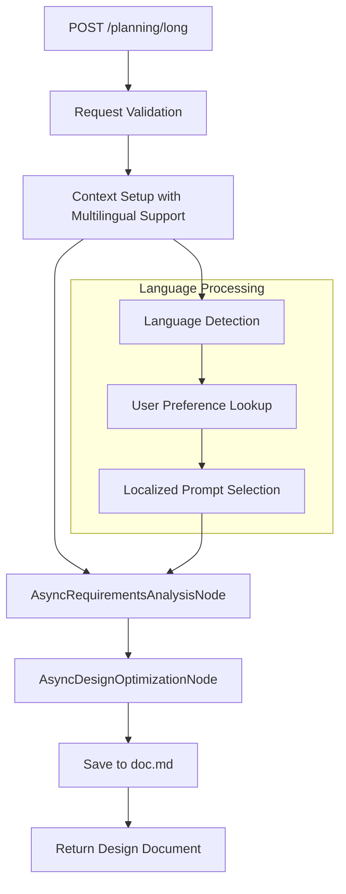

# Long Planning API Design Document

## Overview

The Long Planning API is designed for generating comprehensive design documents based on user requirements, previous workflows, and existing design documents. It supports complex project planning with multilingual capabilities and follows Node/Flow architecture patterns.

## API Specification

### Endpoint
`POST /planning/long`

### Purpose
Generate detailed technical design documents that integrate:
- User natural language requirements
- Previous workflow steps (from short planning)
- Existing design documents for enhancement
- Comprehensive Node/Flow architecture guidelines

### Input Parameters
- **requirement** (required): User's natural language requirement description
- **previous_flow** (optional): Previous workflow steps for context
- **design_doc** (optional): Existing design document for enhancement
- **language** (optional): Preferred language (en, zh, es, fr, ja)
- **user_id** (optional): User identifier for language preferences

### Output
- **flow**: Comprehensive design document in markdown format
- **language**: Language used for processing
- **user_id**: User identifier (if provided)

## Processing Flow Design

The Long Planning API follows a sequential two-node processing pattern:



### Processing Steps

1. **Request Reception and Validation**
   - Parse request body using `LongPlanningRequest` schema
   - Validate required `requirement` field
   - Extract optional parameters: `previous_flow`, `design_doc`, `language`, `user_id`

2. **Multilingual Context Setup**
   - Determine processing language using priority order:
     - Explicit `language` parameter
     - User preference from `user_id` lookup
     - Auto-detection from `requirement` text
     - System default (en)
   - Setup shared context with multilingual metadata

3. **Requirements Analysis Node (AsyncRequirementsAnalysisNode)**
   - **Input**: Natural language requirement, short flow steps, processed documents
   - **Processing**: Language-aware requirements analysis using localized prompts
   - **Output**: Structured requirements analysis stored in shared context

4. **Design Optimization Node (AsyncDesignOptimizationNode)**
   - **Input**: Analyzed requirements, conversation history, existing documents
   - **Processing**: Comprehensive design document generation with Node/Flow guidelines
   - **Output**: Complete markdown design document

5. **File System Integration**
   - Save generated design document to `doc.md`
   - Enable external access to generated documentation

6. **Response Generation**
   - Return design document with language metadata
   - Include user identifier if provided

## Node Architecture and Data Flow

### Shared Memory Structure

```python
shared = {
    "user_input": {
        "processed_natural_language": str,  # User requirement
        "processed_documents": Any          # Design document content
    },
    "short_flow_steps": Optional[Any],     # Previous workflow steps
    "conversation_history": [],            # Conversation context
    "request_language": Optional[str],     # Requested language
    "user_id": Optional[str],             # User identifier
    "user_language_preference": Optional[str],  # User preference
    "language": str,                      # Determined language
    "requirements": str,                  # Analyzed requirements
    "documentation": str                  # Generated documentation
}
```

### Node Execution Sequence

```python
# Node instantiation
requirement_node = AsyncRequirementsAnalysisNode()
design_doc_node = AsyncDesignOptimizationNode()

# Sequential connection
requirement_node >> design_doc_node

# Flow execution
await AsyncFlow(start=requirement_node).run_async(shared)
```

### Node Implementation Details

#### AsyncRequirementsAnalysisNode
- **Purpose**: Analyze and structure user requirements
- **Design**: AsyncNode with multilingual support
- **Data Access**:
  - Read: processed_natural_language, short_flow_steps, processed_documents
  - Write: requirements to shared context
- **Processing**:
  - Language detection and localized prompt selection
  - LLM-based requirements analysis
  - Context-aware requirement structuring

#### AsyncDesignOptimizationNode
- **Purpose**: Generate comprehensive design documentation
- **Design**: AsyncNode with complex document processing
- **Data Access**:
  - Read: requirements, conversation_history, processed_documents
  - Write: processed_documents, documentation, file system (doc.md)
- **Processing**:
  - Comprehensive design document generation
  - Node/Flow architecture pattern integration
  - Markdown formatting and file output

## Key Features and Extensibility

### Asynchronous Processing
- All nodes implement async patterns for I/O-intensive operations
- Non-blocking LLM interactions
- Concurrent request handling capability

### Multilingual Support
- Language detection at multiple levels
- Localized prompt templates for all processing stages
- User preference integration and storage

### Extensibility Points
- Additional nodes can be inserted in the processing chain
- Shared context structure supports additional metadata
- Modular design enables feature enhancement

### Integration Capabilities
- File system integration for document persistence
- MCP tool integration for external access
- Configuration management for runtime customization

## Example Usage

### Request Example

```json
{
  "requirement": "Design a microservices architecture for an e-commerce platform with user management, product catalog, and order processing",
  "previous_flow": [
    "1. User Registration and Authentication",
    "2. Product Catalog Management",
    "3. Shopping Cart Functionality",
    "4. Order Processing and Payment"
  ],
  "design_doc": "# Initial E-commerce Design\n## Overview\nBasic microservices structure with API gateway...",
  "language": "en",
  "user_id": "architect001"
}
```

### Response Example

```json
{
  "flow": "# E-commerce Microservices Architecture\n\n## Project Requirements\n\nThis project implements a comprehensive e-commerce platform using microservices architecture...\n\n## Flow Design\n\nThe system consists of the following microservices:\n\n1. **User Service**: Handles authentication and user management\n2. **Product Service**: Manages product catalog and inventory\n3. **Order Service**: Processes orders and payments\n4. **Notification Service**: Handles email and SMS notifications\n\n### Flow Diagram\n\n```mermaid\nflowchart TD\n    A[API Gateway] --> B[User Service]\n    A --> C[Product Service]\n    A --> D[Order Service]\n    D --> E[Payment Service]\n    D --> F[Notification Service]\n```\n\n## Data Structure\n\n```python\nshared = {\n    \"user_data\": {\n        \"user_id\": str,\n        \"profile\": dict\n    },\n    \"product_data\": {\n        \"products\": list,\n        \"inventory\": dict\n    },\n    \"order_data\": {\n        \"orders\": list,\n        \"payments\": list\n    }\n}\n```\n\n## Node Designs\n\n### 1. UserManagementNode\n- **Purpose**: Handle user registration, authentication, and profile management\n- **Design**: AsyncNode with JWT token management\n- **Data Access**: Read/write user data from shared store\n\n### 2. ProductCatalogNode\n- **Purpose**: Manage product information and inventory\n- **Design**: AsyncNode with caching capabilities\n- **Data Access**: Read/write product data and inventory\n\n### 3. OrderProcessingNode\n- **Purpose**: Handle order creation, payment processing, and fulfillment\n- **Design**: AsyncNode with payment gateway integration\n- **Data Access**: Read user and product data, write order data\n\n### 4. NotificationNode\n- **Purpose**: Send notifications for order updates and promotions\n- **Design**: AsyncNode with multiple notification channels\n- **Data Access**: Read order data, send notifications",
  "language": "en",
  "user_id": "architect001"
}
```

## Related Files and Components

### Core Implementation Files
- **`api/v1/planning.py`**: Main API endpoint implementation
- **`nodes.py`**: Node definitions for AsyncRequirementsAnalysisNode and AsyncDesignOptimizationNode
- **`fastapi_main.py`**: FastAPI application setup and router integration

### Utility Modules
- **`utils/call_llm.py`**: LLM integration and async communication
- **`utils/multilingual_utils.py`**: Language detection and localization
- **`utils/prompt_templates.py`**: Localized prompt template management
- **`utils/config_manager.py`**: Configuration and user preference management

### Integration Components
- **`mcp/mcp_service.py`**: MCP tool integration for external access
- **`settings.toml`**: System configuration and LLM settings
- **`docs/`**: Comprehensive documentation and specifications
