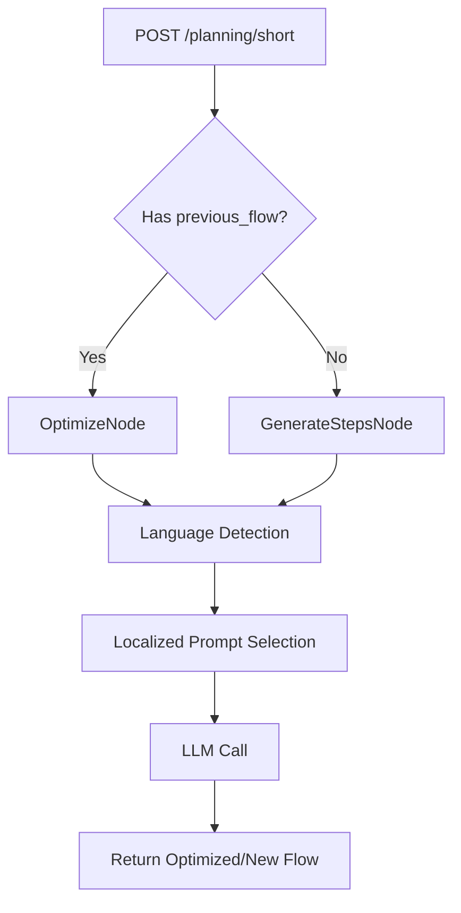
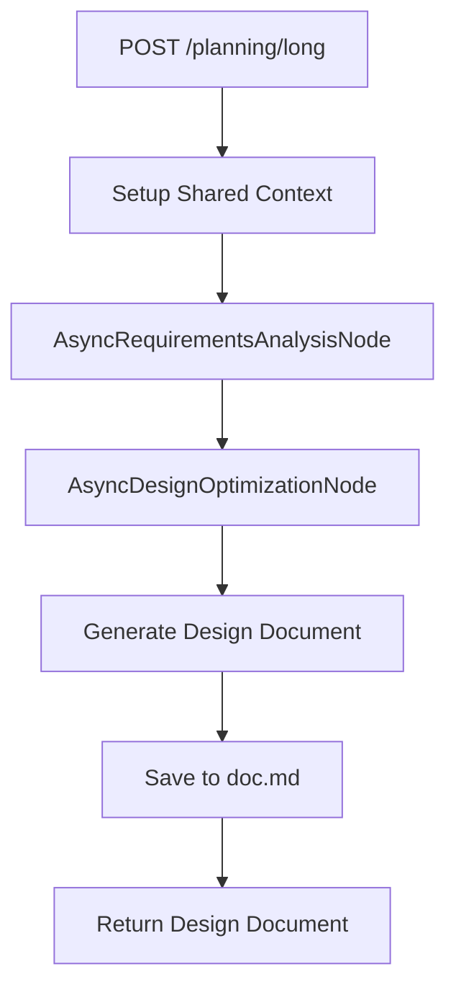
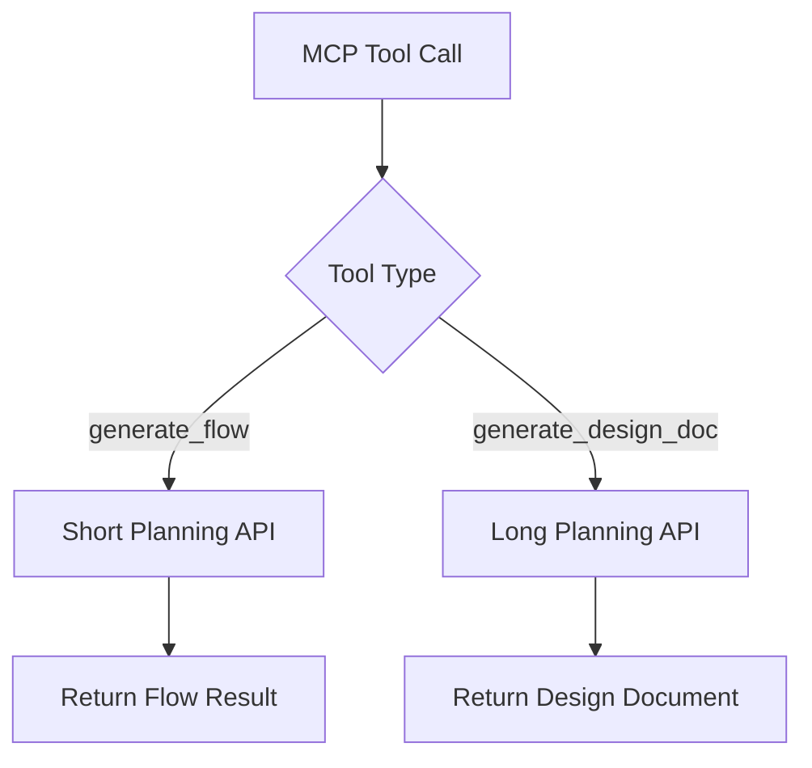

# GTPlanner: Multilingual Planning and Design System

## Project Overview

GTPlanner is a comprehensive planning and design system that provides two main APIs for generating workflows and detailed design documents. The system supports multilingual functionality with automatic language detection and localized prompt templates.

## Project Requirements

The system provides the following core capabilities:

1. **Short Planning API** (`/planning/short`):
   - Generate step-by-step workflows from natural language requirements
   - Optimize existing workflows based on feedback
   - Support iterative refinement with version tracking
   - Multilingual support with automatic language detection

2. **Long Planning API** (`/planning/long`):
   - Generate comprehensive design documents
   - Integrate requirements analysis with design optimization
   - Support complex document processing and formatting
   - Output structured markdown documentation

3. **Multilingual Support**:
   - Support for 5 languages: English (en), Chinese (zh), Spanish (es), French (fr), Japanese (ja)
   - Automatic language detection from user input
   - User preference storage and retrieval
   - Localized prompt templates with fallback mechanisms

4. **MCP Integration**:
   - Model Context Protocol (MCP) service for external tool integration
   - Direct function calls for planning operations
   - Streamlined HTTP interface on port 8001

5. **Performance & Reliability**:
   - Asynchronous processing throughout the system
   - Configurable LLM integration with retry mechanisms
   - Error handling and graceful degradation

## System Architecture

The GTPlanner system is built using a Node-Flow architecture pattern with the following key components:

### API Layer
- **FastAPI Application**: Main HTTP server (`fastapi_main.py`)
- **Planning Router**: RESTful endpoints for short and long planning (`api/v1/planning.py`)
- **MCP Service**: Model Context Protocol integration (`mcp/mcp_service.py`)

### Core Processing Patterns
1. **Node-Flow Pattern**: Modular processing units connected in directed graphs
2. **Async Pattern**: Non-blocking operations for improved performance
3. **Multilingual Pattern**: Language detection and localized processing
4. **Optimization Pattern**: Iterative refinement with version tracking

## Flow Design

### Short Planning Flow



### Long Planning Flow



### MCP Integration Flow



## Utility Functions

### Core LLM Integration
1. **Call LLM Async** (`utils/call_llm.py`)
   - *Input*: prompt (str), is_json (bool)
   - *Output*: response (str) or parsed JSON
   - *Configuration*: Uses Dynaconf for settings management
   - *Features*: Async HTTP client, JSON repair, configurable models
   - *Usage*: Primary interface for all LLM interactions

### Multilingual Support
2. **Language Detection** (`utils/language_detection.py`)
   - *Input*: text (str), user_preference (Optional[str])
   - *Output*: detected language code (str)
   - *Features*: Pattern-based detection, Chinese/Japanese disambiguation
   - *Supported Languages*: en, zh, es, fr, ja

3. **Multilingual Utils** (`utils/multilingual_utils.py`)
   - *Functions*: determine_language(), get_localized_prompt(), validate_language_request()
   - *Features*: Language preference management, prompt localization, fallback handling
   - *Integration*: Used by all processing nodes for multilingual support

4. **Prompt Templates** (`utils/prompt_templates.py`)
   - *Templates*: generate_steps, optimize_steps, requirements_analysis
   - *Languages*: Full template sets for all 5 supported languages
   - *Features*: Template inheritance, variable substitution, fallback mechanisms

### Configuration Management
5. **Config Manager** (`utils/config_manager.py`)
   - *Functions*: get_language_preference(), get_default_language()
   - *Features*: User preference storage, environment variable support
   - *Integration*: Dynaconf-based configuration system

## Data Structure

### Short Planning API Shared Memory

```python
shared = {
    "requirement": str,                    # User's natural language requirement
    "request_language": Optional[str],     # Explicitly requested language
    "user_id": Optional[str],             # User identifier for preferences
    "user_language_preference": Optional[str],  # Stored user preference
    "language": str,                      # Determined/detected language
    "history": [],                        # Processing history with versions
    "version": int,                       # Current version number
    "steps": str,                         # Generated or optimized steps
    "feedback": str,                      # User feedback for optimization
    "final_steps": str                    # Finalized workflow steps
}
```

### Long Planning API Shared Memory

```python
shared = {
    "user_input": {
        "processed_natural_language": str,  # User requirement
        "processed_documents": Any          # Design document content
    },
    "short_flow_steps": Optional[Any],     # Previous workflow steps
    "conversation_history": [],            # Conversation context
    "request_language": Optional[str],     # Requested language
    "user_id": Optional[str],             # User identifier
    "user_language_preference": Optional[str],  # User preference
    "language": str,                      # Determined language
    "requirements": str,                  # Analyzed requirements
    "documentation": str                  # Generated documentation
}
```

## Node Designs

### Short Planning Nodes

#### 1. GenerateStepsNode
- **Purpose**: Generate new workflow steps from user requirements
- **Design**: AsyncNode with multilingual support
- **Data Access**:
  - Read: requirement, user_language_preference, request_language from shared
  - Write: steps, language, history to shared
- **Implementation Details**:
  - **prep_async**: Determines language using multilingual utilities
  - **exec_async**: Gets localized prompt template and calls LLM
  - **post_async**: Stores generated steps and updates history with version tracking

#### 2. OptimizeNode
- **Purpose**: Optimize existing workflow based on feedback
- **Design**: AsyncNode with version tracking
- **Data Access**:
  - Read: steps, feedback, version, language preferences from shared
  - Write: optimized steps, incremented version, history to shared
- **Implementation Details**:
  - **prep_async**: Prepares optimization context with version information
  - **exec_async**: Uses localized optimization prompt template
  - **post_async**: Updates steps and increments version number

### Long Planning Nodes

#### 3. AsyncRequirementsAnalysisNode
- **Purpose**: Analyze user requirements for comprehensive planning
- **Design**: AsyncNode with multilingual support
- **Data Access**:
  - Read: processed_natural_language, short_flow_steps, processed_documents from shared
  - Write: requirements to shared
- **Implementation Details**:
  - **prep_async**: Determines language and prepares analysis context
  - **exec_async**: Uses localized requirements analysis prompt
  - **post_async**: Stores analyzed requirements for design optimization

#### 4. AsyncDesignOptimizationNode
- **Purpose**: Generate comprehensive design documentation
- **Design**: AsyncNode with complex document processing
- **Data Access**:
  - Read: requirements, conversation_history, processed_documents, user_instructions from shared
  - Write: processed_documents, documentation to shared, saves to doc.md file
- **Implementation Details**:
  - **prep_async**: Prepares comprehensive design context
  - **exec_async**: Uses detailed design optimization prompt with Node/Flow architecture guidelines
  - **post_async**: Saves generated documentation to file system

## API Specifications

### Short Planning API

**Endpoint**: `POST /planning/short`

**Request Schema**:
```python
class ShortPlanningRequest(BaseModel):
    requirement: str                    # Required: User's natural language requirement
    previous_flow: Optional[Any] = None # Optional: Existing workflow for optimization
    language: Optional[str] = None      # Optional: Preferred language (en, zh, es, fr, ja)
    user_id: Optional[str] = None       # Optional: User identifier for preferences
```

**Response Schema**:
```json
{
    "flow": "Generated or optimized workflow steps",
    "language": "en",
    "user_id": "user123"
}
```

**Processing Logic**:
- If `previous_flow` provided: Optimization path using OptimizeNode
- If no `previous_flow`: New generation path using GenerateStepsNode
- Language detection and localization applied throughout

### Long Planning API

**Endpoint**: `POST /planning/long`

**Request Schema**:
```python
class LongPlanningRequest(BaseModel):
    requirement: str                    # Required: User's natural language requirement
    previous_flow: Optional[Any] = None # Optional: Previous workflow steps
    design_doc: Optional[Any] = None    # Optional: Existing design document
    language: Optional[str] = None      # Optional: Preferred language
    user_id: Optional[str] = None       # Optional: User identifier
```

**Response Schema**:
```json
{
    "flow": "Generated comprehensive design document",
    "language": "en",
    "user_id": "user123"
}
```

**Processing Logic**:
- Sequential processing: AsyncRequirementsAnalysisNode >> AsyncDesignOptimizationNode
- Comprehensive document generation with Node/Flow architecture guidelines
- Output saved to `doc.md` file

### MCP Tool Integration

**Tool 1**: `generate_flow`
- Maps to Short Planning API
- Supports all short planning parameters
- Returns workflow with language information

**Tool 2**: `generate_design_doc`
- Maps to Long Planning API
- Supports all long planning parameters
- Returns comprehensive design document
