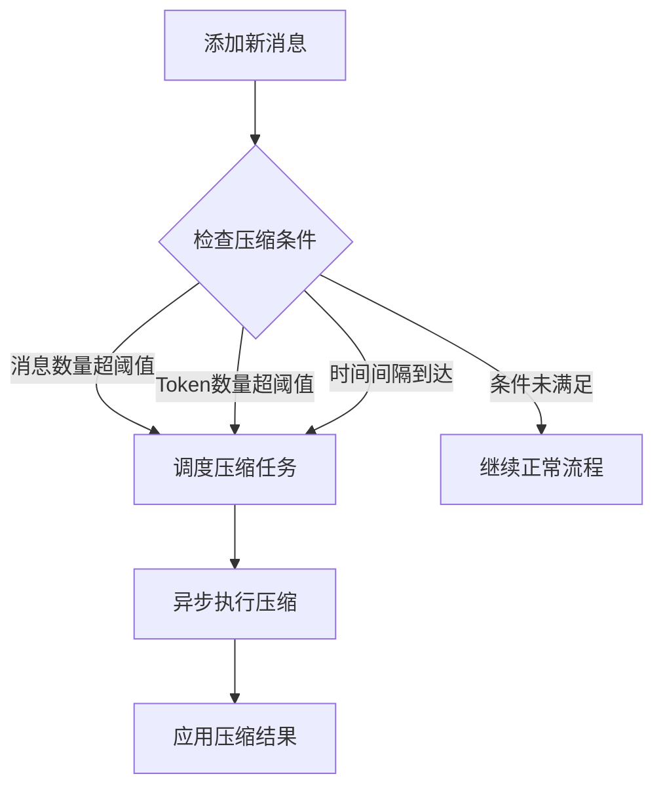
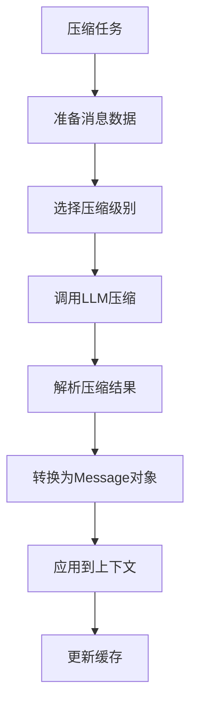

# 🗜️ 智能上下文压缩系统

## 概述

GTPlanner的智能上下文压缩系统解决了传统硬编码压缩导致的信息丢失问题。通过基于LLM的智能压缩，系统能够：

- 🧠 **智能保留关键信息**：使用LLM理解对话内容，保留重要决策和结论
- 🔄 **异步处理**：后台压缩，不阻塞主流程
- 📊 **多级压缩**：支持light/medium/heavy/summary四个压缩级别
- ⚙️ **灵活配置**：可调整压缩阈值、保留消息数等参数
- 📈 **实时监控**：提供压缩状态查看和建议

## 核心特性

### 1. 智能压缩算法

使用专门训练的提示模板，LLM能够：
- 识别对话中的关键决策点
- 合并相似或重复的内容
- 保留工具调用的重要结果
- 维护时间顺序和逻辑关系

### 2. 四级压缩策略

| 级别 | 保留信息 | 适用场景 | 压缩比 |
|------|----------|----------|--------|
| Light | 90% | 轻度优化，保留详细信息 | ~10% |
| Medium | 70% | 平衡压缩，日常使用 | ~30% |
| Heavy | 50% | 重度压缩，长对话历史 | ~50% |
| Summary | 30% | 摘要模式，极简保留 | ~70% |

### 3. 自动触发机制

系统会在以下情况自动触发压缩：
- 消息数量超过配置阈值（默认50条）
- 估算token数量超过限制（默认6000 tokens）
- 上下文复杂度达到压缩建议级别

## 使用方法

### CLI命令

```bash
# 查看压缩状态和建议
/compress

# 立即执行压缩
/compress now medium

# 启动/停止压缩服务
/compress start
/compress stop

# 启用/禁用自动压缩
/compress enable
/compress disable

# 查看压缩配置
/compress config
```

### 编程接口

```python
from utils.compression_manager import compression_manager

# 查看压缩状态
compression_manager.print_status()

# 手动触发压缩
await compression_manager.manual_compress("medium")

# 配置压缩参数
compression_manager.configure(
    compression_threshold=30,
    preserve_recent=10,
    auto_compress=True
)

# 启动压缩服务
await compression_manager.start_service()
```

### 统一上下文集成

```python
from core.unified_context import get_context

context = get_context()

# 查看压缩状态
status = context.get_compression_status()

# 手动压缩
await context.manual_compress("heavy")

# 配置压缩
context.configure_compression(
    compression_threshold=40,
    preserve_recent=8
)
```

## 配置参数

### 上下文配置

| 参数 | 默认值 | 说明 |
|------|--------|------|
| `auto_compress` | `True` | 是否启用自动压缩 |
| `compression_threshold` | `50` | 触发压缩的消息数量阈值 |
| `token_threshold` | `6000` | 触发压缩的token数量阈值 |
| `preserve_recent` | `10` | 保留最近消息数 |
| `compression_ratio_target` | `0.7` | 目标压缩比 |

### 压缩器配置

| 参数 | 默认值 | 说明 |
|------|--------|------|
| `max_context_length` | `8000` | 最大上下文长度（tokens） |
| `compression_threshold` | `6000` | 触发压缩的token阈值 |
| `min_messages_to_compress` | `10` | 最少压缩消息数 |
| `quality_threshold` | `0.8` | 压缩质量阈值 |

## 工作原理

### 1. 压缩触发



### 2. 压缩流程



### 3. 消息保留策略

- **最近消息**：始终保留最近N条消息（可配置）
- **压缩消息**：较早的消息经过智能压缩
- **关键信息**：工具调用结果、重要决策点优先保留

## 性能优化

### 1. 异步处理

压缩任务在后台异步执行，不影响主流程响应速度：

```python
# 压缩任务异步调度
asyncio.create_task(self._schedule_compression_async())
```

### 2. 智能缓存

- 消息哈希去重
- 压缩结果缓存
- 状态变更通知

### 3. 资源管理

- 压缩队列管理
- 服务生命周期控制
- 内存使用优化

## 最佳实践

### 1. 压缩级别选择

- **开发阶段**：使用light级别，保留详细信息
- **日常使用**：使用medium级别，平衡性能和信息保留
- **长期会话**：使用heavy级别，大幅减少上下文长度
- **存档模式**：使用summary级别，生成精简摘要

### 2. 配置建议

```python
# 开发环境配置
compression_manager.configure(
    compression_threshold=100,  # 更高消息阈值
    token_threshold=10000,      # 更高token阈值
    preserve_recent=15,         # 保留更多最近消息
    auto_compress=False         # 手动控制压缩
)

# 生产环境配置
compression_manager.configure(
    compression_threshold=50,   # 标准消息阈值
    token_threshold=6000,       # 标准token阈值
    preserve_recent=10,         # 标准保留数量
    auto_compress=True          # 自动压缩
)
```

### 3. 监控和调试

```python
# 定期检查压缩状态
status = compression_manager.get_status()
if status["context"]["compression_needed"]:
    print("建议执行压缩")

# 查看压缩建议
suggestions = compression_manager.get_compression_suggestions()
print(f"推荐级别: {suggestions['recommended_level']}")
```

## 故障排除

### 常见问题

1. **压缩服务未启动**
   ```bash
   /compress start
   ```

2. **压缩任务失败**
   - 检查OpenAI API配置
   - 查看错误日志
   - 重启压缩服务

3. **压缩效果不理想**
   - 调整压缩级别
   - 增加保留消息数
   - 检查消息质量

### 调试命令

```bash
# 查看详细状态
/compress config

# 强制立即压缩
/compress now heavy

# 重启压缩服务
/compress stop
/compress start
```

## 示例演示

运行智能压缩演示：

```bash
python examples/compression_demo.py
```

该演示将展示：
- 创建长对话历史
- 不同级别的压缩效果
- 配置管理功能
- 状态监控界面

## 技术架构

### 核心组件

1. **ContextCompressor**: 压缩引擎核心
2. **CompressionManager**: 管理接口
3. **UnifiedContext**: 上下文集成
4. **MessageBuilder**: 消息构建优化

### 数据流

```
用户输入 → 消息添加 → 压缩检查 → 异步压缩 → 结果应用 → 上下文更新
```

### 扩展性

- 支持自定义压缩策略
- 可插拔的压缩算法
- 灵活的配置系统
- 完整的监控接口

## 总结

智能上下文压缩系统通过以下方式解决了硬编码压缩的问题：

1. **智能理解**：LLM理解对话内容，而非简单截断
2. **保留关键信息**：识别并保留重要决策和结论
3. **灵活配置**：根据使用场景调整压缩策略
4. **异步处理**：不影响用户体验的后台压缩
5. **实时监控**：提供完整的状态查看和管理功能

这样的设计确保了上下文的连贯性和关联性，同时有效控制了上下文长度，提升了系统的整体性能。
