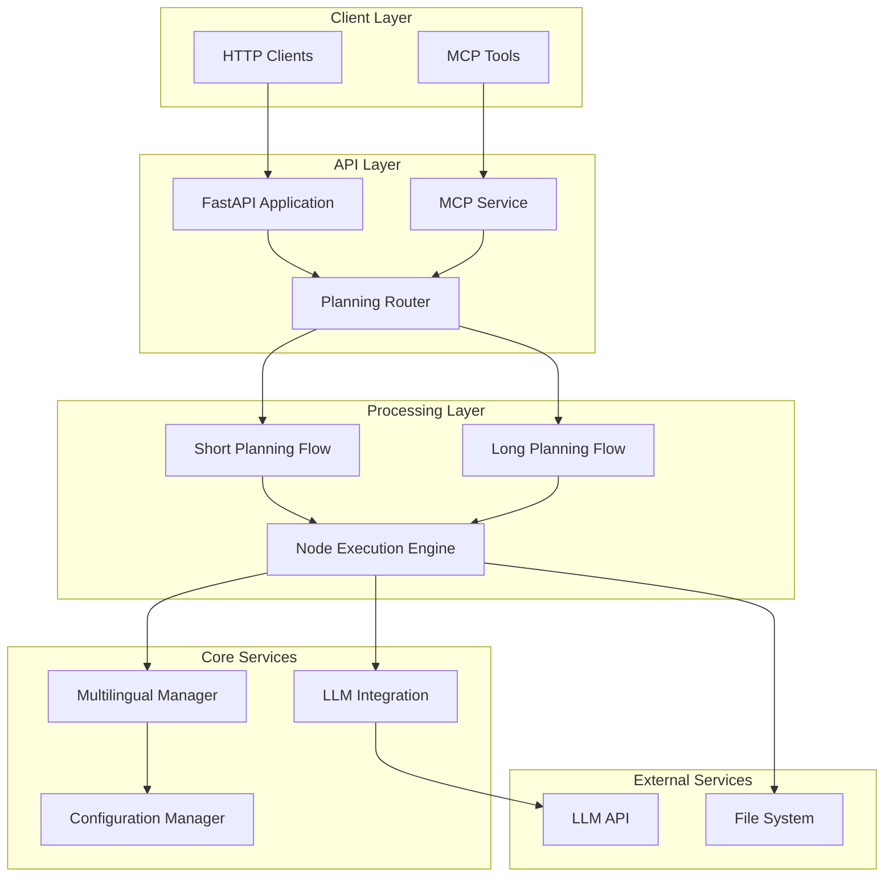
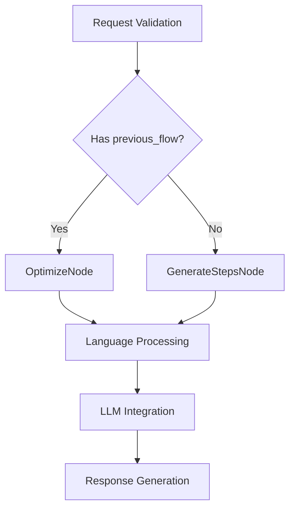
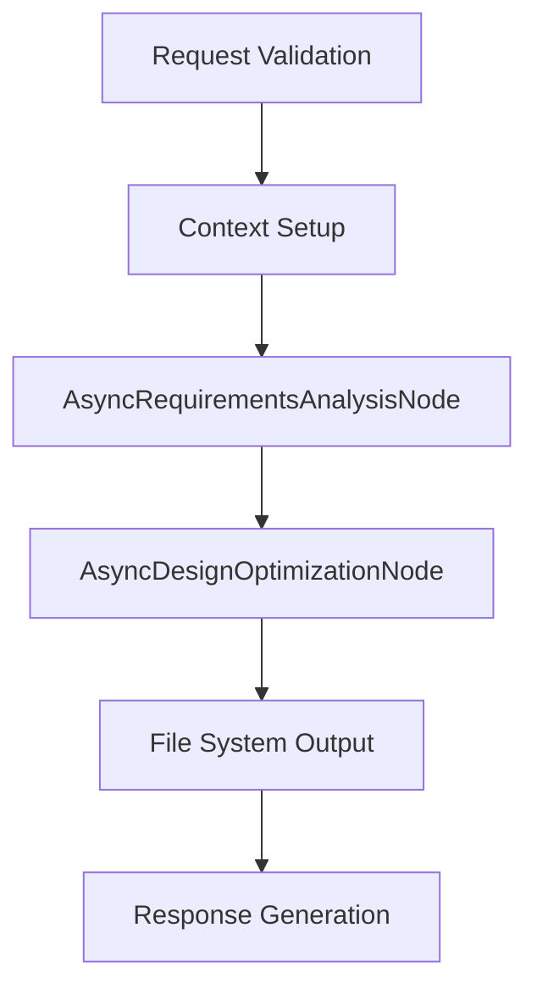
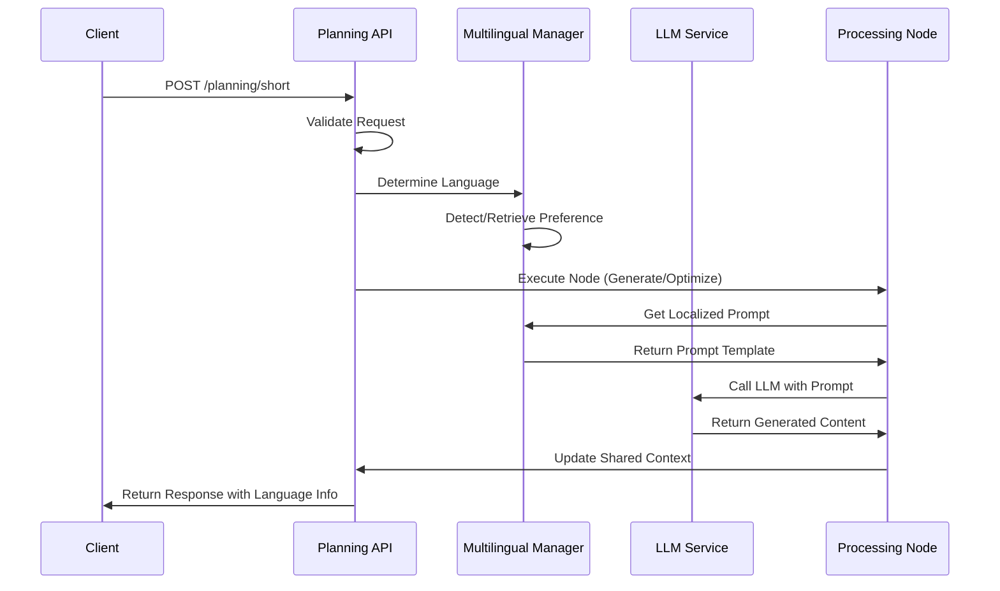
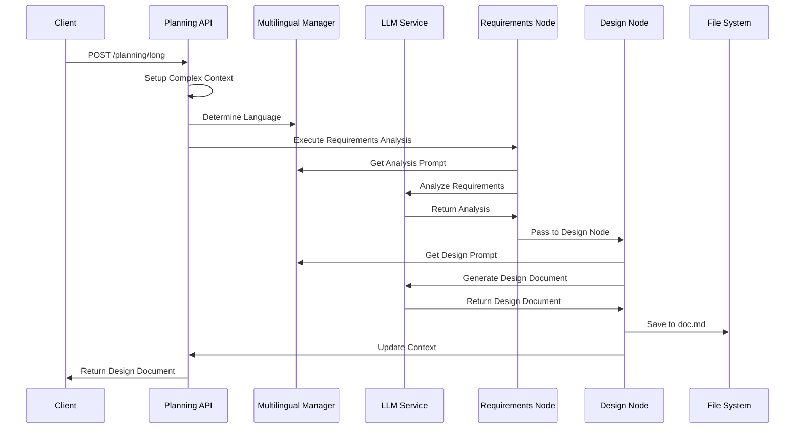
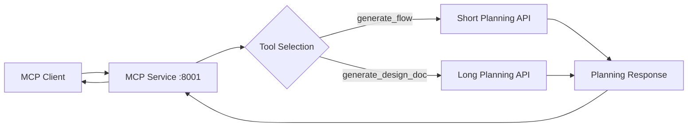
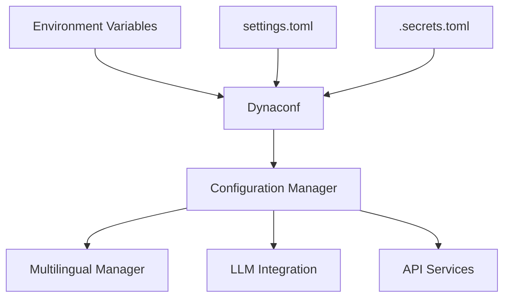
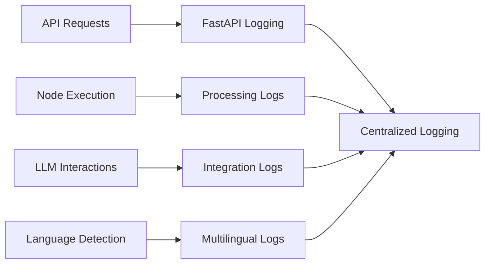

# GTPlanner System Architecture

## Overview

GTPlanner is a multilingual planning and design system built on a Node-Flow architecture pattern. The system provides REST APIs for workflow generation and comprehensive design document creation, with integrated multilingual support and MCP (Model Context Protocol) integration.

## High-Level Architecture

## Component Architecture

### API Layer Components

#### FastAPI Application (`fastapi_main.py`)
- **Purpose**: Main HTTP server and application entry point
- **Port**: 11211
- **Features**: 
  - Auto-reload for development
  - Router integration
  - CORS and middleware support

#### Planning Router (`api/v1/planning.py`)
- **Purpose**: RESTful API endpoints for planning operations
- **Endpoints**:
  - `POST /planning/short`: Short workflow planning
  - `POST /planning/long`: Comprehensive design planning
- **Features**:
  - Request validation using Pydantic models
  - Multilingual parameter handling
  - Error response formatting

#### MCP Service (`mcp/mcp_service.py`)
- **Purpose**: Model Context Protocol integration
- **Port**: 8001
- **Tools**:
  - `generate_flow`: Maps to short planning
  - `generate_design_doc`: Maps to long planning
- **Features**:
  - Direct function call integration
  - Parameter validation and error handling
  - Streamlined HTTP interface

### Processing Layer Components

#### Short Planning Flow

**Key Nodes**:
- **GenerateStepsNode**: New workflow generation with multilingual support
- **OptimizeNode**: Workflow optimization with version tracking

#### Long Planning Flow

**Key Nodes**:
- **AsyncRequirementsAnalysisNode**: Requirements analysis with language detection
- **AsyncDesignOptimizationNode**: Comprehensive design document generation

### Core Services

#### Multilingual Manager (`utils/multilingual_utils.py`)
- **Purpose**: Centralized multilingual functionality
- **Features**:
  - Language detection from text patterns
  - User preference management
  - Localized prompt template selection
  - Fallback mechanism implementation

#### LLM Integration (`utils/call_llm.py`)
- **Purpose**: Asynchronous LLM communication
- **Features**:
  - Configurable model selection
  - Async HTTP client with timeout handling
  - JSON response parsing and repair
  - Error handling and retry logic

#### Configuration Manager (`utils/config_manager.py`)
- **Purpose**: System and user configuration management
- **Features**:
  - Dynaconf-based configuration
  - Environment variable support
  - User preference storage and retrieval
  - Runtime configuration updates

## Data Flow Architecture

### Short Planning Data Flow

### Long Planning Data Flow

## Integration Architecture

### MCP Integration Pattern

### Configuration Integration

## Security Architecture

### Current Security Model
- **Authentication**: None (open API)
- **Authorization**: None (public access)
- **Data Protection**: No sensitive data persistence
- **API Security**: Basic input validation

### Security Considerations
- User identification through optional `user_id` parameter
- Language preference storage without authentication
- LLM API key protection through environment variables
- Input sanitization for prompt injection prevention

## Scalability Architecture

### Horizontal Scaling Capabilities
- **Stateless Design**: No persistent state between requests
- **Async Processing**: Non-blocking I/O operations
- **Load Balancing**: Multiple instance deployment support
- **Resource Isolation**: Independent request processing

### Performance Optimizations
- **Connection Pooling**: Async HTTP client reuse
- **Caching Opportunities**: 
  - Language detection results
  - Prompt template caching
  - User preference caching
- **Timeout Management**: Configurable LLM request timeouts

## Monitoring and Observability

### Logging Architecture

### Metrics Collection Points
- **Request Metrics**: Endpoint usage, response times, error rates
- **Processing Metrics**: Node execution times, language distribution
- **Integration Metrics**: LLM response times, success rates
- **User Metrics**: Language preference patterns, user activity

## Deployment Architecture

### Development Environment
- **Local Development**: Direct Python execution
- **Hot Reload**: FastAPI auto-reload for development
- **Configuration**: Local settings files and environment variables

### Production Considerations
- **Container Deployment**: Docker containerization support
- **Environment Separation**: Development, staging, production configs
- **Health Checks**: API endpoint health monitoring
- **Resource Management**: Memory and CPU optimization for LLM calls

## Extension Points

### Adding New Languages
1. Update `SupportedLanguage` enum in `language_detection.py`
2. Add language patterns to `LanguageDetector`
3. Create prompt templates in `prompt_templates.py`
4. Update configuration in `settings.toml`

### Adding New Nodes
1. Implement `AsyncNode` interface
2. Define `prep_async`, `exec_async`, `post_async` methods
3. Integrate with existing flows
4. Update documentation and tests

### Adding New APIs
1. Create new router in `api/v1/`
2. Define Pydantic request/response models
3. Implement processing logic
4. Add MCP tool integration if needed
5. Update documentation and specifications
