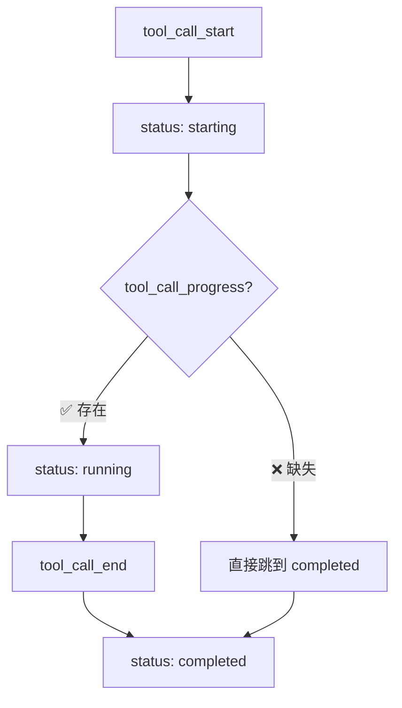
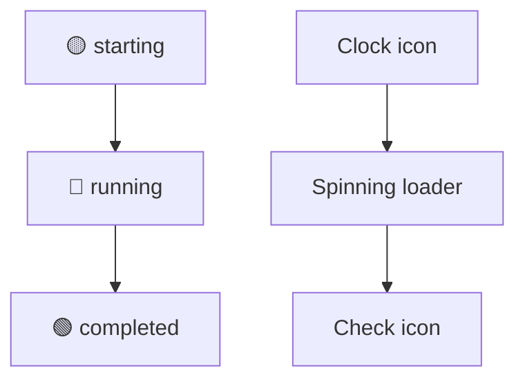

# 工具调用进度状态修复

## 🔍 问题描述

用户反馈：**工具运行中的状态一直展示不出来，现在只能看到启动中和已完成。**

## 🎯 问题分析

### SSE事件流分析

从用户提供的SSE响应来看：

```
event: tool_call_start
data: {"status": "starting", ...}

event: heartbeat
data: {...}
(多个心跳事件)

event: tool_call_end  
data: {"status": "completed", ...}
```

**缺少了 `tool_call_progress` 事件！**

### 前端状态管理逻辑

前端依赖以下事件来更新工具调用状态：

1. **`tool_call_start`** → 状态设为 `starting`
2. **`tool_call_progress`** → 状态设为 `running` ⚠️ **缺失**
3. **`tool_call_end`** → 状态设为 `completed`

### 状态转换流程



## 🔍 根因分析

### 后端工具执行流程

1. **ToolExecutor** 发送 `tool_call_start` (status: starting)
2. **执行工具逻辑** (无进度事件)
3. **ToolExecutor** 发送 `tool_call_end` (status: completed)

### 问题所在

**ToolExecutor 没有发送 `tool_call_progress` 事件**，导致：
- 前端状态直接从 `starting` 跳到 `completed`
- 用户看不到 `running` 状态（蓝色旋转图标）
- 无法显示工具执行的进度信息

## ✅ 修复方案

### 方案选择

考虑了两种方案：

#### 方案1：在每个工具中添加进度事件 ❌
- **优点**：精确控制进度
- **缺点**：需要修改所有工具，工作量大

#### 方案2：在ToolExecutor中自动添加进度事件 ✅
- **优点**：一次修改，所有工具受益
- **缺点**：进度信息相对简单

**选择方案2**，因为它能快速解决问题且影响范围可控。

### 具体修复

在 `ToolExecutor._execute_single_tool` 中添加自动进度事件：

```python
# 发送工具开始事件
tool_status = ToolCallStatus(
    tool_name=tool_name,
    status="starting",
    call_id=call_id,
    progress_message=f"正在调用{tool_name}工具...",
    arguments=arguments
)
await streaming_session.emit_event(
    StreamEventBuilder.tool_call_start(streaming_session.session_id, tool_status)
)

# ✅ 新增：立即发送进度事件，将状态更新为 running
tool_status_running = ToolCallStatus(
    tool_name=tool_name,
    status="running",
    call_id=call_id,
    progress_message=f"正在执行{tool_name}工具..."
)
await streaming_session.emit_event(
    StreamEventBuilder.tool_call_progress(streaming_session.session_id, tool_status_running)
)

# 执行工具
start_time = time.time()
tool_result = await execute_agent_tool(tool_name, arguments, shared)
```

## 🎯 修复效果

### 修复前的事件流
```
tool_call_start (starting) → tool_call_end (completed)
```

### 修复后的事件流
```
tool_call_start (starting) → tool_call_progress (running) → tool_call_end (completed)
```

### 前端状态变化



### 用户体验改进

1. **视觉反馈** - 用户能看到蓝色旋转图标，知道工具正在执行
2. **状态清晰** - 明确区分"启动中"和"运行中"状态
3. **进度信息** - 显示"正在执行XX工具..."的进度消息

## 🔧 技术细节

### 事件发送时机

```python
# 时机1：工具调用开始
await streaming_session.emit_event(tool_call_start)

# 时机2：工具开始执行（新增）
await streaming_session.emit_event(tool_call_progress)

# 时机3：工具执行完成
await streaming_session.emit_event(tool_call_end)
```

### 状态管理

前端 `onToolCallProgress` 处理逻辑：

```typescript
onToolCallProgress: (toolName: string, progress: string, callId?: string) => {
  const updatedToolCalls = conversationState.toolCalls.map(call => {
    const isMatch = callId 
      ? call.id === callId 
      : call.toolName === toolName && call.status === 'starting';
    
    return isMatch 
      ? { ...call, status: 'running' as const, progressMessage: progress }
      : call;
  });
  
  actions.setToolCalls(updatedToolCalls);
}
```

### 错误处理

修复也包含了错误情况的处理：

```python
# 如果工具执行失败，也会发送相应的进度事件
tool_status = ToolCallStatus(
    tool_name=tool_name,
    status="failed",
    call_id=call_id,
    progress_message=f"{tool_name}工具执行异常",
    error_message=str(e)
)
```

## 🚀 测试验证

### 测试场景

1. **正常工具执行** - 验证 starting → running → completed 流程
2. **工具执行失败** - 验证 starting → running → failed 流程
3. **多个工具并行** - 验证状态隔离
4. **长时间执行的工具** - 验证 running 状态持续显示

### 预期结果

- ✅ 工具调用开始后立即显示 running 状态
- ✅ 显示蓝色旋转图标和进度消息
- ✅ 状态转换流畅，无跳跃
- ✅ 所有工具类型都受益（short_planning, design, research, tool_recommend）

## 📊 影响范围

### 受益的工具

- ✅ **short_planning** - 短期规划工具
- ✅ **design** - 设计文档生成工具  
- ✅ **research** - 研究工具
- ✅ **tool_recommend** - 工具推荐工具
- ✅ **未来新增的工具** - 自动获得进度状态支持

### 兼容性

- ✅ **向后兼容** - 不影响现有功能
- ✅ **前端兼容** - 前端已有 `tool_call_progress` 处理逻辑
- ✅ **SSE兼容** - 使用标准的SSE事件格式

## 🔄 未来优化

### 短期优化

1. **验证修复效果** - 确认所有工具都能正确显示 running 状态
2. **性能监控** - 监控额外事件对性能的影响
3. **用户反馈** - 收集用户对新状态显示的反馈

### 长期优化

1. **精细化进度** - 在具体工具中添加更详细的进度信息
2. **进度百分比** - 支持显示执行进度百分比
3. **取消功能** - 支持取消正在执行的工具调用

## 🎉 结论

通过在 `ToolExecutor` 中自动添加 `tool_call_progress` 事件，我们解决了工具调用状态显示的问题：

1. **问题解决** - 用户现在能看到工具的 running 状态
2. **体验改进** - 更清晰的视觉反馈和状态转换
3. **架构优化** - 一次修改，所有工具受益
4. **未来保障** - 新增工具自动获得进度状态支持

现在所有工具调用都应该能正确显示：
**🟡 启动中 → 🔵 运行中 → 🟢 已完成**
