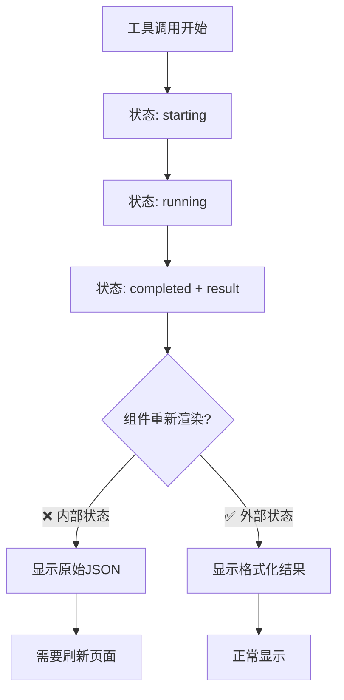

# 工具调用渲染问题修复

## 🔍 问题描述

用户反馈：**流式回复过程中的工具卡片完成后没有渲染还是原始的json，需要刷新页面加载一下才正常。**

## 🎯 问题根因

### 状态管理不一致

1. **MessageList** 使用外部状态管理：
   ```typescript
   <ToolSelector
     isExpanded={expandedCalls?.has(item.data.id)}
     onExpandedChange={onToolCallExpandedChange}
   />
   ```

2. **ToolSelector** 没有传递状态管理 props 给专用工具组件：
   ```typescript
   // ❌ 问题：没有传递 isExpanded 和 onExpandedChange
   <ShortPlanningTool
     toolCall={toolCall}
     showDetails={showDetails}
     compact={compact}
   />
   ```

3. **专用工具组件** 使用内部状态：
   ```typescript
   // ❌ 问题：使用内部 useState，与外部状态不同步
   const [isExpanded, setIsExpanded] = useState(showDetails);
   ```

### 渲染流程问题



## ✅ 修复方案

### 1. 统一状态管理

#### 修复 ToolSelector
```typescript
// ✅ 修复后：传递状态管理 props 给所有专用工具组件
case ToolName.SHORT_PLANNING:
  return (
    <ShortPlanningTool
      toolCall={toolCall}
      showDetails={showDetails}
      compact={compact}
      isExpanded={isExpanded}           // ✅ 新增
      onExpandedChange={onExpandedChange} // ✅ 新增
    />
  );
```

#### 修复专用工具组件
```typescript
// ✅ 修复后：支持外部状态管理，内部状态作为后备
interface ShortPlanningToolProps {
  // ... 现有 props
  isExpanded?: boolean;                    // ✅ 新增
  onExpandedChange?: (callId: string, expanded: boolean) => void; // ✅ 新增
}

export function ShortPlanningTool({
  // ... 现有 props
  isExpanded: externalIsExpanded,          // ✅ 新增
  onExpandedChange                         // ✅ 新增
}: ShortPlanningToolProps) {
  // ✅ 混合状态管理：优先使用外部状态，内部状态作为后备
  const [internalIsExpanded, setInternalIsExpanded] = useState(showDetails);
  const isExpanded = externalIsExpanded !== undefined ? externalIsExpanded : internalIsExpanded;
  
  const handleExpandedChange = (expanded: boolean) => {
    if (onExpandedChange) {
      onExpandedChange(toolCall.id, expanded);  // ✅ 使用外部状态管理
    } else {
      setInternalIsExpanded(expanded);          // ✅ 后备到内部状态
    }
  };
  
  // ✅ 使用统一的处理函数
  onClick={() => handleExpandedChange(!isExpanded)}
}
```

### 2. 修复的组件

1. **ToolSelector** - 传递状态管理 props
2. **ShortPlanningTool** - 支持外部状态管理
3. **DesignTool** - 支持外部状态管理
4. **ResearchTool** - 支持外部状态管理
5. **ToolRecommendTool** - 支持外部状态管理

### 3. 向后兼容性

修复保持了向后兼容性：
- 如果没有传递外部状态管理 props，组件仍然使用内部状态
- 现有的使用方式不会被破坏
- 渐进式升级，不需要一次性修改所有使用点

## 🎯 修复效果

### 修复前的问题流程
```
工具调用完成 → 状态更新 → 组件使用内部状态 → 不重新渲染 → 显示原始JSON
```

### 修复后的正常流程
```
工具调用完成 → 状态更新 → 外部状态变化 → 组件重新渲染 → 显示格式化结果
```

### 预期行为
1. **工具调用开始** - 显示进度状态
2. **工具调用进行中** - 显示运行状态和进度消息
3. **工具调用完成** - 立即显示格式化的结果，无需刷新页面
4. **展开/收起** - 状态在所有组件间保持同步

## 🔧 技术细节

### 状态管理层次
```
MessageList (外部状态管理)
  ↓
ToolSelector (状态传递)
  ↓
专用工具组件 (混合状态管理)
```

### 状态同步机制
```typescript
// 外部状态管理（MessageList）
const [expandedCalls, setExpandedCalls] = useState<Set<string>>(new Set());

// 状态传递（ToolSelector）
isExpanded={expandedCalls?.has(item.data.id)}
onExpandedChange={onToolCallExpandedChange}

// 混合状态管理（专用工具组件）
const isExpanded = externalIsExpanded !== undefined ? externalIsExpanded : internalIsExpanded;
```

## 🚀 测试验证

### 测试场景
1. **新工具调用** - 验证从开始到完成的整个流程
2. **展开/收起** - 验证状态同步
3. **多个工具调用** - 验证状态隔离
4. **页面刷新** - 验证状态恢复

### 预期结果
- ✅ 工具调用完成后立即显示格式化结果
- ✅ 展开/收起状态正确同步
- ✅ 不需要刷新页面
- ✅ 向后兼容性保持

## 📊 架构改进

### 优点
1. **状态一致性** - 外部状态管理确保组件间同步
2. **向后兼容** - 内部状态作为后备，不破坏现有代码
3. **渐进式升级** - 可以逐步迁移到外部状态管理
4. **性能优化** - 减少不必要的重新渲染

### 未来优化方向
1. **完全外部化** - 逐步移除内部状态管理
2. **状态持久化** - 考虑将展开状态持久化到本地存储
3. **性能监控** - 监控状态更新的性能影响

## 🎉 结论

通过统一状态管理，我们解决了工具调用完成后需要刷新页面才能看到格式化结果的问题。修复保持了向后兼容性，同时为未来的状态管理优化奠定了基础。

现在工具调用应该能够：
- 实时显示状态变化
- 完成后立即显示格式化结果
- 正确处理展开/收起状态
- 无需刷新页面即可正常工作
