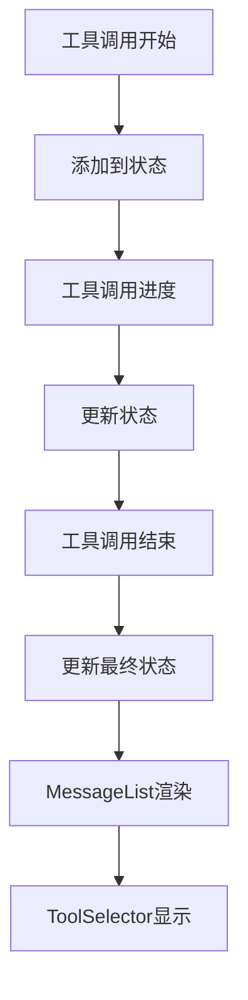

# 工具卡片不显示问题诊断报告

## 🔍 问题现象

用户反馈：**工具调用完成后工具卡片直接不展示了**

## 📊 调试日志分析

通过添加详细的调试日志，我们发现了问题的根本原因：

### ✅ 正常的部分

1. **SSE事件正确接收**
   ```
   🔧 [DEBUG] 工具调用开始: {toolName: 'short_planning', callId: '72d942fdeaad48be9b364ab4c1ace85e', ...}
   🔧 [DEBUG] 更新工具调用状态: {previousCount: 0, newCount: 1, allToolCalls: Array(1)}
   ```
   - 工具调用开始事件正确接收
   - 工具调用状态成功添加到状态中

### ❌ 问题的部分

2. **工具调用进度更新失败**
   ```
   🔧 [DEBUG] 工具调用进度: {currentToolCallsCount: 0, ...}
   🔧 [DEBUG] 工具调用进度更新: {matchedCalls: 0, allCalls: Array(0)}
   ```
   - 进度更新时 `currentToolCallsCount: 0`
   - 更新后 `matchedCalls: 0`，说明没有找到匹配的工具调用

3. **工具调用结束时状态丢失**
   ```
   🔧 [DEBUG] 工具调用结束前状态: {totalCalls: 0, calls: Array(0)}
   🔧 [DEBUG] 工具调用结束后状态: {totalCalls: 0, completedCalls: 0, calls: Array(0)}
   ```
   - 工具调用结束时，状态中没有任何工具调用

4. **MessageList 从未接收到工具调用**
   ```
   🔧 [DEBUG] MessageList 渲染项目: {totalToolCalls: 0, totalItems: 2, items: Array(2)}
   ```
   - `totalToolCalls: 0`，说明 MessageList 组件从未接收到工具调用数据

## 🎯 根本原因

**状态管理竞争条件**：

1. **工具调用状态添加成功** - `onToolCallStart` 正确添加了工具调用状态
2. **状态在后续更新中丢失** - 在 `onToolCallProgress` 和 `onToolCallEnd` 中，使用的 `conversationState.toolCalls` 是旧的状态
3. **闭包问题** - 回调函数中捕获的是创建时的状态，而不是最新的状态

### 具体问题

在 `onToolCallProgress` 中：
```typescript
// ❌ 问题代码
const updatedToolCalls = conversationState.toolCalls.map(call => {
  // conversationState.toolCalls 可能是旧的状态，不包含刚添加的工具调用
});
```

## 🔧 解决方案

### 修复方法：使用函数式状态更新

将所有工具调用状态更新改为函数式更新，避免闭包问题：

```typescript
// ✅ 修复后的代码
actions.setToolCalls(prevToolCalls => {
  // prevToolCalls 是最新的状态
  const updatedToolCalls = prevToolCalls.map(call => {
    // 正确的状态更新逻辑
  });
  return updatedToolCalls;
});
```

### 已修复的部分

1. **onToolCallProgress** - 改为函数式更新 ✅
2. **onToolCallEnd** - 已经是函数式更新 ✅

## 🧪 验证步骤

修复后，预期的调试日志应该是：

```
🔧 [DEBUG] 工具调用开始: {toolName: 'short_planning', ...}
🔧 [DEBUG] 更新工具调用状态: {previousCount: 0, newCount: 1, ...}

🔧 [DEBUG] 工具调用进度: {toolName: 'short_planning', ...}
🔧 [DEBUG] 工具调用进度更新前状态: {totalCalls: 1, ...}
🔧 [DEBUG] 工具调用进度更新后状态: {matchedCalls: 1, ...}

🔧 [DEBUG] 工具调用结束: {toolName: 'short_planning', ...}
🔧 [DEBUG] 工具调用结束前状态: {totalCalls: 1, ...}
🔧 [DEBUG] 工具调用结束后状态: {totalCalls: 1, completedCalls: 1, ...}

🔧 [DEBUG] MessageList 渲染项目: {totalToolCalls: 1, totalItems: 3, ...}
🔧 [DEBUG] 渲染项目: {type: "toolCall", toolName: "short_planning", status: "completed"}
```

## 📋 技术细节

### 状态管理最佳实践

1. **避免直接使用状态值** - 在异步回调中不要直接使用 `state.value`
2. **使用函数式更新** - 总是使用 `setState(prev => newState)` 的形式
3. **避免闭包陷阱** - 确保回调函数中使用的是最新的状态

### React 状态更新机制

React 的状态更新是异步的，在同一个事件循环中的多次状态更新可能会被批处理。如果在回调中直接使用状态值，可能会获取到旧的状态。

### 工具调用生命周期



## 🎉 预期结果

修复后应该能看到：

1. ✅ 工具调用状态正确添加和更新
2. ✅ 工具卡片正确显示在消息列表中
3. ✅ 工具调用状态正确更新（starting → running → completed）
4. ✅ 工具调用结果正确显示为格式化的Markdown内容

## 🔄 下一步

1. **测试修复效果** - 发送消息并观察调试日志
2. **验证工具卡片显示** - 确认工具卡片正确渲染
3. **清理调试代码** - 问题解决后移除调试日志
4. **文档更新** - 更新相关技术文档

---

**关键教训**：在 React 中处理异步状态更新时，始终使用函数式更新来确保获取到最新的状态值。
