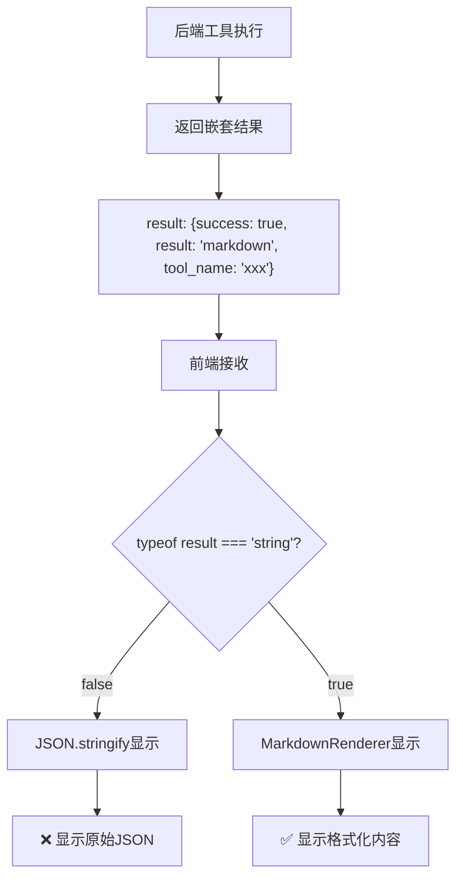

# 工具调用结果JSON显示问题修复

## 🔍 问题描述

用户反馈：**工具调用完成后仍然显示原始JSON而不是格式化的Markdown内容**

## 🎯 问题分析

### SSE响应数据结构

从用户提供的SSE响应来看，后端返回的数据结构是固定的：

```json
{
  "event_type": "tool_call_end",
  "data": {
    "tool_name": "short_planning",
    "status": "completed",
    "result": {
      "success": true,
      "result": "# ⚙️ 技术规划阶段输出\n\n## 1. 🔧 技术实现路径...",
      "tool_name": "short_planning"
    }
  }
}
```

### 前端渲染逻辑问题

**问题所在**：前端组件的结果解析逻辑不正确

```typescript
// ❌ 问题代码
{typeof toolCall.result === 'string' ? (
  <MarkdownRenderer content={toolCall.result} />
) : (
  <MarkdownRenderer content={JSON.stringify(toolCall.result, null, 2)} />
)}
```

**分析**：
1. `toolCall.result` 是一个对象：`{success: true, result: "markdown内容", tool_name: "short_planning"}`
2. 前端检测到是对象，执行 `JSON.stringify(toolCall.result, null, 2)`
3. 导致显示原始JSON而不是Markdown内容

### 数据流分析



## ✅ 修复方案

### 核心修复逻辑

需要正确提取嵌套的 `result` 字段：

```typescript
// ✅ 修复后的代码
{(() => {
  // 如果是字符串，直接显示
  if (typeof toolCall.result === 'string') {
    return <MarkdownRenderer content={toolCall.result} />;
  }

  // 如果是对象，提取嵌套的 result 字段（工具的固定格式）
  if (typeof toolCall.result === 'object' && toolCall.result !== null) {
    // 工具返回格式：{success: true, result: "内容", tool_name: "工具名"}
    if ('result' in toolCall.result && typeof toolCall.result.result === 'string') {
      return <MarkdownRenderer content={toolCall.result.result} />;
    }
  }

  // 后备：显示原始JSON
  return (
    <pre className="whitespace-pre-wrap font-mono">
      {JSON.stringify(toolCall.result, null, 2)}
    </pre>
  );
})()}
```

### 修复的组件

1. **ShortPlanningTool** - 短期规划工具
2. **DesignTool** - 设计文档生成工具
3. **ResearchTool** - 研究工具

### 修复前后对比

#### 修复前
```
显示内容：
{
  "success": true,
  "result": "# ⚙️ 技术规划阶段输出\n\n## 1. 🔧 技术实现路径\n\n1. **视频文件接收与验证**：建立文件上传接口...",
  "tool_name": "short_planning"
}
```

#### 修复后
```
显示内容：
# ⚙️ 技术规划阶段输出

## 1. 🔧 技术实现路径

1. **视频文件接收与验证**：建立文件上传接口...
```

## 🔧 技术细节

### 数据结构标准化

所有工具都遵循统一的返回格式：

```typescript
interface ToolResult {
  success: boolean;
  result: string;  // Markdown内容
  tool_name: string;
  error?: string;  // 可选的错误信息
}
```

### 解析优先级

1. **字符串类型** - 直接渲染为Markdown
2. **对象类型** - 提取 `result` 字段渲染为Markdown
3. **其他情况** - 显示格式化的JSON作为后备

### 错误处理

修复后的代码包含了完整的错误处理：
- 类型检查确保安全访问
- 后备显示机制防止渲染失败
- 保持原有的错误信息显示逻辑

## 🚀 修复效果

### 用户体验改进

1. **内容可读性** - 显示格式化的Markdown而不是原始JSON
2. **视觉体验** - 正确的标题、列表、代码块等格式
3. **信息层次** - 清晰的内容结构和层次关系

### 技术效果

1. **代码简化** - 移除了复杂的尝试逻辑，直接针对固定格式处理
2. **性能优化** - 减少了不必要的字符串处理和条件判断
3. **维护性** - 代码逻辑清晰，易于理解和维护

## 📊 影响范围

### 受益的工具类型

- ✅ **short_planning** - 短期规划工具
- ✅ **design** - 设计文档生成工具
- ✅ **research** - 研究工具
- ✅ **未来工具** - 遵循相同格式的新工具

### 兼容性保证

- ✅ **向后兼容** - 仍然支持字符串类型的结果
- ✅ **错误处理** - 异常情况下显示JSON作为后备
- ✅ **类型安全** - 完整的类型检查和空值处理

## 🔄 测试验证

### 测试场景

1. **正常工具执行** - 验证Markdown内容正确显示
2. **错误情况** - 验证错误信息正确显示
3. **异常数据** - 验证后备显示机制
4. **多种工具类型** - 验证所有工具都能正确渲染

### 预期结果

- ✅ 工具调用完成后立即显示格式化的Markdown内容
- ✅ 标题、列表、代码块等格式正确渲染
- ✅ 不再显示原始JSON结构
- ✅ 错误情况下仍有合理的显示

## 🎉 结论

通过正确解析工具返回的嵌套数据结构，我们解决了工具调用结果显示原始JSON的问题：

1. **问题解决** - 用户现在能看到格式化的Markdown内容
2. **体验改进** - 更好的可读性和视觉效果
3. **代码优化** - 简化了解析逻辑，提高了可维护性
4. **标准化** - 统一了所有工具的结果显示方式

现在所有工具调用的结果都应该能正确显示为格式化的Markdown内容，而不是原始的JSON数据。
