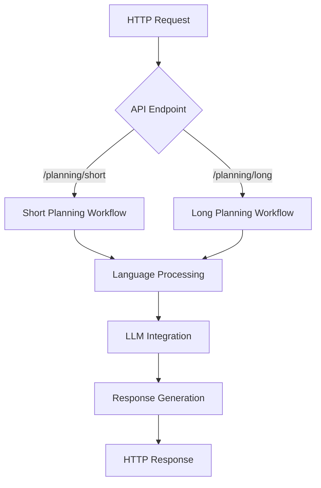

# GTPlanner Workflow Analysis

## Overview

This document provides a comprehensive analysis of the GTPlanner system workflows, including detailed process flows, decision points, branching logic, and error handling for both Short Planning and Long Planning APIs.

## System Architecture Flow



## Short Planning API Workflow

### Entry Point and Validation

1. **HTTP Request Reception**
   - Endpoint: `POST /planning/short`
   - Request body validation using Pydantic `ShortPlanningRequest`
   - Required field validation: `requirement`

2. **Initial Context Setup**
   - Extract parameters: `requirement`, `previous_flow`, `language`, `user_id`
   - Create base shared context with multilingual support
   - Initialize history and version tracking

### Language Processing Pipeline

3. **User Preference Retrieval**
   - If `user_id` provided: Query stored language preferences
   - Integration with `utils.config_manager.get_language_preference()`
   - Add preference to shared context if found

4. **Language Determination**
   - Priority order:
     1. Explicit `language` parameter
     2. User preference from `user_id`
     3. Auto-detection from `requirement` text
     4. System default (en)
   - Uses `utils.multilingual_utils.determine_language()`

### Decision Point: Processing Path Selection

5. **Flow Type Decision**
   ```mermaid
   flowchart TD
       A[Check previous_flow] --> B{Has previous_flow?}
       B -->|Yes| C[Optimization Path]
       B -->|No| D[Generation Path]
   ```

### Path A: Optimization Workflow

6. **Optimization Context Setup**
   - Copy base shared context
   - Set `steps` to `previous_flow`
   - Set `feedback` to new `requirement`
   - Prepare for OptimizeNode execution

7. **OptimizeNode Processing**
   - **prep_async**: 
     - Retrieve current version number
     - Determine language (stored or detect from feedback)
     - Prepare optimization context
   - **exec_async**:
     - Get localized "optimize_steps" prompt template
     - Format prompt with steps, feedback, and version
     - Call LLM asynchronously
   - **post_async**:
     - Increment version number
     - Update history with new version
     - Store optimized steps

### Path B: New Generation Workflow

8. **Generation Context Setup**
   - Use base shared context
   - Prepare for GenerateStepsNode execution

9. **GenerateStepsNode Processing**
   - **prep_async**:
     - Extract requirement from shared context
     - Determine language using multilingual utilities
     - Return requirement and language
   - **exec_async**:
     - Get localized "generate_steps" prompt template
     - Format prompt with requirement
     - Call LLM asynchronously
   - **post_async**:
     - Store generated steps
     - Update history with initial version (V1)
     - Return default action

### Response Generation

10. **Language Metadata**
    - Determine response language from shared context
    - Fallback to request language or default

11. **Response Assembly**
    - Extract flow from shared context
    - Include language and user_id metadata
    - Return structured response

## Long Planning API Workflow

### Entry Point and Validation

1. **HTTP Request Reception**
   - Endpoint: `POST /planning/long`
   - Request body validation using Pydantic `LongPlanningRequest`
   - Required field validation: `requirement`

2. **Complex Context Setup**
   - Extract all parameters: `requirement`, `previous_flow`, `design_doc`, `language`, `user_id`
   - Create comprehensive shared context structure
   - Setup for document processing workflow

### Language Processing

3. **User Preference Integration**
   - Similar to short planning: retrieve and integrate user preferences
   - Setup multilingual context for complex document processing

### Sequential Node Processing

4. **Requirements Analysis Phase**
   - **AsyncRequirementsAnalysisNode** execution
   - **prep_async**:
     - Extract natural language requirement
     - Retrieve short flow steps and processed documents
     - Determine language using multilingual utilities
   - **exec_async**:
     - Get localized "requirements_analysis" prompt template
     - Format with comprehensive context
     - Call LLM for detailed analysis
   - **post_async**:
     - Store analyzed requirements
     - Return default action for next node

5. **Design Optimization Phase**
   - **AsyncDesignOptimizationNode** execution
   - **prep_async**:
     - Gather all context: requirements, conversation history, documents
     - Prepare comprehensive design context
   - **exec_async**:
     - Use complex design optimization prompt
     - Include Node/Flow architecture guidelines
     - Generate comprehensive markdown documentation
   - **post_async**:
     - Store generated documentation
     - Save to `doc.md` file
     - Update conversation history

### File System Integration

6. **Document Persistence**
   - Generated design document saved to `doc.md`
   - File system integration for persistent storage
   - Enables external access to generated documentation

## Error Handling and Edge Cases

### Input Validation Errors

1. **Missing Required Fields**
   - Return structured error response
   - HTTP 400 status with descriptive message

2. **Invalid Language Codes**
   - Language validation using `validate_language_request()`
   - Fallback to default language with warning

### Processing Errors

3. **LLM Integration Failures**
   - Async timeout handling (100 seconds default)
   - Connection error recovery
   - Response parsing error handling

4. **Language Detection Failures**
   - Fallback to default language (en)
   - Graceful degradation with logging

### Node Execution Errors

5. **Node Processing Failures**
   - Exception handling in async node execution
   - Shared context preservation
   - Error propagation with context

## Performance Considerations

### Asynchronous Processing

1. **Non-blocking Operations**
   - All LLM calls are asynchronous
   - HTTP client with async session management
   - Concurrent request handling capability

2. **Resource Management**
   - Connection pooling for LLM API calls
   - Memory efficient shared context handling
   - Timeout management for long-running operations

### Scalability Patterns

3. **Stateless Design**
   - No persistent state between requests
   - Self-contained shared context
   - Horizontal scaling capability

4. **Caching Opportunities**
   - Language detection results
   - Prompt template caching
   - User preference caching

## Integration Points

### MCP Service Integration

1. **Tool Mapping**
   - `generate_flow` → Short Planning API
   - `generate_design_doc` → Long Planning API
   - Direct function call integration

2. **Parameter Validation**
   - Language validation at MCP layer
   - Error handling and response formatting
   - Consistent interface across integration points

### Configuration Management

3. **Settings Integration**
   - Dynaconf-based configuration
   - Environment variable support
   - Runtime configuration updates

4. **User Preference Management**
   - Persistent user language preferences
   - Dynamic preference retrieval
   - Fallback mechanism implementation

## Monitoring and Observability

### Logging Points

1. **Request Processing**
   - API endpoint access logging
   - Parameter extraction and validation
   - Language determination logging

2. **Node Execution**
   - Node lifecycle logging
   - LLM interaction logging
   - Error and exception logging

### Metrics Collection

3. **Performance Metrics**
   - Request processing time
   - LLM response time
   - Language detection accuracy

4. **Usage Metrics**
   - API endpoint usage patterns
   - Language distribution
   - User preference patterns
